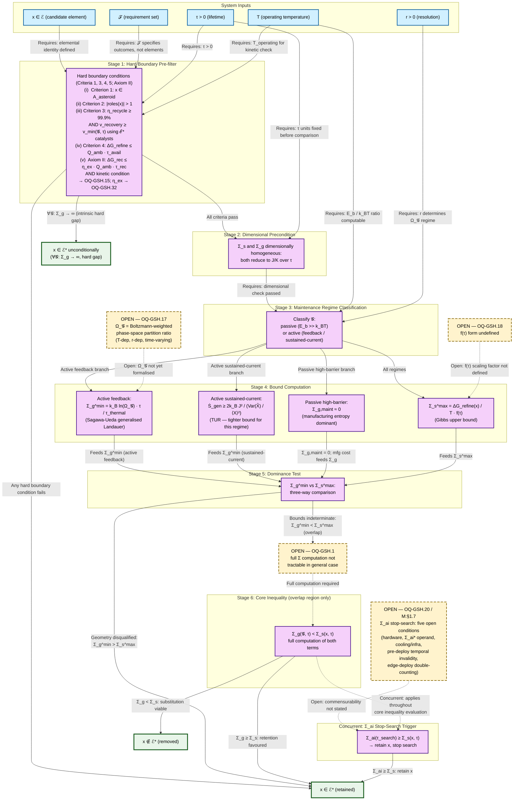
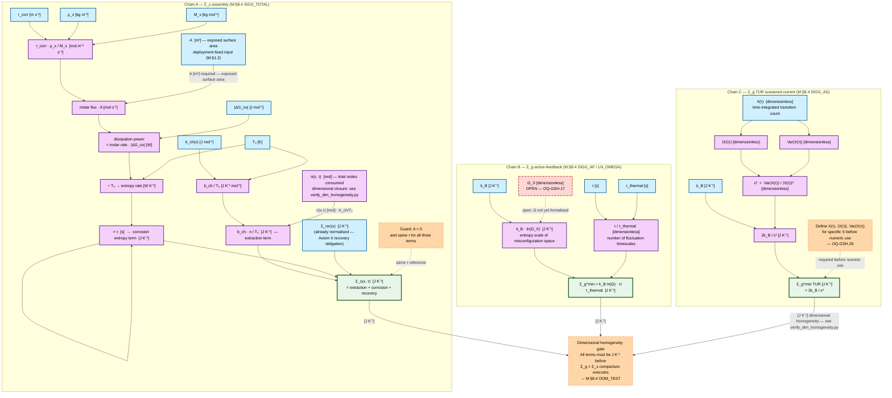

# GSH Mathematical Inventory

*`GSH_mathematical_inventory.md` is a **co-primary source** alongside `geometric_sufficiency_hypothesis.md`. Formula bodies, symbol glossaries, regime conditions, dimensional checks, and verification infrastructure live here. The hypothesis contains the argument structure and axiomatic claims; this document contains the formal expressions of those claims. Both must be loaded for complete coverage. Pointers of the form `[→ GSH_mathematical_inventory.md M:§N.N]` in the hypothesis are required navigation — the pointed section is authoritative. Verification scripts: `verify_gsh_math.py` (algebraic checks), `verify_dim_homogeneity.py`, `fe_crossover_numeric.py` (Fe/Al crossover numeric instance). All scripts are in the same directory. Section references: `M:§N` for this document, `H:§N` for the hypothesis.*

---

*Epistemic markers *(D)*, *(H)*, *(C)*, *(OQ)* follow the same scheme as [geometric_sufficiency_hypothesis.md](geometric_sufficiency_hypothesis.md)  — see H:§0 epistemic status key.*

## Computability tier index

Every mathematical object in this document is assigned to one of three tiers. Tier is determined by current computability, not by the formula's correctness or importance. A Tier 3 formula is not weaker than a Tier 1 formula — it is valid in a narrower regime. An auditor should confirm the correct tier applies before evaluating a specific pipeline run.

**M:§0 — Computability tier definition table**

| Tier | Meaning | Auditor action |
| :--- | :--- | :--- |
| *T1* — Computable now | Numerical output from standard data; verification script exists | Check script output and data source |
| *T2* — Structural objective | Defines the physical ideal or limit; guides AI search; non-computable in general case | Verify bounds do not overlap before applying full computation |
| *T3* — Regime-scoped bound | Valid within stated boundary conditions only; incorrect outside them | Confirm regime classification before applying |

**M:§0 — Computability tier index**

| Formula / object | §Location | Tier | Status | Notes |
| :--- | :--- | :--- | :--- | :--- |
| Core inequality $\Sigma_g(\mathcal{G}, \tau) < \Sigma_s(x, \tau)$ | M:§1.3 | *T2* | Structural | Computable at dominance level (non-overlapping bounds — see M:§1.6 dominance test); general $\Sigma_g$ is open research problem |
| Minimisation integral $\min \int (\dot{S}_{\mathrm{gen,supply}} + \dot{S}_{\mathrm{gen,maintenance}})\,dt$ | M:§1.4 | *T2* | Structural | Governing objective; $\dot{S}_{\mathrm{gen,maintenance}}$ not computable for arbitrary macro-geometries |
| $\Sigma_s(\mathrm{Fe}, \tau) = \Sigma_s^{\mathrm{extraction}}(\mathrm{Fe}) + r_{\mathrm{corr}} \cdot \tau + \Sigma_{\mathrm{rec}}(\mathrm{Fe})$ | M:§3.1, M:§4.2 | *T1* | Computable | Szargut + ISO 9223 data; implemented in `fe_crossover_numeric.py` |
| $\tau^* : \Sigma_s(\mathrm{Fe}, \tau^*) = \Sigma_g(\mathcal{G}_{\mathrm{sub}}, \tau^*)$ | M:§3.1 | *T1* | Computable | Crossover lifetime — numeric instance in `fe_crossover_numeric.py` |
| $\Delta G_{\mathrm{recovery}} \leq \eta_{\mathrm{ex}} \cdot \dot{Q}_{\mathrm{ambient}} \cdot \tau_{\mathrm{recovery}} / n_{\mathrm{rec}}(x)$ (Axiom II) | M:§2.2 | *T1* | Computable | Thermodynamic condition only; kinetic condition (OQ-GSH.15) is not computable from tables alone. $\eta_{\mathrm{ex}}$ must be declared before evaluation; operative value per deployment context is open — OQ-GSH.32 |
| $\Delta G_{\mathrm{refine}}(x) > \dot{Q}_{\mathrm{ambient}} \cdot \tau_{\mathrm{avail}}$ (Criterion 4) | M:§4.1 | *T1* | Computable | NIST / mp-api data for $\Delta G_{\mathrm{refine}}$ |
| $\eta_{\mathrm{recycle}}(x) < 0.999$ (Criterion 3) | M:§4.1 | *T1* | Computable (threshold stipulated) | $< 99.9\%$ threshold stated; candidate derivation $\eta_{\mathrm{recycle}}^{\min} = (1-\epsilon)^{\tau_{\mathrm{cycle}}/\tau}$ — see OQ-GSH.25. Operative threshold: $99.9\%$ static value. The candidate formula is not operative until OQ-GSH.25 resolves $\epsilon$ and $\tau_{\mathrm{cycle}}$ from $\mathcal{F}$. |
| Cycle closure $\int_0^{T_{\mathrm{gradient}}} \dot{B}_{\mathrm{store}}\,dt \geq 0$ (Axiom III) | M:§2.3 | *T1* | Computable given $\dot{B}_{\mathrm{store}}$ model | Equivalence to $\tau_{\mathrm{storage}}$ condition asserted but not proved |
| Boltzmann-Shannon maintenance bound $k_B \ln(\Omega_\mathcal{G}) \cdot \tau / \tau_{\mathrm{thermal}}$ | M:§1.6 | *T3* | Regime-scoped | Active-maintenance regime only ( $E_b \lesssim 10\,k_B T$); invalid for passive high-barrier structures ( $E_b \gg k_B T$) — see M:§1.6 scale applicability boundary. Transition region ( $k_B T \lesssim E_b \lesssim 10\,k_B T$): composite accounting required ( $\Sigma_g = \Sigma_{g,\mathrm{mfg}} + \Sigma_{g,\mathrm{maintenance}}$) — see M:§1.6 and OQ-GSH.19. |
| Sagawa-Ueda / generalised Landauer bound | M:§1.6 | *T3* | Regime-scoped | Feedback-correction sub-regime of active maintenance — see M:§1.6 |
| TUR (Thermodynamic Uncertainty Relation) cumulative bound $\Sigma_g^{\min} \geq 2 k_B / \epsilon^2$ where $\epsilon^2 = \operatorname{Var}(X(\tau))/\langle X(\tau)\rangle^2$ | M:§1.6 | T3 | Regime-scoped | Sustained-current sub-regime of active maintenance. Tighter than Sagawa-Ueda in this sub-regime. $X(\tau)$, $\langle X(\tau)\rangle$, $\operatorname{Var}(X(\tau))$ require definition for a specific $\mathcal{G}$ before numeric use — OQ-GSH.26. **Scale note:** at $\epsilon^2 = 1$ the bound evaluates to $2k_B \approx 2.76 \times 10^{-23}\ \mathrm{J}\cdot\mathrm{K}^{-1}$ — 20+ orders of magnitude below engineering-scale $\Sigma_s$ values (range $\sim 10^3$–$10^6\ \mathrm{J}\cdot\mathrm{K}^{-1}$). The TUR bound is operative only at nano/molecular scale where $\epsilon^2 \ll 1$ due to a very large mean transition count $\langle X(\tau)\rangle$. Do not use as a dominance-test bound for macro-scale candidates — the Boltzmann-Shannon bound or manufacturing entropy form applies instead. |
| Manufacturing entropy $\Sigma_{g,\mathrm{mfg}} = W_{\mathrm{irreversible,fab}} / T_0^{\mathrm{fab}}$ | M:§1.6 (passive) | *T1* | Computable | Gutowski machining data; Szargut formation exergy. Applies: passive macro structures where $\tau \leq \tau_{\mathrm{wearout}}$. $T_0^{\mathrm{fab}}$ is fabrication-context dead-state. Scale threshold and $T_0$ context mismatch: OQ-GSH.19 |
| $\Omega_\mathcal{G}(T, r)$ phase-space partition ratio | M:§1.6 ( $\Omega_\mathcal{G}$ phase-space definition — OQ-GSH.17) | T3 | Open — OQ-GSH.17 | Structure correct; numerical value requires Hamiltonian of specific $\mathcal{G}$ — not generically computable |
| Gibbs upper bound $\Sigma_s^{\max} \leq \Delta G_{\mathrm{refine}} / T \cdot f(\tau)$ | M:§1.6 | *T2* | Open — OQ-GSH.18 | $f(\tau)$ form open (OQ-GSH.18). $\Sigma_s^{\max}$ is unavailable as a numeric value; the dominance test cannot short-circuit via the upper bound. Conservative fallback: treat $\Sigma_s^{\max}$ as unbounded and proceed to full computation if $\Sigma_g^{\min}$ does not strictly dominate. |
| $\Sigma_{\mathrm{AI}}(\tau_{\mathrm{search}}) \geq \Sigma_s(x, \tau)$ stop-search trigger | M:§1.7 | *T2* | Open — OQ-GSH.20 | Three unresolved conditions block reliable application: (i) $\dot{S}_{\mathrm{AI}}$ is hardware-contingent, not a property of the search problem alone; (ii) the sound operand is minimum achievable $\Sigma_{\mathrm{AI}}^*$, which is intractable — actual incurred cost is a proxy but penalises inefficient implementations; (iii) pre-deployment $\Sigma_{\mathrm{AI}}$ is a sunk cost compared against a future penalty, creating a temporal invalidity. Operative fallback: trigger is disabled when commensurability (OQ-GSH.20) cannot be confirmed; primary pipeline chain continues unblocked. |
| OQ-GSH.10 transition cost terms | M:§1.8 | *T2* | Open | Transition cost terms are excluded from current $\Sigma_g$ and $\Sigma_s$ computations; pipeline cannot account for stranded asset, dual-running, or scale-up entropy until resolved |
| Entropy export rate $\dot{S}_{\mathrm{gen}} \leq \dot{Q}_{\mathrm{export}} / T_{\mathrm{boundary}}$ | M:§7 OQ-GSH.14 | *T2* | Open | Candidate third Axiom III condition; axiomatic status unresolved |

*This index is a navigation aid. The verification gap summary table (M:§7 falsification-repair record) and per-formula verification checks are the authoritative epistemic record.*

**How to use this index for computation:** 
- (1) Identify the formula's tier and status in this table. 
- (2) Read M:§1.1 for the units of each symbol in the formula. 
- (3) Apply the M:§1.2a transition rules to confirm the conversion path to $\mathrm{J}\cdot\mathrm{K}^{-1}$ — the dimensional flow is: Rate ( $\mathrm{W}\cdot\mathrm{K}^{-1}$) $\rightarrow \times\tau \rightarrow \mathrm{J}\cdot\mathrm{K}^{-1} \rightarrow \times T_0 \rightarrow \mathrm{J} \rightarrow$ inequality $\rightarrow$ Boolean $\rightarrow$ boundary condition. 
- (4) Check the Notes column: a *T1* formula with a named data source is executable now; a *T2* or *T3* formula has a defined unit path but a named open condition (OQ-GSH.N) blocks numeric evaluation. M:§1.6 contains inline unit traces for the formulas it defines — use those as the reference for any new instance. Dimensional homogeneity of all chains is verified programmatically by `verify_dim_homogeneity.py`; that script is the authoritative dimensional record.

---

## Table of Contents

| Section | Content |
| :--- | :--- |
| M:§0 — Scope note | $MDL$ (Minimum Description Length) framing; computability tier key |
| M:§1 — Core inequality and trade-off structure | Group header — all content in M:§1.1–M:§1.8 |
| M:§1.1 Symbol definitions | Full type/units/constraint glossary for all symbols |
| M:§1.2 State classification | Deployment-fixed vs. evaluation-computed; drift failure mode |
| M:§1.2a Cross-domain transitions | Tr1–Tr8 transitions: lossiness, validity, risk — **where domain-mixing errors originate** |
| M:§1.3 Boundary value interpretation | Limiting cases of $\Sigma_g$, $\Sigma_s$, and inequality output |
| M:§1.4 Integral formulation | $\Sigma_s$ and $\Sigma_g$ as integrals; deployment model split |
| M:§1.5 $\tau$-scaling | Directional behaviour as $\tau \to 0$ and $\tau \to \infty$ |
| M:§1.6 Bounding method | Boltzmann-Shannon lower bound; Gibbs upper bound; dominance test; active/passive regime split |
| M:§1.7 $\Sigma_{\mathrm{AI}}$ stop-search trigger | Threshold condition; pre-deployment vs. edge-deployed regimes |
| M:§1.8 OQ-GSH.10 transition costs | Stranded asset, dual-running, scale-up entropy candidates |
| M:§2 — Axioms: mathematical content | Group header — all content in M:§2.1–M:§2.4 |
| M:§2.1 Axiom I | Minimum cardinality; hard gap exception |
| M:§2.2 Axiom II | Two-condition operative test: thermodynamic + kinetic; infrastructure recursion |
| M:§2.3 Axiom III | Gradient locality; cycle closure integral |
| M:§2.4 Axiom IV | Hard gap condition; geometric boundary |
| M:§3 — Agent rules: mathematical content | Group header — all content in M:§3.1–M:§3.2 |
| M:§3.1 Requirement 1 | $\Sigma_s$ and $\Sigma_g$ computation; exergy normalisation basis |
| M:§3.2 Requirement 3 | Pointer to M:§1.7 |
| M:§4 — Criteria hierarchy: mathematical content | Group header — all content in M:§4.1–M:§4.3 |
| M:§4.1 Hard boundary conditions | Criterion 1, Criterion 2, Criterion 3, Criterion 4 — formal expressions ( $\Sigma_g \to \infty$ or thermodynamic axiom violated) |
| M:§4.2 $\mathrm{Fe}$ supply-chain entropy operative form | $\Sigma_s(\mathrm{Fe}, \tau)$ with $r_{\mathrm{corr}}$ as deployment-fixed input; general inequality; $\tau^*$ crossover pointer to OQ-GSH.8 |
| M:§4.3 Cost comparisons | Criterion 5–9 operative form ( $\Sigma_g$ vs $\Sigma_s$ — boundary revealed, decision external) |
| M:§5 — Derivation example | No new math; deuterium availability note |
| M:§6 — Challenges: mathematical content | Group header — all content in M:§6.1–M:§6.7 |
| M:§6.1 Challenge A — magnetism gap | $\mu_r$ hard gap expression |
| M:§6.2 Challenge B — logic substrate | Binary Turing-complete question |
| M:§6.3 Challenge C — refractory ceiling | $\mathrm{SiC}$ and $\mathrm{W}$ temperature constants |
| M:§6.4 Challenge D — $\mathrm{Na}$/$\mathrm{K}$ pair | Axiom I minimality test form |
| M:§6.5 Input validity constraints | V1–V7 pipeline preconditions with consequences |
| M:§6.6 $\mathcal{F}$ structural preconditions | F1–F6 requirement-set validity conditions |
| M:§6.7 Pipeline-internal validity gates | G1–G4 stage-transition halt conditions |
| M:§7 — OQ mathematical content | OQ-GSH.8, .10, .14 formal expressions |
| Open verification checks | Unresolved gaps from source; open research requirements |
| M:§8 — Computational pipeline: four graph formats | Group header — all content in subsections M:§8.1–M:§8.5 |
| M:§8.1 Role separation | Four graph format: prose / math / CD-DG / H-DFG / DAG; C4 analogy |
| M:§8.2 CD-DG | Constraint-driven dependency graph with Mermaid diagram |
| M:§8.3 — H-DFG (Earth context) | Hierarchical data flow graph; Earth vs. space context delta |
| M:§8.4 — DAG | Atomic dependency graph; execution levels; concurrency |
| M:§8.5 — Normalisation detail | C4 code-level zoom into three M:§8.4 entropy assembly nodes; unit-conversion steps explicit; dimensional gaps surfaced as structure |

*Note: This section records unresolved physical and logical constraints in the GSH pipeline. Corrections and amendments are documented in `geometric_sufficiency_hypothesis_retraction.md` §A07.*

---

## M:§0 — Scope note

**MDL (Minimum Description Length) framing (prose):**

> Optimal engineering solution minimises element cardinality and compensates through geometric arrangement.

No formula stated. The M:§1 $\Sigma$ trade-off argument is the mathematical instantiation. See M:§1.

---

## M:§1 — Core inequality and trade-off structure

### M:§1.1 Symbol definitions

Type column uses the following taxonomy: 
- **Set** — unordered collection, no arithmetic
- **Config** — geometric configuration object, not linearly decomposable (no addition or scalar multiplication)
- **Scalar** — real-valued single number
- **Rate** — scalar per unit time
- **Vector** — element of $\mathbb{R}^k$, supports linear algebra
- **Constant** — fixed physical value, not a free variable. Mixing types across an equality or inequality is a type error regardless of dimensional agreement.

| Symbol | Definition | Type | Units | Constraint | Notes |
| :--- | :--- | :--- | :--- | :--- | :--- |
| $\mathcal{E}$ | Complete element library | Set | — | $\lvert \mathcal{E} \rvert \leq 118$ | All chemical elements |
| $\mathcal{E}^*$ | Minimum-cardinality subset of $\mathcal{E}$ satisfying requirement set $\mathcal{F}$ | Set | — | $\mathcal{E}^* \subseteq \mathcal{E}$ | Co-determined with $\lvert \mathcal{E}^* \rvert$ by the element-selection pipeline. **Named-instance convention:** a solved instance is written $\mathcal{E}^*(\mathcal{F}_{\mathrm{space}})$ or $\mathcal{E}^*(\mathcal{F}_{\mathrm{Earth}})$ — parenthetical is the named $\mathcal{F}$ the pipeline was evaluated against; deployment context is implicit via F5. Adding a context requires defining a new named $\mathcal{F}$ (see $\mathcal{F}$ row). Distinct from the role-subscript $\mathcal{E}^*_{\mathrm{infra}}$ (OQ-GSH.24), which denotes the element set embodied in manufacturing infrastructure. |
| $\mathcal{F}$ | Engineering requirement set | Set | — | Elemental specifications excluded by definition | Functional outcomes only; elemental specifications collapse substitution space. **Named instances:** $\mathcal{F}_{\mathrm{space}}$ — general-purpose space engineering at 3–5 AU ( $T_0 \approx 250\,\mathrm{K}$, $\dot{Q}_{\mathrm{solar}} \approx 50\,\mathrm{W}\cdot\mathrm{m}^{-2}$, ATM absent, abundance from $\mathrm{C}$/$\mathrm{S}$/$\mathrm{M}$-type asteroids); $\mathcal{F}_{\mathrm{Earth}}$ — terrestrial general engineering (Criterion 1 shifts to crustal abundance; $T_0 = 298\,\mathrm{K}$; ATM present). A new deployment context requires a new named instance with its M:§1.2 binding stated explicitly before the pipeline evaluates it. |
| $\mathcal{G}$ | A specific geometric arrangement | Config | — | Resolution $r$ is a parameter | Specifies the candidate geometric arrangement evaluated against the core entropy inequality; not a vector — cannot be added or scaled; manipulated only by geometric operations. $\mathcal{G}_1 + \mathcal{G}_2$ is a type error. The material realising $\mathcal{G}$ may be a multi-element compound or composite from $\mathcal{E}^*$ (e.g., $\mathrm{SiC}$, geopolymer); alloy/phase properties of that material are an input to $\Sigma_g$, computed from Calculation of Phase Diagrams (CALPHAD) or Density Functional Theory (DFT) data for the specific composition |
| $x$ | A candidate element | Scalar index | — | $x \in \mathcal{E}$ | Indexes into element set $\mathcal{E}$. Scope: $x$ is always a pure element — multi-component alloys or compounds are not valid values of $x$. An alloy (e.g., steel = $\mathrm{Fe}$ + $\mathrm{C}$) is not evaluable as a single $x$; it requires separate entries for each constituent element or a scope extension |
| $\tau$ | Operational lifetime of the system | Scalar | $\mathrm{s}$ | $\tau > 0$ | Sets the integration upper limit and evaluation horizon for the core inequality; appears as M:§1.4 integration upper limit |
| $\tau_{\mathrm{search}}$ | AI geometric search duration | Scalar | $\mathrm{s}$ | $\tau_{\mathrm{search}} > 0$ | Scopes the AI search cost $\Sigma_{\mathrm{AI}}$; argument of $\Sigma_{\mathrm{AI}}$; distinct from operational lifetime $\tau$ |
| $\tau_{\mathrm{recovery}}$ | Duration available for recovery reaction | Scalar | $\mathrm{s}$ | $\tau_{\mathrm{recovery}} > 0$ | Sets the time window for Axiom II thermodynamic feasibility; appears in M:§2.2 thermodynamic condition |
| $\tau_{\mathrm{thermal}}$ | Thermal fluctuation timescale | Scalar | $\mathrm{s}$ | $= k_B T_0 / u_{\mathrm{attempt}}$ | Normalises the Boltzmann-Shannon maintenance rate to entropy units; enters active-feedback bound denominator; deployment-fixed |
| $r$ | Geometric resolution of arrangement $\mathcal{G}$ | Scalar | $\mathrm{m}$ | $r > 0$ | Finer $r \rightarrow$ higher $\Sigma_g$; non-linear relationship (see OQ-GSH.17) |
| $\Sigma_s(x, \tau)$ | Supply-chain entropy of element $x$ over lifetime $\tau$ | Scalar | $\mathrm{J}\cdot\mathrm{K}^{-1}$ | $\Sigma_s \geq 0$ | Left-hand operand of the core inequality; cumulative (not a rate). Exergy normalisation basis: M:§1.4 (integral definitions). Do not sum with $\dot{S}_{\mathrm{gen}}$ without time factor |
| $\Sigma_g(\mathcal{G}, \tau)$ | Precision entropy of geometric arrangement $\mathcal{G}$ over $\tau$ | Scalar | $\mathrm{J}\cdot\mathrm{K}^{-1}$ | $\Sigma_g \geq 0$ | Right-hand operand of the core inequality; cumulative (not a rate). $\Sigma_g \rightarrow \infty$ defines a hard gap |
| $\Sigma_{\mathrm{AI}}(\tau_{\mathrm{search}})$ | AI search entropy over search duration $\tau_{\mathrm{search}}$ | Scalar | $\mathrm{J}\cdot\mathrm{K}^{-1}$ | $\Sigma_{\mathrm{AI}} \geq 0$ | Operand of the stop-search trigger (M:§1.7); cumulative sunk cost; does not enter core inequality |
| $\Sigma_{\mathrm{rec}}(x)$ | Axiom II recycling obligation entropy for element $x$ | Scalar | $\mathrm{J}\cdot\mathrm{K}^{-1}$ | $\Sigma_{\mathrm{rec}} \geq 0$ | Cumulative deferred debt; accrues from $t = 0$ regardless of decommissioning timing |
| $\dot{S}_{\mathrm{gen,supply}}(\mathcal{E}^*)$ | Entropy generation rate — supply chain for element set $\mathcal{E}^*$ | Rate | $\mathrm{W}\cdot\mathrm{K}^{-1}$ | $\geq 0$ | Rate form of $\Sigma_s$; integrand of the M:§1.4 supply-chain integral. Irreversibility term only (Moran/Shapiro/Bejan). Do not equate directly with cumulative $\Sigma_s$ |
| $\dot{S}_{\mathrm{gen,maintenance}}(\mathcal{G})$ | Entropy generation rate — maintaining arrangement $\mathcal{G}$ | Rate | $\mathrm{W}\cdot\mathrm{K}^{-1}$ | $\geq 0$ | Rate form of $\Sigma_g$; integrand of the M:§1.4 maintenance integral. Irreversibility term only |
| $\dot{\Sigma}_s$ | Entropy accumulation rate of supply-chain cost — rate at which $\Sigma_s$ increases per unit time | Rate | $\mathrm{J}\cdot\mathrm{K}^{-1}\cdot\mathrm{s}^{-1}$ | $\dot{\Sigma}_s \geq 0$ | Slope term in the M:§6.1 linear crossover model: $\Sigma_s(\tau) = \Sigma_{s,\mathrm{initial}} + \dot{\Sigma}_s \cdot \tau$. Distinct from $\dot{S}_{\mathrm{gen,supply}}$ — that is the instantaneous rate for the full element set $\mathcal{E}^*$; $\dot{\Sigma}_s$ is the per-element ongoing degradation rate in the crossover context |
| $\dot{\Sigma}_g$ | Entropy accumulation rate of geometric arrangement cost — rate at which $\Sigma_g$ increases per unit time | Rate | $\mathrm{J}\cdot\mathrm{K}^{-1}\cdot\mathrm{s}^{-1}$ | $\dot{\Sigma}_g \geq 0$ | Slope term in the M:§6.1 linear crossover model: $\Sigma_g(\tau) = \Sigma_{g,\mathrm{mfg}} + \dot{\Sigma}_g \cdot \tau$. Determined by the Carnot Coefficient of Performance (COP) argument for the cryogenic case: $\dot{\Sigma}_g \approx 15.6 \cdot \dot{\Sigma}_{s,\mathrm{thermal\ load}}$ at $18\,\mathrm{K}$ |
| $\Sigma_{s,\mathrm{initial}}$ | $\tau$-independent initial supply-chain entropy — extraction cost at $t = 0$ | Scalar | $\mathrm{J}\cdot\mathrm{K}^{-1}$ | $\Sigma_{s,\mathrm{initial}} \geq 0$ | Intercept of the M:§6.1 linear crossover model for $\Sigma_s$; structurally parallel to $\Sigma_{g,\mathrm{mfg}}$ (the intercept of the $\Sigma_g$ model). For $\mathrm{Fe}$: $\Sigma_{s,\mathrm{initial}} = b_{ch}(\mathrm{Fe}) / T_0 \approx 1.25\,\mathrm{J}\cdot\mathrm{K}^{-1}$ per mole (Szargut 1988, T1). Distinct from $\Sigma_s(x, \tau)$ — the full cumulative form includes the $\dot{\Sigma}_s \cdot \tau$ rate term on top of this initial cost. **Accounting convention note:** $\Sigma_{s,\mathrm{initial}}$ uses $b_{ch}/T_0$ (exergy-based lower bound on extraction cost) while $\Sigma_{g,\mathrm{mfg}}$ uses $W_{\mathrm{irreversible,fab}}/T_0^{\mathrm{fab}}$ (irreversibility-based actual fabrication cost). These are not the same accounting method — $b_{ch}/T_0$ is a minimum and $W_{\mathrm{irreversible,fab}}/T_0$ is the actual. The two sides of the crossover model are therefore not symmetric in their conservatism: $\Sigma_s$ uses a lower bound on its intercept; $\Sigma_g$ uses the actual. This means the crossover $\tau^*$ is conservative in the retention direction: the actual supply-chain cost is at least as large as $b_{ch}/T_0$, so the real $\tau^*$ is no earlier than the computed one. |
| $b_{ch}(x)$ | Standard chemical exergy of element $x$ at the Szargut (1988) dead-state convention | Scalar | $\mathrm{J}\cdot\mathrm{mol}^{-1}$ | $b_{ch}(x) > 0$ for all elements under the Szargut convention | Primary data source for $\Sigma_s^{\mathrm{extraction}}(x) = b_{ch}(x) / T_0$; tabulated in Szargut (1988); mp-api replacement targets marked in `fe_crossover_numeric.py`. Must use a consistent thermodynamic reference state — do not mix conventions within one evaluation (see M:§6.5 V6). **Interpretation note:** $b_{ch}(x)/T_0$ is the minimum extraction cost proxy — the exergy required to raise $x$ from the dead-state environment to its functional form, normalised to entropy units. It is a lower bound on the actual $W_{\mathrm{lost,extraction}}/T_i$ for the extraction step; for a reversible extraction $S_{\mathrm{gen}} = 0$ but $b_{ch}$ is still consumed from gradient flux (Axiom III obligation). Do not equate $b_{ch}/T_0$ with strict irreversibility — it is the thermodynamic debt of initial extraction, not a path-dependent entropy generation term. |
| $T_0$ | Exergy reference temperature | Constant | $\mathrm{K}$ | $T_0 > 0$; $298\,\mathrm{K}$ (Earth context) | Normalises exergy to entropy units throughout the pipeline; deployment-fixed (M:§1.2); sets $k_B T_0$ for Boltzmann-Shannon and Arrhenius terms |
| $T_{\mathrm{operating}}$ | Operating temperature achievable within element set $\mathcal{E}^*$ using gradient-derived energy | Scalar | $\mathrm{K}$ | $T_{\mathrm{operating}} > 0$ | Bounds the kinetic feasibility window in the Axiom II kinetic condition (M:§2.2); deployment-context-dependent |
| $k_B$ | Boltzmann constant | Constant | $\mathrm{J}\cdot\mathrm{K}^{-1}$ | $= 1.380649 \times 10^{-23}\ \mathrm{J}\cdot\mathrm{K}^{-1}$ | Scales the Boltzmann-Shannon bound and TUR bound to entropy units; not a free variable |
| $\Omega_{\mathcal{G}}(T, r, t)$ | Phase-space ratio — misconfigured to correctly-configured states | Scalar | — (dimensionless) | $\Omega_{\mathcal{G}} \geq 1$ | Operand of the Boltzmann-Shannon maintenance bound; $T$-, $r$-, and $t$-dependent. Static integer form is an approximation valid only when energy landscape is stationary. See OQ-GSH.17 |
| $v_{\mathrm{recovery}}(x, T_{\mathrm{operating}}, \mathcal{E}^*)$ | Recovery reaction rate for element $x$ | Scalar | $\mathrm{mol}\cdot\mathrm{s}^{-1}$ | $\geq 0$ | Compared against $v_{\min}$ in the Axiom II kinetic condition (M:§2.2); not a vector — scalar rate only |
| $v_{\min}(\mathcal{G}, \tau)$ | Minimum operationally sufficient recovery rate for loop closure within $\tau$ | Scalar | $\mathrm{mol}\cdot\mathrm{s}^{-1}$ | $> 0$ | Threshold in the Axiom II kinetic condition — $v_{\mathrm{recovery}} \geq v_{\min}$ is the operative test; *T2* — problem-specific, not generally computable |
| $\Delta G_{\mathrm{recovery}}(x)$ | Gibbs free energy of recovery reaction for element $x$ | Scalar | $\mathrm{J}\cdot\mathrm{mol}^{-1}$ | Sign unconstrained; bounded by available ambient exergy — M:§2.2 | Left-hand operand of the Axiom II thermodynamic condition (M:§2.2); negative values indicate spontaneous recovery (no flux required); positive values represent the energy input required for a driven process (flux ceiling applies per M:§2.2). Computable (*T1*) from thermochemical tables. |
| $\dot{Q}_{\mathrm{ambient}}$ | Incident power from available Axiom III-compliant gradient source (solar, thermal, or other gradient flux) at deployment context | Scalar | $\mathrm{W}$ | $> 0$ | Provides the right-hand ceiling for the Axiom II thermodynamic condition and the Criterion 4 refining energy comparison; deployment-fixed |
| $\mu_r$ | Relative magnetic permeability | Scalar | — dimensionless | $\mu_r \geq 1$ | Hard gap symbol — flags elements whose magnetic function cannot be replicated by any geometric arrangement within $\mathcal{E}^*$; $d$-electron band structure absent from element set $\mathcal{E}^*$ at any geometric arrangement; see M:§6.1 Challenge A |
| $\mathbf{p}(x)$ | Per-element property vector for element $x$ | Vector — $\mathbb{R}^k$ | Mixed (per component) | One vector per $x \in \mathcal{E}$ | Carries all per-element properties into the pipeline evaluation; the only true vector in this symbol set — supports linear algebra. $k$ = number of properties tracked; used in M:§8.3 pipeline |
| $\eta_{\mathrm{recycle}}(x)$ | Recyclability efficiency of element $x$ — fraction of material recovered and returned to service per cycle | Scalar | — (dimensionless, $0 < \eta_{\mathrm{recycle}} \leq 1$) | $0 < \eta_{\mathrm{recycle}} \leq 1$ | Operand of the Criterion 3 hard boundary condition — $\eta_{\mathrm{recycle}} \geq 0.999$ required to pass. Evaluated against ambient-flux-only conditions (no external energy input). See M:§4.1 |
| $\epsilon$ | Maximum allowable fractional material loss before geometric substitute fails to satisfy $\mathcal{F}$ | Scalar | — (dimensionless, $0 < \epsilon < 1$) | $\epsilon > 0$ | Candidate parameter for Criterion 3 threshold derivation (OQ-GSH.25): $\eta_{\mathrm{recycle}}^{\min} = (1-\epsilon)^{\tau_{\mathrm{cycle}} / \tau}$. Must be derived from $\mathcal{F}$ — not stipulated. Not operative until OQ-GSH.25 is resolved; the static $99.9\%$ threshold applies in the interim |
| $\tau_{\mathrm{cycle}}$ | Recycling cycle period — time between successive recycling operations | Scalar | $\mathrm{s}$ | $\tau_{\mathrm{cycle}} > 0$, $\tau_{\mathrm{cycle}} < \tau$ | Scales the Criterion 3 recyclability threshold via $(1-\epsilon)^{\tau_{\mathrm{cycle}}/\tau}$; deployment-fixed state (M:§1.2). Candidate parameter for Criterion 3 threshold derivation (OQ-GSH.25). Distinct from the refining cycle $\tau_{\mathrm{cycle}}$ in the Gibbs bound $f(\tau) = \tau / \tau_{\mathrm{cycle}}$ (OQ-GSH.18) — same symbol, different physical process |
| $W_{\mathrm{irreversible,fab}}$ | Exergy consumed by the fabrication process beyond the minimum thermodynamic work required for the same transformation | Scalar | $\mathrm{J}$ | $W_{\mathrm{irreversible,fab}} \geq 0$ | Numerator of the passive-regime manufacturing entropy formula $\Sigma_{g,\mathrm{mfg}} = W_{\mathrm{irreversible,fab}} / T_0^{\mathrm{fab}}$ (M:§1.6). Source: Gutowski *et al.* (2009) for machining and forming; Szargut (2005) for phase transformations |
| $T_0^{\mathrm{fab}}$ | Dead-state temperature of the fabrication context | Scalar | $\mathrm{K}$ | $T_0^{\mathrm{fab}} > 0$ | Denominator of the passive-regime manufacturing entropy formula; for Earth-manufactured components: $T_0^{\mathrm{fab}} = 298\,\mathrm{K}$. Distinct from $T_0$ (deployment dead-state) — the two differ for off-Earth deployment. Context mismatch between $T_0^{\mathrm{fab}}$ and $T_0^{\mathrm{deploy}}$ is an open condition. *[→ OQ-GSH.19]* |
| $\tau_{\mathrm{wearout}}$ | Structural lifespan of the geometric substitute — time at which cumulative mechanical degradation requires replacement | Scalar | $\mathrm{s}$ | $\tau_{\mathrm{wearout}} > 0$ | Sets the validity boundary for the single-cost passive-regime formula — $\Sigma_{g,\mathrm{mfg}}$ is valid only when $\tau \leq \tau_{\mathrm{wearout}}$; for longer lifetimes the operative cost is $\lceil \tau / \tau_{\mathrm{wearout}} \rceil \cdot \Sigma_{g,\mathrm{mfg}}$. Deployment-fixed in principle; not generically computable without material failure data for the specific geometry. *[→ OQ-GSH.19]* |
| $B_s$, $B_g$ | Exergy-normalised supply-chain and geometric entropy: $B = T_0 \cdot \Sigma$ | Scalar | $\mathrm{J}$ | $B \geq 0$ | Bridge the entropy-unit $\Sigma$ terms to exergy-unit $B$ terms via cross-domain transition Tr2 (M:§1.2a); invertible given fixed $T_0$. Used for dimensional homogeneity check only — core inequality operates on $\Sigma$ terms |
| $H$ | Hamiltonian of geometric arrangement $\mathcal{G}$ — total energy as a function of phase-space coordinates | Scalar field | $\mathrm{J}$ | Context-dependent | Determines the Boltzmann-weighted phase-space partition ratio $\Omega_{\mathcal{G}}$; not generally computable — see OQ-GSH.17. Appears in $\Omega_{\mathcal{G}}$ phase-space integral (M:§1.6 $\Omega_{\mathcal{G}}$ phase-space integral — OQ-GSH.17) and cross-domain transitions table (M:§1.2a) |
| $\Gamma_{\mathrm{mis}}(r)$, $\Gamma_{\mathrm{correct}}(r)$ | Phase-space regions of misconfigured and correctly-configured states of $\mathcal{G}$ at resolution $r$ | Set (phase-space region) | — | Partition of accessible phase space; boundary depends on functional resolution $r$ | Partition the phase space for the $\Omega_{\mathcal{G}}$ integral (M:§1.6 $\Omega_\mathcal{G}$ phase-space integral — OQ-GSH.17); boundary between regions is the open problem in OQ-GSH.17 |
| $\mathcal{A}_{\mathrm{asteroid}}$ | Set of elements present in $\mathrm{C}$/$\mathrm{S}$/$\mathrm{M}$-type asteroids at recoverable abundance | Set | — | $\mathcal{A}_{\mathrm{asteroid}} \subseteq \mathcal{E}$ | Criterion 1 membership test: $x \notin \mathcal{A}_{\mathrm{asteroid}}$ fires the hard boundary condition. Distinct from $\mathcal{A}_{\mathrm{ref}}$ (M:§1.2): $\mathcal{A}_{\mathrm{ref}}$ is a scalar abundance reference value; $\mathcal{A}_{\mathrm{asteroid}}$ is the set of elements passing the abundance threshold. See M:§4.1 |
| $W_{\mathrm{lost},i}(x)$ | Lost work (exergy destruction) at supply-chain process step $i$ for element $x$ | Scalar | $\mathrm{J}$ | $W_{\mathrm{lost},i} \geq 0$ | Summand in the M:§3.1 per-step $\Sigma_s$ sum; one term per process step. Source: Szargut (1988) / NIST per step. Distinct from total $\Sigma_s$ |
| $T_i$ | Process temperature at supply-chain step $i$ | Scalar | $\mathrm{K}$ | $T_i > 0$ | Denominator in the M:§3.1 per-step $\Sigma_s$ sum — $\sum_i W_{\mathrm{lost},i} / T_i$ converts lost work to entropy units. Distinct from $T_0$ (exergy reference temperature, deployment-fixed) — $T_i$ is the local process temperature at step $i$ and varies across steps |
| $n(x, \tau)$ | Total moles of element $x$ consumed in the supply chain over lifetime $\tau$ | Scalar | $\mathrm{mol}$ | $n > 0$ | Required multiplicative factor in Gibbs upper bound (M:§1.6) for dimensional closure: $\Delta G / T \cdot f(\tau) \cdot n \rightarrow \mathrm{J}\cdot\mathrm{K}^{-1}$. Distinct from $n_{\mathrm{rec}}$ — $n$ counts supply-chain consumption; $n_{\mathrm{rec}}$ counts recovery. **Zero-consumption guard:** for elements used in trace or catalytic roles where $n \approx 0$ over $\tau$ (e.g. $\mathrm{Pt}$ catalyst layer, $\mathrm{Ag}$ thin-film), the Gibbs bound collapses to zero — it captures only ongoing consumption cost, not the one-time initial extraction cost $\Sigma_{s,\mathrm{initial}}$ which is $\tau$-independent. The dominance test still retains such elements correctly (any positive $\Sigma_g^{\min} > 0 = \Sigma_s^{\max}$), but via formula collapse rather than genuine supply-chain accounting. The initial extraction cost must be accounted separately for zero/trace-consumption elements. |
| $n_{\mathrm{rec}}(x)$ | Total moles of element $x$ recovered over $\tau_{\mathrm{recovery}}$ | Scalar | $\mathrm{mol}$ | $n_{\mathrm{rec}} > 0$ | Provides dimensional closure in the Axiom II thermodynamic condition denominator (M:§2.2): $\dot{Q}_{\mathrm{ambient}} \cdot \tau_{\mathrm{recovery}} / n_{\mathrm{rec}} \rightarrow \mathrm{J}\cdot\mathrm{mol}^{-1}$ |
| $\eta_{\mathrm{ex}}$ | Exergy efficiency of ambient-flux-to-chemical-work conversion | Scalar | — (dimensionless, $0 < \eta_{\mathrm{ex}} \leq 1$) | $\eta_{\mathrm{ex}} \leq \eta_{\mathrm{theoretical}}$; context-dependent upper bound | Scales the available ambient flux in the Axiom II thermodynamic condition to the fraction convertible to chemical work; upper bound is Landsberg limit ( $\approx 0.93$) for solar radiation, Carnot limit for thermal gradients, quantum efficiency for photochemical pathways. Not a free variable — must be declared before evaluating borderline candidates. *[→ OQ-GSH.32]* |
| $X(\tau)$ | Time-integrated count of configuration transitions over $\tau$ | Scalar | — (dimensionless) | $X(\tau) \geq 0$ | Operand of the TUR cumulative bound (M:§1.6) — $\epsilon^2 = \operatorname{Var}(X(\tau)) / \langle X(\tau) \rangle^2$ is its squared coefficient of variation. $\langle X(\tau) \rangle$ is its mean; $\operatorname{Var}(X(\tau))$ is its variance. Definition of $X(\tau)$ for a specific $\mathcal{G}$ is required before numeric use of the TUR bound. *[→ OQ-GSH.26]* |
| $\epsilon^2$ | Squared coefficient of variation of $X(\tau)$: $\epsilon^2 = \operatorname{Var}(X(\tau)) / \langle X(\tau) \rangle^2$ | Scalar | — (dimensionless) | $\epsilon^2 > 0$ | Denominator of the TUR cumulative bound $\Sigma_g^{\min} \geq 2 k_B / \epsilon^2$ (M:§1.6); dimensionless by construction — ratio of same-unit quantities |
| $D_i$ | Hysteresis dissipation energy per load cycle $i$ | Scalar | $\mathrm{J}$ | $D_i \geq 0$ | Contributes to fatigue entropy via $\sum_i D_i / T$ in the M:§1.6 OQ-GSH.23 mechanical maintenance gap; source: materials S-N curve data and cyclic stress-strain hysteresis loop area. Not currently bounded — see OQ-GSH.23 |
| $F_f(t)$ | Friction force at contact surface — time-varying during sliding wear | Scalar | $\mathrm{N}$ | $F_f(t) \geq 0$ | Contributes to wear entropy via $\int_0^\tau F_f(t) \cdot v_{\mathrm{slide}}(t) / T_0\,dt$ in the M:§1.6 OQ-GSH.23 mechanical maintenance gap; source: tribological contact model for specific $\mathcal{G}$ geometry. Not currently bounded — see OQ-GSH.23 |
| $v_{\mathrm{slide}}(t)$ | Sliding velocity at contact surface — time-varying during wear | Scalar | $\mathrm{m}\cdot\mathrm{s}^{-1}$ | $v_{\mathrm{slide}}(t) \geq 0$ | Paired with $F_f(t)$ in the M:§1.6 OQ-GSH.23 wear entropy integral; distinct from $v_{\mathrm{recovery}}$ (chemical recovery rate). Not currently bounded — see OQ-GSH.23 |
| $\phi(t)$ | Scale-up entropy multiplier — ratio of $\Sigma_g$ during production ramp-up to mature-production $\Sigma_g$ | Scalar | — (dimensionless) | $\phi(t) > 1$ during ramp-up; $\phi(t) \to 1$ at mature scale | Scales the M:§1.8 OQ-GSH.10 transition cost for production ramp-up: $\Sigma_{\mathrm{scaleup}}(t) = \Sigma_g^{\mathrm{mature}} \cdot \phi(t)$. Deployment-fixed once production scale is established; open condition under OQ-GSH.10 |
| $\tau_{\mathrm{avail}}$ | Time window during which ambient flux is available to perform refining — the comparison window for Criterion 4 | Scalar | $\mathrm{s}$ | $\tau_{\mathrm{avail}} > 0$ | Right-hand scaling factor in the Criterion 4 refining energy comparison: $\Delta G_{\mathrm{refine}} \leq \dot{Q}_{\mathrm{ambient}} \cdot \tau_{\mathrm{avail}}$ (M:§4.1, M:§0 tier table); deployment-fixed (M:§1.2); in the space context equals the continuous irradiation time |

---

### M:§1.2 State classification — deployment-fixed vs. evaluation-computed

Before any computation is described, symbols must be partitioned into two classes. An auditor cannot verify the pipeline without knowing which inputs are fixed for a deployment context and which are re-derived for each candidate.

**Deployment-fixed state** — locked when the operating context is established; must not change during element evaluation. Changing any of these mid-evaluation without re-running the full pipeline from the beginning invalidates all downstream results.

| Symbol | Value (Earth context) | Notes |
| :--- | :--- | :--- |
| $T_0$ | $298\,\mathrm{K}$ | Exergy reference and regime boundary; sets $k_B T_0$ for Boltzmann-Shannon and Arrhenius terms |
| $\dot{Q}_{\mathrm{solar}}$ | $1361\,\mathrm{W}\cdot\mathrm{m}^{-2}$ | Ambient flux ceiling against which Criterion 4 and Axiom II thermodynamic conditions are evaluated |
| $\tau_{\mathrm{thermal}}$ | $k_B T_0 / u_{\mathrm{attempt}}$ at $298\ \mathrm{K}$ | Thermal fluctuation timescale; enters active-feedback bound denominator. $u_{\mathrm{attempt}}$ is the attempt-frequency energy scale ( $\mathrm{J}$ ) — characteristic energy per thermal attempt event, typically $\sim k_B T_0$ |
| $\mathrm{ATM}$ | $\mathrm{N}_2/\mathrm{O}_2$ atmosphere | Kinetic enabler for Criterion 3; absent in vacuum context |
| $b_{ch}(x)$ | Szargut (1988) / mp-api targets | Chemical exergy per element — universal, not context-specific |
| $\Delta G_{\mathrm{refine}}(x)$ | NIST / mp-api | Refining energy per element — universal |
| $r_{\mathrm{corr}}(x)$ | ISO 9223 | Converted corrosion entropy rate coefficient — $\mathrm{J}\cdot\mathrm{K}^{-1}\cdot\mathrm{s}^{-1}$; derived from physical penetration rate ( $\mathrm{m}\cdot\mathrm{s}^{-1}$) via `fe_crossover_numeric.py` conversion chain ( $\dot{d} \times \rho \times \lvert \Delta G_{\mathrm{ox}} \rvert / T_0 / M$); near zero in vacuum for electrochemical mechanisms; UV/radiation-driven degradation of surface coatings on non-bare surfaces is uncharacterised for space vacuum and exotic planetary contexts. **Abiotic scope:** ISO 9223 characterises electrochemical atmospheric corrosion in sterile environments. It does not cover microbiologically influenced corrosion (MIC), where biofilm formation and microbial metabolic products (e.g., H$_2$S, organic acids) produce distinct kinetics that can dominate degradation in biotic contexts (water loops, soil contact, planetary greenhouses). For biotic deployment contexts, $r_{\mathrm{corr}}$ must be sourced from MIC-specific data rather than ISO 9223; the pipeline structure is unchanged — $r_{\mathrm{corr}}$ remains a deployment-fixed input — only the value and kinetic model differ. |
| $\mathcal{A}_{\mathrm{ref}}$ | Earth crustal $\mathrm{ppm}$ | Abundance reference for Criterion 1 — asteroid composition in space context |

**Evaluation-computed state** — derived fresh for each candidate triple $(x, \tau, \mathcal{G})$:

| Symbol | Computed from |
| :--- | :--- |
| $E_b / k_B T_0$ | Candidate geometry $\mathcal{G}$ and $T_0$ — regime classifier input |
| $\Sigma_s(x, \tau)$ | $b_{ch}$, $r_{\mathrm{corr}}$, $\tau$, $T_0$ — full assembly chain (M:§3.1) |
| $\Sigma_g(\mathcal{G}, \tau)$ | Regime branch, $\Omega_\mathcal{G}$, $\tau$, $\tau_{\mathrm{thermal}}$ — bound selected by regime |
| $\Sigma_g^{\min}$ / $\Sigma_s^{\max}$ | Dominance test inputs — see M:§1.6 |
| Boundary condition output | Output of dominance test or full computation — boundary revealed, decision external |
| $\tau^*$ | Crossover point — $\mathrm{Fe}$/$\mathrm{Al}$ Earth instance in `fe_crossover_numeric.py` |

**Drift failure mode:** If any deployment-fixed input is updated during element evaluation — for example, if $T_0$ is adjusted for a candidate operating at elevated temperature, or if $\dot{Q}_{\mathrm{solar}}$ is scaled for orbital position mid-run — the regime classification and all entropy bounds already computed for earlier candidates are stale. Every result downstream of the changed input must be recomputed. This is analogue for the "Boiling Frog" vulnerability: gradual parameter drift that produces silently mis-routed decisions without triggering an explicit error.

---

### M:§1.2a Cross-domain transitions

*This section documents every boundary crossing in the GSH pipeline where a value moves between mathematical domains, changes representation, or is reduced in dimension. Each transition has a defined operation, a lossiness declaration, a validity condition, and a risk statement for violation. Undeclared transitions are latent type or dimension errors.*

*Dimensional flow summary:* $\text{Rate } (\mathrm{W}\cdot\mathrm{K}^{-1}) \xrightarrow{\int_0^\tau} \text{Scalar } (\mathrm{J}\cdot\mathrm{K}^{-1}) \xrightarrow{\times T_0} \text{Scalar } (\mathrm{J}) \xrightarrow{\text{inequality}} \text{Boolean} \xrightarrow{\text{pipeline routing}} \text{Set membership}$

**M:§1.2a — Cross-domain transitions table**

| Transition | From | To | Operation / normalisation | Lossiness | Valid when | Risk if violated |
| :--- | :--- | :--- | :--- | :--- | :--- | :--- |
| **Tr1 — Rate $\rightarrow$ cumulative entropy** | $\dot{S}_{\mathrm{gen}}$ · Rate · $\mathrm{W}\cdot\mathrm{K}^{-1}$ | $\Sigma_s$ or $\Sigma_g$ · Scalar · $\mathrm{J}\cdot\mathrm{K}^{-1}$ | $\int_0^\tau \dot{S}_{\mathrm{gen}}\,dt$ | **Lossy** — time profile discarded; only the total accumulated value retained | Continuous-throughput model where $\dot{S}_{\mathrm{gen}}$ is finite and integrable over $\tau$ | Discrete deployed systems (manufacturing impulse, decommissioning event) cannot use the rate integral directly — their entropy is concentrated at two time points, not distributed. Mixing models produces an underestimate of $\Sigma_s$ for discrete systems |
| **Tr2 — Entropy $\rightarrow$ exergy normalisation** | $\Sigma_s$, $\Sigma_g$ · Scalar · $\mathrm{J}\cdot\mathrm{K}^{-1}$ | $B_s$, $B_g$ · Scalar · $\mathrm{J}$ | $B = T_0 \cdot \Sigma$ (multiply by deployment-fixed $T_0$) | **Lossless given fixed $T_0$** — invertible within a deployment context | $T_0$ is deployment-fixed (M:§1.2); both $\Sigma_s$ and $\Sigma_g$ computed at the same $T_0$ | Comparing exergy values computed at different $T_0$ (e.g., Earth vs. stellar proximity) invalidates the inequality. $T_0$ must be locked before any exergy comparison begins |
| **Tr3 — $\Omega_{\mathcal{G}}$ (dimensionless) $\rightarrow$ maintenance entropy bound** | $\Omega_{\mathcal{G}}$ · Scalar · dimensionless | $\Sigma_g^{\min}$ · Scalar · $\mathrm{J}\cdot\mathrm{K}^{-1}$ | $k_B \ln(\Omega_{\mathcal{G}}) \cdot \tau / \tau_{\mathrm{thermal}}$ | **Lossy** — static integer approximation of $\Omega_{\mathcal{G}}$ used; $T$-, $r$-, and $t$-dependence collapsed to a single value | Energy landscape stationary over $\tau$; $\Omega_{\mathcal{G}}$ not time-varying [→ OQ-GSH.17] | Non-stationary Hamiltonian (structural degradation over $\tau$) makes $\Omega_{\mathcal{G}}$ time-varying; static form underestimates the maintenance bound for configurations that degrade in service |
| **Tr4 — Thermodynamic feasibility $\leftrightarrow$ kinetic sufficiency** | $\Delta G_{\mathrm{recovery}}$ · Scalar · $\mathrm{J}\cdot\mathrm{mol}^{-1}$ | $v_{\mathrm{recovery}}$ · Scalar · $\mathrm{mol}\cdot\mathrm{s}^{-1}$ | No conversion exists — these are parallel, orthogonal conditions | **Not a transition** — domain boundary, not a reduction. Neither implies the other | Never: $\Delta G \leq 0$ does not imply $v_{\mathrm{recovery}} \geq v_{\min}$, and vice versa | Treating Gibbs feasibility as sufficient for Axiom II omits the kinetic condition. A reaction thermodynamically spontaneous but kinetically inert at $T_{\mathrm{operating}}$ fails the operative test. This is the most common Axiom II error |
| **Tr5 — Property vector $\rightarrow$ scalar criterion score** | $\mathbf{p}(x)$ · Vector · $\mathbb{R}^k$ | Criterion pass/fail · Boolean | Projection or threshold per criterion M:§4 | **Lossy** — inter-property correlations and magnitudes discarded; only the relevant component retained per criterion | Properties selected for each criterion are functionally independent for that criterion's physical test | Correlated properties (e.g., thermal conductivity and electrical conductivity in metals — both high in $\mathrm{Ag}$) double-count the same physical capability if used in separate criteria without independence check |
| **Tr6 — Set $\rightarrow$ cardinality scalar** | $\mathcal{E}^*$ · Set | $\lvert \mathcal{E}^* \rvert$ · Scalar · $\mathbb{N}$ | Cardinality extraction | **Lossy** — element identities and their specific functional roles discarded; only the count retained | All members are distinct functional outcomes; elemental specifications excluded from requirement set $\mathcal{F}$ (M:§1.1) | Inflated $\lvert \mathcal{E}^* \rvert$ from elemental specifications in requirement set $\mathcal{F}$ falsely expands the substitution problem. Cardinality comparison across different deployment contexts is invalid without restating the pipeline evaluation conditions |
| **Tr7 — Continuous $\tau$ integral $\rightarrow$ discrete impulse sum** | $\int_0^\tau \dot{S}_{\mathrm{gen}}\,dt$ · Scalar · $\mathrm{J}\cdot\mathrm{K}^{-1}$ | $\sum_i S_{\mathrm{event},i}$ · Scalar · $\mathrm{J}\cdot\mathrm{K}^{-1}$ | Deployment model switch: continuous $\rightarrow$ discrete | **Model substitution** — the two forms are not equal; one is chosen based on deployment type | Discrete deployed systems only: manufacturing entropy $+$ decommissioning entropy as point events; continuous-throughput systems use Tr1 | Applying the continuous integral to a discrete deployed system (e.g., a probe with one manufacture and one decommission event) underestimates $\Sigma_s$ if the per-event entropy exceeds the rate-integrated value. See M:§1.4 deployment model split |
| **Tr8 — Scalar bound comparison $\rightarrow$ boundary condition** | $\Sigma_g^{\min}$, $\Sigma_s^{\max}$ · Scalar · $\mathrm{J}\cdot\mathrm{K}^{-1}$ | Boundary condition · Boolean | Dominance test: if $\Sigma_g^{\min} > \Sigma_s^{\max} \rightarrow$ substitute too costly; if $\Sigma_g^{\min} < \Sigma_s^{\max} \rightarrow$ bounds indeterminate — overlap possible; proceed to full computation; overlap $\rightarrow$ full computation required | **Lossless within the dominance region** — bounds are conservative by construction. **Lossy at the boundary** — overlap cases require full $\Sigma_g$ computation (*T2*, not currently available) | Non-overlapping bounds only. Overlap region defers to the open research problem [→ OQ-GSH.1, OQ-GSH.7] | Treating a dominance-level determination as sufficient when bounds overlap produces a false boundary condition result. The overlap region must be flagged explicitly — not silently resolved by rounding or choosing the nearer bound |

**Source:** [→ `geometric_sufficiency_hypothesis.md` H:§1 "Argument ( $\Sigma$ trade-off)"]; M:§2 Axiom I; M:§4 intro

$$\Sigma_g(\mathcal{G}, \tau) < \Sigma_s(x, \tau)$$

**Reading:** Element $x$ is removed from $\mathcal{E}$ when a geometric arrangement $\mathcal{G}$ exists such that the precision entropy of $\mathcal{G}$ is lower than the supply-chain entropy of retaining $x$.

**Epistemic status:** *(H)* — physically meaningful, not yet computable in the general case.

**Implicit assumptions:**
1. $\Sigma_s$ and $\Sigma_g$ are both entropy quantities over the same time horizon $\tau$ — they are commensurate. This requires both to be measured in the same units ( $\mathrm{J}\cdot\mathrm{K}^{-1}$ or equivalent normalised entropy). Not stated explicitly in `geometric_sufficiency_hypothesis.md`.
2. The inequality is binary: either a qualifying $\mathcal{G}$ exists or it does not. The source does not state whether $\mathcal{G}$ is uniquely determined or whether the minimum over all $\mathcal{G}$ is taken.
3. $\Sigma_g$ depends on $r$ (resolution) but the inequality does not state whether it is evaluated at current achievable $r$ or at optimal $r$. The nanostructure trap — where $\Sigma_g \to \infty$ as $r \to r_{\mathrm{required}}$ — arises precisely because some geometric configurations require resolution below what is currently achievable, making the maintenance cost unbounded.

**Verification check:** Confirm dimensional homogeneity. Both $\Sigma_s$ and $\Sigma_g$ must reduce to $\mathrm{J}\cdot\mathrm{K}^{-1}$ (or equivalent) integrated over $\tau$.

**Infrastructure amortization scope (OQ-GSH.24):** $\Sigma_s(x, \tau)$ as defined captures the per-product supply-chain entropy — extraction, processing, and recycling for the product element set $\mathcal{E}^*$. It does not include the embodied material cost of the manufacturing infrastructure ( $\mathcal{E}^*_{\mathrm{infra}}$) that produces the geometric substitute. The full per-product supply-chain entropy is:

$$\Sigma_{s,\mathrm{total}}(x, \tau) = \Sigma_{s,\mathrm{direct}}(x, \tau) + \frac{\Sigma_s(\mathcal{E}^*_{\mathrm{infra}}, \tau_{\mathrm{infra}})}{N_{\mathrm{products}}}$$

- $\Sigma_{s,\mathrm{total}}(x, \tau)$: full per-product supply-chain entropy including amortized infrastructure — $\mathrm{J}\cdot\mathrm{K}^{-1}$; lower bound on true cost when $N_{\mathrm{products}}$ is finite; approaches $\Sigma_{s,\mathrm{direct}}$ as $N_{\mathrm{products}} \to \infty$
- $\Sigma_{s,\mathrm{direct}}(x, \tau)$: per-product supply-chain entropy excluding manufacturing infrastructure — $\mathrm{J}\cdot\mathrm{K}^{-1}$; the quantity used in the core inequality; a lower bound on the true cost
- $\mathcal{E}^*_{\mathrm{infra}}$: element set embodied in the manufacturing infrastructure — Set; distinct from $\mathcal{E}^*$ (the product element set); subject to its own Axiom I–IV evaluation
- $\tau_{\mathrm{infra}}$: operational lifetime of the manufacturing infrastructure — s; deployment-context input; not generally equal to the product lifetime $\tau$
- $N_{\mathrm{products}}$: total number of products manufactured over $\tau_{\mathrm{infra}}$ — dimensionless positive integer; the minimum $N_{\mathrm{products}}$ at which the per-product approximation $\Sigma_{s,\mathrm{total}} \approx \Sigma_{s,\mathrm{direct}}$ is valid has not been bounded for any deployment context [→ OQ-GSH.24]

For large $N_{\mathrm{products}}$ the amortized term approaches zero, providing a condition under which the current per-product formulation is a valid approximation. Until this condition is stated and bounded, $\Sigma_s$ is a lower bound on true supply-chain cost. The gap applies equally to $\Sigma_g$ if the geometric substitute requires a dedicated manufacturing facility. *[→ `geometric_sufficiency_hypothesis.md` OQ-GSH.24]*

---

### M:§1.3 Boundary value interpretation

*This section states what each extreme value of $\Sigma_g$, $\Sigma_s$, and the inequality output means physically and what the pipeline does with it. Distinct from M:§1.5 ( $\tau$-scaling), which covers the behaviour of the symbols as the lifetime parameter $\tau$ varies — these are the limits of the symbols' own values.*

**M:§1.3 — Boundary value interpretation table**

| Expression | Limiting case | Physical situation | Pipeline consequence |
| :--- | :--- | :--- | :--- |
| $\Sigma_g(\mathcal{G}, \tau)$ | $\to 0$ | Passive high-barrier arrangement: Arrhenius suppression drives maintenance cost to near zero. Manufacturing entropy is the sole operative $\Sigma_g$ term (M:§1.6 passive regime). | Inequality $\Sigma_g < \Sigma_s$ satisfied for any element with non-zero supply-chain cost. Element removal favoured unless manufacturing cost is itself large. |
| $\Sigma_g(\mathcal{G}, \tau)$ for all $\mathcal{G}$ | $\to \infty$ | **Hard gap (Axiom IV):** no geometric arrangement can supply the required functional property. Occurs when the requirement depends on a fundamental constant of an absent element (nuclear cross-section, $d$-electron band structure, work function). | Hard gap confirmed: no arrangement of $\mathcal{E}^*$ satisfies this requirement. Pipeline exits at the boundary gate (M:§8.2) — no entropy computation or dominance test required. |
| $\Sigma_g(\mathcal{G}, \tau)$ as $r \to r_{\mathrm{required}}$ | $\to \infty$ | **Nanostructure trap:** the geometric resolution required to achieve the functional outcome approaches or exceeds current manufacturing capability — $\Sigma_g$ evaluated at achievable $r$, not optimal $r$. The arrangement is physically valid but not realisable at scale. | Same routing as hard gap. Unlike intrinsic hard gap, this barrier is technological — it may become non-infinite if manufacturing capability improves. The two cases must be distinguished in any gap classification. |
| $\Sigma_s(x, \tau)$ | $\to 0$ | Theoretical floor: element requires negligible supply-chain entropy. No real element satisfies this — $b_{ch}(x) > 0$ for all elements under the Szargut (1988) dead-state convention. | Inequality cannot be satisfied; geometric arrangement cannot be cheaper than zero. Element unconditionally retained. This case does not arise for any element in $\mathcal{E}$. |
| $\Sigma_s(x, \tau)$ | $\to \infty$ | Element is practically unobtainable in the deployment context — extreme rarity or extreme refining energy. In practice, Criterion 1 (abundance) and Criterion 4 (refining energy) are hard boundary conditions that route elements to the boundary gate before entropy computation is reached. | Pre-empted by the hard boundary pre-filter (M:§8.2). If somehow reached, the inequality is satisfied for any finite $\Sigma_g$ — element removed. |
| $\Sigma_g = \Sigma_s$ (equality) | $\tau = \tau^*$ | **Crossover point:** the geometric arrangement and supply-chain retention are entropy-equivalent at this lifetime horizon. Neither path is strictly preferred. | Decision is indeterminate at $\tau^*$; requires domain judgment or a sub-objective. Below $\tau^*$: element retained. Above $\tau^*$: element removed. The $\mathrm{Fe}$/$\mathrm{Al}$ Earth instance is in question OQ-GSH.8, computed in `fe_crossover_numeric.py`. |
| $\Sigma_g \ll \Sigma_s$ | — | Geometric substitution strongly favoured: the precision cost of maintaining arrangement $\mathcal{G}$ is far below the supply-chain cost of retaining $x$. | Dominance test short-circuits: $\Sigma_g^{\min} < \Sigma_s^{\max}$ → element removed without full computation. |
| $\Sigma_g \gg \Sigma_s$ | — | Element retention strongly favoured: precision cost of any available arrangement exceeds supply-chain cost of keeping $x$. | Dominance test short-circuits: $\Sigma_g^{\min} > \Sigma_s^{\max}$ → geometry disqualified, element retained without full computation. |
| $\min_{\mathcal{G}} \Sigma_g(\mathcal{G}, \tau)$ | Finite, $\geq \Sigma_s$ | **Cost-dominance retain:** a feasible $\mathcal{G}$ exists (existence posit holds), but the cheapest qualifying arrangement is not cheaper than supply-chain retention. The barrier is economic, not physical — it may reverse if manufacturing capability improves without any change to the physics. | Element retained on cost grounds, not a hard gap. Do not route to hard gap exit or frontier condition. Axiom I (M:§2) requires both geometric feasibility and $\Sigma_g < \Sigma_s$ — failure of the cost condition alone is not a physical impossibility. |

**$\tau^*$ note:** the crossover is not a universal constant — it is element-specific, deployment-context-specific (Earth vs. space, corrosion rate, solar flux), and geometry-specific. A crossover that exists for $\mathrm{Fe}$ on Earth under ISO 9223 conditions may not exist for the same element in vacuum where $r_{\mathrm{corr}} = 0$.

---

### M:§1.4 Integral formulation

**Source:** M:§1 "Scope (integral formulation)"

**Definitions (exact by construction):**

$$\Sigma_s(\mathcal{E}^*, \tau) = \int_0^\tau \dot{S}_{\mathrm{gen,supply}}(\mathcal{E}^*)\,dt$$

- $\Sigma_s(\mathcal{E}^*, \tau)$: cumulative supply-chain entropy of element set $\mathcal{E}^*$ over lifetime $\tau$ — $\mathrm{J}\cdot\mathrm{K}^{-1}$
- $\dot{S}_{\mathrm{gen,supply}}(\mathcal{E}^*)$: entropy generation rate of the supply chain for $\mathcal{E}^*$ — $\mathrm{J}\cdot\mathrm{K}^{-1}\cdot\mathrm{s}^{-1}$, $\geq 0$ by second law
- $\tau$: operational lifetime — s

$$\Sigma_g(\mathcal{G}, \tau) = \int_0^\tau \dot{S}_{\mathrm{gen,maintenance}}(\mathcal{G})\,dt$$

- $\Sigma_g(\mathcal{G}, \tau)$: cumulative maintenance entropy of geometric arrangement $\mathcal{G}$ over lifetime $\tau$ — $\mathrm{J}\cdot\mathrm{K}^{-1}$
- $\dot{S}_{\mathrm{gen,maintenance}}(\mathcal{G})$: entropy generation rate of maintaining $\mathcal{G}$ against degradation — $\mathrm{J}\cdot\mathrm{K}^{-1}\cdot\mathrm{s}^{-1}$, $\geq 0$ by second law

**Minimisation objective:**

$$\min_{\mathcal{E}^*, \mathcal{G}} \int_{0}^{\tau} \left( \dot{S}_{\mathrm{gen,supply}}(\mathcal{E}^*) + \dot{S}_{\mathrm{gen,maintenance}}(\mathcal{G}) \right) dt$$

- Minimisation is over both $\mathcal{E}^*$ (element set, combinatorial) and $\mathcal{G}$ (geometric arrangement, continuous) jointly

**Cardinality interpretation:**
- $|\mathcal{E}^*| = 1$: single element satisfies all functional requirements — minimisation reduces to optimising $\mathcal{G}$ for that element alone
- $|\mathcal{E}^*| = n > 1$: multiple elements retained — each contributes a $\dot{S}_{\mathrm{gen,supply}}$ term; minimisation must weigh adding an element (increasing supply-chain cost) against the reduction in $\Sigma_g$ it enables
- Cardinality is a joint output of the minimisation, not a fixed input

**Epistemic status:** Definitions exact; computability of $\dot{S}_{\mathrm{gen}}$ for real systems is *(C)*-class.

**Implicit assumptions:**
1. Both rates are non-negative (second law: $\dot{S}_{\mathrm{gen}} \geq 0$). Not violated by the formulation.
2. The minimisation is over both $\mathcal{E}^*$ and $\mathcal{G}$ jointly — a combinatorial-continuous joint optimisation. No tractability claim is made; `geometric_sufficiency_hypothesis.md` explicitly calls computability an open problem.
3. $\dot{S}_{\mathrm{gen,supply}}$ and $\dot{S}_{\mathrm{gen,maintenance}}$ are treated as functions of $t$ — implying both rates can be continuous over $[0, \tau]$.

**Deployment model split (M:§1.4 precision note):**

| Deployment context | Supply-chain rate form | Consequence |
| :--- | :--- | :--- |
| Continuous-throughput industrial ecosystem | $\dot{S}_{\mathrm{gen,supply}}(t)$ continuous over $[0, \tau]$ | Integral applies directly |
| Discrete deployed system (probe, station) | $\dot{S}_{\mathrm{gen,supply}}(t) \approx \Sigma_s^{\mathrm{mfg}} \cdot \delta(t) + \Sigma_s^{\mathrm{decom}} \cdot \delta(t - \tau)$ | Integral collapses to endpoint impulses; accumulated-total form is correct operative form |

- $\Sigma_s^{\mathrm{mfg}}$: one-time manufacturing and processing entropy of element set $\mathcal{E}^*$ for the deployed system — $\mathrm{J}\cdot\mathrm{K}^{-1}$; concentrated at $t = 0$; lower bound on true per-product cost (excludes infrastructure amortization — *[→ geometric_sufficiency_hypothesis.md; H:§7; OQ-GSH.24]*)
- $\Sigma_s^{\mathrm{decom}}$: one-time decommissioning and recovery entropy at end of life — $\mathrm{J}\cdot\mathrm{K}^{-1}$; concentrated at $t = \tau$; includes Axiom II recovery loop costs
- $\delta(t)$: Dirac delta function — $\mathrm{s}^{-1}$; models instantaneous entropy impulse at a single time point; $\int_{-\infty}^{\infty} \delta(t)\,dt = 1$; used here to express the discrete deployment model within the rate-integral framework of M:§1.4

**Verification check:** For the discrete deployed case — verify that $\int_0^\tau \Sigma_s^{\mathrm{mfg}} \cdot \delta(t)\,dt = \Sigma_s^{\mathrm{mfg}}$ (correct by definition of Dirac delta). The accumulated-total inequality $\Sigma_g(\mathcal{G}, \tau) < \Sigma_s(x, \tau)$ then equals $\int_0^\tau \dot{S}_{\mathrm{gen,maintenance}}\,dt < \Sigma_s^{\mathrm{mfg}} + \Sigma_s^{\mathrm{decom}}$ — confirm this is the stated form.

**Computational collapse summary — how each regime reduces the integrals to solvable arithmetic:**

| Regime | $\Sigma_s$ collapse | $\Sigma_g$ collapse | Computability | Terminal unit |
| :--- | :--- | :--- | :--- | :--- |
| Any supply chain | Continuous integral → per-step exergy-loss sum $\sum_i W_{\mathrm{lost},i} / T_i$ (M:§3.1) | — | *T1* — standard thermochemical databases | $\mathrm{J}\cdot\mathrm{K}^{-1}$ ( $\Sigma_s$) |
| Passive high-barrier ( $E_b \gg k_B T$) | Per-step sum above | Arrhenius suppression drives $\dot{S}_{\mathrm{gen,maintenance}} \to 0$; integral collapses to one-time manufacturing impulse $\Sigma_{g,\mathrm{mfg}}$ (M:§1.6 passive high-barrier regime — manufacturing entropy) | *T1* — manufacturing exergy from process data | $\mathrm{J}\cdot\mathrm{K}^{-1}$ (both $\Sigma_s$ and $\Sigma_g$) — must match before M:§1.3 inequality |
| Active feedback (Sagawa-Ueda) | Per-step sum above | Rate floor $\times \tau$: $\Sigma_g^{\min} = k_B \ln(\Omega_\mathcal{G}) \cdot \tau / \tau_{\mathrm{thermal}}$ (M:§1.6 active-maintenance regime — Sagawa-Ueda / TUR) | *T3* — regime-scoped bound; $\Omega_\mathcal{G}$ open (OQ-GSH.17) | $\mathrm{J}\cdot\mathrm{K}^{-1}$ (both sides) |
| Active sustained-current (TUR) | Per-step sum above | Cumulative bound: $\Sigma_g^{\min} \geq 2k_B / \epsilon^2$ where $\epsilon^2 = \operatorname{Var}(X(\tau))/\langle X(\tau)\rangle^2$ (M:§1.6 active-maintenance regime — Sagawa-Ueda / TUR) | *T3* — regime-scoped bound; $X(\tau)$ definition required for specific $\mathcal{G}$ (OQ-GSH.26) | $\mathrm{J}\cdot\mathrm{K}^{-1}$ (both sides) |
| Macro mechanical degradation ( $r > 1\,\mu\mathrm{m}$) | Per-step sum above | Finite Element Analysis (FEA) spatial-temporal integration: $\sum_t \sum_{\mathrm{mesh}} \dot{s}_{\mathrm{gen}}(\mathbf{r}, t) \cdot \Delta V \cdot \Delta t$ (OQ-GSH.23) | *T2* — standard FEA solvers (MOOSE, COMSOL); not yet bounded analytically | $\mathrm{J}\cdot\mathrm{K}^{-1}$ ( $\dot{s}_{\mathrm{gen}} \cdot \Delta V \cdot \Delta t$ has units $\mathrm{J}\cdot\mathrm{K}^{-1}$ per mesh cell) |

---

### M:§1.5 $\tau$-scaling

**Source:** [→ `geometric_sufficiency_hypothesis.md` H:§1 "Argument ( $\Sigma$ trade-off)]"

**Directional consequence (not a formula):**

- As $\tau \to 0$: $\Sigma_s(x, \tau) \to 0$ (no compounding); $\Sigma_g(\mathcal{G}, \tau) > 0$ (manufacturing cost remains). Inequality $\Sigma_g < \Sigma_s$ less likely to hold → element retention favoured.
- As $\tau \to \infty$: $\Sigma_s$ grows (continuously compounding); $\Sigma_g$ grows sub-linearly if maintenance is periodic. Inequality more likely to hold → geometric substitution favoured.

**Implicit assumption:** $\dot{S}_{\mathrm{gen,supply}} > 0$ is constant or slowly varying — otherwise $\Sigma_s$ need not compound monotonically. Source states $\Sigma_s$ "accrues continuously" without bounding the rate.

**Verification check:** Identify whether there is a claimed crossover $\tau^*$ such that the inequality changes direction. OQ-GSH.8 asks for the $\mathrm{Fe}$ instance of this crossover explicitly. Confirm the directional argument is consistent with the integral form: $\Sigma_s(\mathcal{E}^*, \tau) = \int_0^\tau \dot{S}_{\mathrm{gen,supply}}\,dt$ grows with $\tau$ iff $\dot{S}_{\mathrm{gen,supply}} > 0$, which holds by the second law for any real supply chain with active processing.

---

### M:§1.6 Bounding method

**Source:** M:§3 "Scope (bounding method)"

**Boltzmann-Shannon lower bound on $\Sigma_g$:**

The minimum entropy required to maintain configuration $\mathcal{G}$ at resolution $r$ against thermal noise over $\tau$:

$$\Sigma_g^{\min}(\mathcal{G}, r, \tau) \geq k_B \ln(\Omega_{\mathcal{G}}) \cdot \frac{\tau}{\tau_{\mathrm{thermal}}}$$

- $\Sigma_g^{\min}$: minimum achievable maintenance entropy for $\mathcal{G}$ — $\mathrm{J}\cdot\mathrm{K}^{-1}$
- $k_B$: Boltzmann constant — $1.381 \times 10^{-23} \ \mathrm{J}\cdot\mathrm{K}^{-1}$
- $\Omega_{\mathcal{G}}$: number of thermally-accessible misconfigurations of $\mathcal{G}$ — dimensionless; $T$- and $r$-dependent (see check 3 below)
- $\tau_{\mathrm{thermal}}$: characteristic thermal fluctuation timescale — s
- $r$: spatial resolution of the geometric arrangement — m; enters via $\Omega_{\mathcal{G}}(r)$

**Gibbs upper bound on $\Sigma_s$:**

The minimum supply-chain entropy floor for element $x$, bounded below by the Gibbs free energy of refining $x$ from its most dilute available source at operating temperature $T$, normalised to $\tau$. **Naming note:** this quantity is labelled $\Sigma_s^{\max}$ because it serves as the upper ceiling on *how cheap* the supply chain can be — used by the dominance test to disqualify geometric substitution when even the best-case supply chain is cheaper than the cheapest geometry. It is not a ceiling on how expensive the actual supply chain is (real processes exceed $\Delta G / T$; they can be arbitrarily less efficient). The conservative direction is correct: underestimating $\Sigma_s$ (using the thermodynamic minimum) makes the dominance test harder to satisfy for geometric substitution, biasing toward retention. **Code consumer warning:** any automated implementation that reads $\Sigma_s^{\max}$ as a conventional upper bound on supply-chain cost and applies the dominance inequality without reading this naming note will produce the wrong inequality direction — $\Sigma_g^{\min} > \Sigma_s^{\max}$ disqualifies geometry (geometry too expensive), which is the correct logic only when $\Sigma_s^{\max}$ is understood as the cheapness ceiling, not a cost ceiling.

$$\Sigma_s^{\max}(x, \tau) \leq \frac{\Delta G_{\mathrm{refine}}(x)}{T} \cdot f(\tau) \cdot n(x, \tau)$$

- $\Delta G_{\mathrm{refine}}(x)$: Gibbs free energy of refining $x$ from its most dilute available source — $\mathrm{J}\cdot\mathrm{mol}^{-1}$
- $T$: operating temperature — $\mathrm{K}$
- $n(x, \tau)$: total moles of element $x$ consumed in the supply chain over $\tau$ — mol; required for dimensional closure from $\mathrm{J}\cdot\mathrm{mol}^{-1}\cdot\mathrm{K}^{-1}$ to $\mathrm{J}\cdot\mathrm{K}^{-1}$ *(D)*
- $f(\tau)$: dimensionless scaling factor capturing how many refining cycles occur over $\tau$; candidate form $\tau / \tau_{\mathrm{cycle}}$ where $\tau_{\mathrm{cycle}}$ is the refining cycle period (the time for one complete ore-to-refined-element processing cycle — distinct from the recycling cycle period $\tau_{\mathrm{recovery}}$ in M:§2.2) — open, see the Gibbs upper bound requirement below (OQ-GSH.18 — $f(\tau)$ undefined)
- *Bound behaviour as $\tau \to \infty$: $f(\tau) \to \infty$ implies no finite Gibbs upper bound holds at infinite horizon — the bound is only operative for finite $\tau$ with a defined $\tau_{\mathrm{cycle}}$*
- *Recycling credit and f(τ): the $f(\tau)$ scaling charges the full refining cost per cycle, as if each cycle draws from raw ore with no recycling credit. This is the worst-case upper bound — the actual $\Sigma_s$ under Axiom II with $\eta_{\mathrm{recycle}} \geq 99.9\%$ is substantially lower. The conservative direction is intentional: overestimating $\Sigma_s^{\max}$ biases the dominance test toward element retention, which is the correct error direction (false retention is recoverable; false removal is not). Do not read $f(\tau)$ as a double-counting of the recycling obligation — it is the no-recycling ceiling, not the operative cost.*

*Unit trace:* $[\mathrm{J}\cdot\mathrm{mol}^{-1}\cdot\mathrm{K}^{-1}] \cdot [1] \cdot [\mathrm{mol}] = [\mathrm{J}\cdot\mathrm{K}^{-1}]$

**Dominance test:**

| Condition | Case | Pipeline routing |
| :--- | :--- | :--- |
| $\Sigma_g^{\min} > \Sigma_s^{\max}$ | Strict retention | Geometry disqualified; retain $x$, do not search further for substitutes |
| $\Sigma_g^{\min} < \Sigma_s^{\max}$, non-overlapping | Strict geometry | Bounds confirm substitution cheaper; full $\Sigma_g$ computation validates the specific $\mathcal{G}$ |
| $\Sigma_g^{\min} = \Sigma_s^{\max}$ | Indifferent | Full computation required; bound tightness insufficient to decide |
| $\Sigma_g^{\min} \lesssim \Sigma_s^{\max}$ (overlap) | Overlap | Bounds do not resolve comparison; compute $\Sigma_g(\mathcal{G}, \tau)$ and $\Sigma_s(x, \tau)$ directly |

**Verification checks:**

1. *(Resolved — active regime; passive scope explicit; $\Omega_\mathcal{G}$ definition open)* **Boltzmann-Shannon bound derivation and scope:**

   The bound $k_B \ln(\Omega_{\mathcal{G}}) \cdot \tau/\tau_{\mathrm{thermal}}$ is derived via the generalised Landauer principle. To maintain configuration $\mathcal{G}$ against thermal fluctuations at rate $1/\tau_{\mathrm{thermal}}$, the minimum entropy generation rate is:
   $$\dot{S}_{\mathrm{gen,maintenance}}(t) \geq \frac{k_B \ln(\Omega_{\mathcal{G}}(t))}{\tau_{\mathrm{thermal}}}$$
   - $\dot{S}_{\mathrm{gen,maintenance}}(t)$: instantaneous entropy generation rate for maintaining $\mathcal{G}$ against thermal fluctuations at time $t$ — $\mathrm{W}\cdot\mathrm{K}^{-1}$ ( $\mathrm{J}\cdot\mathrm{K}^{-1}\cdot\mathrm{s}^{-1}$); $\geq 0$ by second law; integrates to $\Sigma_g^{\min}$ over $\tau$ (see integrated form above)
   - $\Omega_\mathcal{G}(t)$: phase-space partition ratio at time $t$ — dimensionless; time-varying as the Hamiltonian shifts with structural degradation; static integer form is the approximation used when the energy landscape is stationary [→ OQ-GSH.17]
   - $\tau_{\mathrm{thermal}}$: characteristic thermal fluctuation timescale — s; deployment-fixed; $= k_B T_0 / u_{\mathrm{attempt}}$
   Integrating over $\tau$ yields $\Sigma_g^{\min} = \int_0^\tau k_B \ln(\Omega_{\mathcal{G}}(t))/\tau_{\mathrm{thermal}}\,dt$ — units $\mathrm{J}\cdot\mathrm{K}^{-1}$, resolving the dimensional ambiguity. Constant-$\Omega$ case verified in `verify_gsh_math.py` check 10.

   **Maintenance regime scope** — two cases with distinct operative bounds:

   *(i) Active maintenance* — two sub-cases depending on the correction mechanism:

   - *Feedback correction* (an agent measures configuration state and applies targeted corrections — e.g., active Micro-Electro-Mechanical Systems (MEMS) control, optical trap re-centering): the Sagawa-Ueda generalised Landauer principle applies. The bound $k_B \ln(\Omega_{\mathcal{G}})/\tau_{\mathrm{thermal}}$ is the correct rate lower bound, accounting for the thermodynamic cost of the information acquired during error detection.

   - *Sustained-current steady state* (continuous driving force maintains configuration against noise without discrete measurement-feedback cycles — e.g., dynamic electromagnetic traps, powered non-equilibrium assemblies): the Thermodynamic Uncertainty Relation (Barato & Seifert 2015) gives a cumulative lower bound tighter than Sagawa-Ueda for this sub-regime:

     $$\Sigma_g^{\min}(\mathcal{G}, \tau) \geq \frac{2 k_B}{\epsilon^2}$$

     - $k_B$: Boltzmann constant — $\mathrm{J}\cdot\mathrm{K}^{-1}$; $= 1.380649 \times 10^{-23}\,\mathrm{J}\cdot\mathrm{K}^{-1}$
     - $\epsilon^2$: squared coefficient of variation of configuration transitions — dimensionless; $= \operatorname{Var}(X(\tau)) / \langle X(\tau) \rangle^2$; denominator of the TUR bound; $\epsilon^2 > 0$ by definition
     - $X(\tau)$: time-integrated count of configuration transitions over $\tau$ — dimensionless; $\geq 0$; definition for a specific $\mathcal{G}$ is required before numeric use [→ OQ-GSH.26]
     - $\langle X(\tau) \rangle$: mean of $X(\tau)$ — dimensionless
     - $\operatorname{Var}(X(\tau))$: variance of $X(\tau)$ — dimensionless (ratio of dimensionless quantities squared)

     *Unit trace:* $k_B$ [$\mathrm{J}\cdot\mathrm{K}^{-1}$] / $\epsilon^2$ [dimensionless] = $\mathrm{J}\cdot\mathrm{K}^{-1}$

     *[→ OQ-GSH.26: $X(\tau)$, $\langle X(\tau) \rangle$, and $\operatorname{Var}(X(\tau))$ require definition for a specific $\mathcal{G}$ before numeric use — *[→ `geometric_sufficiency_hypothesis` OQ-GSH.26]* for the full open condition.]*

     **Computability note:** Both the Boltzmann-Shannon and TUR bounds carry tier *T3* (regime-scoped) in the M:§0 computability table, but their practical status differs. The TUR bound $2k_B/\epsilon^2$ is a closed-form expression — once $\operatorname{Var}(X(\tau))$ and $\langle X(\tau) \rangle$ are measured for a specific $\mathcal{G}$, the bound evaluates to a single number. The Boltzmann-Shannon bound $k_B \ln(\Omega_{\mathcal{G}})/\tau_{\mathrm{thermal}}$ requires $\Omega_{\mathcal{G}}$ — a phase-space ratio with no formulated expression for any deployment context (OQ-GSH.17). The shared T3 label means both are regime-scoped (active maintenance only); it does not mean both are equally blocked. *[→ M:§0 computability table]*

   *(ii) Passive geometric stability* (structural design resists misconfiguration through energy barriers, without active correction): for configurations with $E_b \gg k_B T$, Arrhenius suppression drives the reconfiguration rate to near zero and $\Sigma_{g,\mathrm{maintenance}} \approx 0$ by design. Applying the $k_B \ln(\Omega)/\tau_{\mathrm{thermal}}$ form to this regime overestimates $\Sigma_g$ by orders of magnitude and is non-conservative — it would falsely disqualify viable passive geometries. In the passive regime $\Sigma_g$ is manufacturing-entropy-dominant; the dominance test uses the one-time manufacturing cost as the operative $\Sigma_g$ term, not the Boltzmann-Shannon rate form.

   **Scope constraint — thermal excitation only:** The Arrhenius suppression argument holds only against *thermal* misconfiguration vectors. In deployment contexts with non-thermal high-energy excitation — UV photons (3–6 eV, directly overlapping covalent bond dissociation energies of ~2.5–5 eV and far exceeding structural reconfiguration barriers of ~1 eV), cosmic ray impacts, and solar wind sputtering in space; atomic oxygen bombardment in LEO — structural disruption occurs at rates independent of $E_b / k_B T_0$. For passive geometric arrangements deployed in such environments, $\Sigma_{g,\mathrm{maintenance}} \approx 0$ is not valid: the operative bound must account for non-thermal damage flux. This is an open condition for space and high-radiation deployment contexts. *[→ OQ-GSH.33]*

   **Manufacturing entropy derivation (passive regime):** For passive macro structures where $\Sigma_{g,\mathrm{maintenance}} \approx 0$, the operative $\Sigma_g$ is the one-time manufacturing cost $\Sigma_{g,\mathrm{mfg}}$ — valid when $\tau \leq \tau_{\mathrm{wearout}}$ (the geometric substitute's structural lifespan). For $\tau > \tau_{\mathrm{wearout}}$, the substitute requires periodic replacement and the operative cost is $\lceil \tau / \tau_{\mathrm{wearout}} \rceil \cdot \Sigma_{g,\mathrm{mfg}}$. The manufacturing cost is not a fluctuation theorem quantity — it is derived from process exergy: the irreversible work expended in fabrication operations (machining, joining, forming, heat treatment) normalised to entropy units by

   $$\Sigma_{g,\mathrm{mfg}} = \frac{W_{\mathrm{irreversible,fab}}}{T_0^{\mathrm{fab}}}$$

   - $\Sigma_{g,\mathrm{mfg}}$: one-time manufacturing entropy of the geometric substitute — $\mathrm{J}\cdot\mathrm{K}^{-1}$; operative $\Sigma_g$ in the passive regime when $\tau \leq \tau_{\mathrm{wearout}}$; for $\tau > \tau_{\mathrm{wearout}}$ multiply by $\lceil \tau / \tau_{\mathrm{wearout}} \rceil$
   - $W_{\mathrm{irreversible,fab}}$: exergy consumed by fabrication beyond minimum thermodynamic work for the same transformation — J; $\geq 0$; sources: Gutowski *et al.* (2009) for machining and forming; Szargut (2005) for phase transformations
   - $T_0^{\mathrm{fab}}$: dead-state temperature of the fabrication context — $\mathrm{K}$; $298\,\mathrm{K}$ for Earth-manufactured components; distinct from deployment dead-state $T_0$ — the two differ for off-Earth deployment [→ OQ-GSH.19]

   **Manufacturing entropy outcome:**
   - $\Sigma_{g,\mathrm{mfg}} \ll \Sigma_s^{\max}$: passive-regime geometry competitive; proceed to dominance test — manufacturing cost alone does not disqualify the arrangement
   - $\Sigma_{g,\mathrm{mfg}} \geq \Sigma_s^{\max}$: one-time manufacturing cost alone exceeds the supply-chain ceiling; geometry disqualified at Stage 5 (dominance test — M:§8.2) without evaluating maintenance terms
   - $\tau > \tau_{\mathrm{wearout}}$: operative cost is $\lceil \tau / \tau_{\mathrm{wearout}} \rceil \cdot \Sigma_{g,\mathrm{mfg}}$ — apply the multiplier before the Stage 5 comparison; the passive-regime single-cost form underestimates $\Sigma_g$ for long-lived deployments

   For deployment in a different thermal environment (e.g., deep space, $T_0^{\mathrm{deploy}} \approx 250\,\mathrm{K}$), the dominance test uses $\Sigma_s$ normalised to $T_0^{\mathrm{deploy}}$ — this context mismatch is an open condition; see OQ-GSH.19. Units: $\mathrm{J}\cdot\mathrm{K}^{-1}$ — dimensionally homogeneous with $\Sigma_s$.

   **Scale applicability boundary:** The stochastic maintenance framework (Boltzmann-Shannon, Sagawa-Ueda, TUR) applies when individual thermal fluctuation events are the operative degradation mechanism — characteristic scale: nano to micro, $L \lesssim 1$ mm, $E_b \lesssim 10\,k_B T$. The process exergy framework applies when fabrication irreversibility dominates and thermal fluctuations are suppressed by macroscopic energy barriers — $L \gtrsim 1$ mm, $E_b \gg k_B T$. The transition region — precision MEMS, thin-film multilayers, atomic-precision devices — requires composite accounting: $\Sigma_g = \Sigma_{g,\mathrm{mfg}} + \Sigma_{g,\mathrm{maintenance}}$, where the maintenance term is non-negligible despite $E_b > k_B T$. Candidate dimensionless transition parameter: $\Phi = W_{\mathrm{diss}} / k_B T$ — at $\Phi \gg 1$ process exergy dominates; at $\Phi \sim 1$ composite accounting is required. No formal derivation of the $\Phi$ threshold is established. *[→ OQ-GSH.19]*

   *Mechanical maintenance gap (OQ-GSH.23):* The passive-regime treatment accounts for manufacturing entropy and corrosion (M:§3.1 chain). Macro-scale mechanical degradation — fatigue ( $\sum_i D_i / T$, where $D_i$ is hysteresis dissipation per load cycle), wear ( $\int_0^\tau F_f(t) \cdot v_{\mathrm{slide}}(t) / T_0\,dt$), and creep — generates non-zero maintenance entropy that is not bounded by the statistical mechanics terms above and is not included in the manufacturing entropy term. The error direction is conservative: true passive-regime $\Sigma_g$ is at least as large as the manufacturing term alone; mechanical degradation only adds to it. For long-$\tau$ structural candidates this underestimate may shift dominance-test outcomes. Corrosion is already handled via the M:§3.1 chemical exergy chain and is not part of this gap. See OQ-GSH.23.

   The inequality direction is unchanged in both cases; the operative magnitude differs by regime.

2. *(Open)* **Gibbs bound — $f(\tau)$ undefined:** $\Delta G / T$ has units $\mathrm{J}\cdot\mathrm{K}^{-1}$ — correct for entropy. $f(\tau)$ is not defined in `geometric_sufficiency_hypothesis.md`; requires explicit form (e.g., $\tau / \tau_{\mathrm{cycle}}$ — number of refining cycles over $\tau$).

3. *(Open — OQ-GSH.17)* **$\Omega_{\mathcal{G}}$ definition:** $\Omega_{\mathcal{G}}$ is not a fixed integer — it is a Boltzmann-weighted phase-space partition ratio:
   $$\Omega_{\mathcal{G}}(T, r) = \frac{\int_{\Gamma_{\mathrm{mis}}(r)} e^{-H/k_BT}\,dp\,dq}{\int_{\Gamma_{\mathrm{correct}}(r)} e^{-H/k_BT}\,dp\,dq}$$
   - $H$: Hamiltonian of arrangement $\mathcal{G}$ — J; total energy as a function of phase-space coordinates; not generally computable [→ OQ-GSH.17]
   - $\Gamma_{\mathrm{mis}}(r)$: phase-space region of misconfigured states of $\mathcal{G}$ at resolution $r$ — set; boundary between $\Gamma_{\mathrm{mis}}$ and $\Gamma_{\mathrm{correct}}$ is the open problem in OQ-GSH.17
   - $\Gamma_{\mathrm{correct}}(r)$: phase-space region of correctly-configured states — set; partition complement of $\Gamma_{\mathrm{mis}}(r)$ in accessible phase space; $r$-dependent
   - $p, q$: generalised momenta and coordinates — integration variables; dimensioned per degree of freedom; full specification requires the Hamiltonian $H$ for the specific $\mathcal{G}$
   This is $T$-dependent, $r$-dependent, and time-varying as the Hamiltonian shifts with structural degradation over $\tau$. The static integer formulation in the bound formula above is an approximation valid only when the energy landscape is stationary. Regime classification (active vs. passive) and the time-dependence of $\Omega_{\mathcal{G}}(t)$ are both inputs to the maintenance entropy calculation; neither is computable from the bound formula alone.

**Crossover sign-regime enumeration:**

The general affine cost model for any element–substitute pair is:

$$\Sigma_s(\tau) = \Sigma_{s,\mathrm{initial}} + \dot{\Sigma}_s \cdot \tau \qquad \Sigma_g(\tau) = \Sigma_{g,\mathrm{mfg}} + \dot{\Sigma}_g \cdot \tau$$

*→ The model linearises both cost curves; the pipeline decision reduces to comparing intercepts and slopes to determine whether a crossover lifetime* $\tau^*$*exists and, if so, its sign and magnitude.*

$$\tau^* = \frac{\Sigma_{s,\mathrm{initial}} - \Sigma_{g,\mathrm{mfg}}}{\dot{\Sigma}_g - \dot{\Sigma}_s}$$

- $\Sigma_{s,\mathrm{initial}}$: $\tau$-independent initial supply-chain entropy — $\mathrm{J}\cdot\mathrm{K}^{-1}$
- $\Sigma_{g,\mathrm{mfg}}$: one-time manufacturing entropy of the substitute — $\mathrm{J}\cdot\mathrm{K}^{-1}$
- $\dot{\Sigma}_s$: entropy accumulation rate of the supply-chain cost — $\mathrm{J}\cdot\mathrm{K}^{-1}\cdot\mathrm{s}^{-1}$
- $\dot{\Sigma}_g$: entropy accumulation rate of the geometric arrangement cost — $\mathrm{J}\cdot\mathrm{K}^{-1}\cdot\mathrm{s}^{-1}$
- $\tau^*$: crossover lifetime where both options are entropy-equivalent — $\mathrm{s}$

→ $\tau^* > 0$ *is necessary (but not sufficient) for a finite crossover to exist; the sign and magnitude of $\tau^*$ determine which of the four regimes below applies.*

Four regimes follow from the signs of the intercept difference $(\Sigma_{s,\mathrm{initial}} - \Sigma_{g,\mathrm{mfg}})$ and the slope difference $(\dot{\Sigma}_g - \dot{\Sigma}_s)$:

| Regime | Intercept condition | Slope condition | $\tau^*$ sign | Computation | Pipeline routing |
| :--- | :--- | :--- | :--- | :--- | :--- |
| (a) | $\Sigma_{g,\mathrm{mfg}} > \Sigma_{s,\mathrm{initial}}$ | $\dot{\Sigma}_g < \dot{\Sigma}_s$ | $> 0$ | Full — compare $\tau^*$ vs $\tau$ | Geometry cheaper for $\tau > \tau^*$; element cheaper below. |
| (b) | $\Sigma_{g,\mathrm{mfg}} > \Sigma_{s,\mathrm{initial}}$ | $\dot{\Sigma}_g \geq \dot{\Sigma}_s$ | $\leq 0$ | Dominance test sufficient | No crossover: geometry more expensive at every $\tau > 0$; retain element unconditionally. |
| (c) | $\Sigma_{g,\mathrm{mfg}} < \Sigma_{s,\mathrm{initial}}$ | $\dot{\Sigma}_g < \dot{\Sigma}_s$ | $< 0$ | Dominance test sufficient | No crossover: geometry cheaper at every $\tau > 0$; remove element unconditionally. |
| (d) | $\Sigma_{g,\mathrm{mfg}} < \Sigma_{s,\mathrm{initial}}$ | $\dot{\Sigma}_g > \dot{\Sigma}_s$ | $> 0$ | Full — compare $\tau^*$ vs $\tau$ | Geometry cheaper for $\tau < \tau^*$; element cheaper above. Operative when substitute has lower manufacturing exergy but higher ongoing maintenance cost (active cooling, powered confinement). |

*Verified in `verify_gsh_math.py` checks 7 and 17.*

---

### M:§1.7 $\Sigma_{\mathrm{AI}}$ stop-search trigger

**Source:**[→ `geometric_sufficiency_hypothesis.md` H:§3 "Scope ( $\Sigma_{\mathrm{AI}}$ stop-search trigger)"; H:§1 frontier condition]

**Trigger condition:**

$$\Sigma_{\mathrm{AI}}(\tau_{\mathrm{search}}) \geq \Sigma_s(x, \tau)$$

- $\Sigma_{\mathrm{AI}}(\tau_{\mathrm{search}})$: cumulative entropy generated by the AI search process over elapsed search duration $\tau_{\mathrm{search}}$ — $\mathrm{J}\cdot\mathrm{K}^{-1}$
- $\tau_{\mathrm{search}}$: elapsed search duration — s; distinct from operational lifetime $\tau$; for pre-deployment search $\tau_{\mathrm{search}} \ll \tau$, for edge-deployed agents $\tau_{\mathrm{search}}$ may approach $\tau$
- $\Sigma_s(x, \tau)$: supply-chain entropy of retaining element $x$ over operational lifetime $\tau$ — $\mathrm{J}\cdot\mathrm{K}^{-1}$; same quantity as in the core inequality

**Trigger interpretation:**
- $\Sigma_{\mathrm{AI}} < \Sigma_s(x, \tau)$: search is still the lower-entropy path — continue searching for a geometric substitute
- $\Sigma_{\mathrm{AI}} \geq \Sigma_s(x, \tau)$: further search costs more entropy than retention — stop, retain $x$ in $\mathcal{E}^*$
- At equality ( $\Sigma_{\mathrm{AI}} = \Sigma_s$): trigger fires; $x$ is retained regardless of whether a valid geometric substitute was found — the trigger fires on cost, not on search completeness

**Epistemic status:** Stop-search rule on the agent — not part of the core inequality.

**Implicit assumptions:**
1. $\Sigma_{\mathrm{AI}}$ and $\Sigma_s$ are commensurate (same units, same $\tau$ reference). The source compares them directly — dimensional homogeneity required.
2. $\tau_{\mathrm{search}}$ and $\tau$ (operational lifetime) are distinct variables. No relationship between them is stated. For pre-deployment search, $\tau_{\mathrm{search}} \ll \tau$; for edge-deployed agents, $\tau_{\mathrm{search}}$ may approach $\tau$.
3. Two regimes:
   - *Pre-deployment:* $\Sigma_{\mathrm{AI}}$ is a one-time sunk cost. Trigger fires once if total search cost exceeds $\Sigma_s(x, \tau)$ before a solution is found.
   - *Edge-deployed:* $\Sigma_{\mathrm{AI}}(\tau_{\mathrm{search}}) = \int_0^{\tau_{\mathrm{search}}} \dot{S}_{\mathrm{AI}}(t)\,dt$ — a continuous rate integral structurally identical to $\Sigma_g$.

**Verification check:** Confirm that $\Sigma_{\mathrm{AI}}$ is excluded from the core inequality (M:§1.3) — it measures search cost, not the physical exchange rate between geometry and chemistry. Source [→ `geometric_sufficiency_hypothesis.md` H:§3 Requirement 3] explicitly requires this separation.

**Commensurability specificity:** Establishing dimensional homogeneity between $\Sigma_{\mathrm{AI}}$ and $\Sigma_s$ is necessary but not sufficient. Four hardware/algorithm contingencies make $\Sigma_{\mathrm{AI}}$ a range rather than a fixed quantity for a given search problem:

*(i) Hardware architecture:* $\dot{S}_{\mathrm{AI}}(t)$ — the entropy generation rate of the compute substrate — depends on the AI hardware platform. A GPU cluster and a neuromorphic chip executing the same search have different $\dot{S}_{\mathrm{AI}}$. The same geometric search problem produces different $\Sigma_{\mathrm{AI}}$ on different hardware. $\Sigma_{\mathrm{AI}}$ is therefore not a property of the search space alone.

*(ii) Algorithm efficiency:* For fixed hardware, an exact solver and a heuristic produce different $\tau_{\mathrm{search}}$ for the same problem, yielding different $\Sigma_{\mathrm{AI}} = \int_0^{\tau_{\mathrm{search}}} \dot{S}_{\mathrm{AI}}(t)\,dt$. An inefficient algorithm may trigger the stop-search condition before the efficient algorithm would find a valid substitution. The trigger fires on cost, not on search completeness.

*(iii) Cooling overhead:* For high-power compute, the entropy generated by the cooling infrastructure may exceed the compute entropy. The cooling system is itself subject to Axiom III: if cooling cannot be provided within $\mathcal{E}^*$ using gradient-derived energy, the search operation is thermodynamically impermissible. The compute substrate itself consumes elements from $\mathcal{E}^*$ through hardware depreciation during the search — a self-referential cost the framework does not account for. *[→ OQ-GSH.20]*

*(iv) Regime accounting incoherence:* The two regimes invoke the same trigger threshold $\Sigma_s(x, \tau)$ but differ fundamentally in when $\Sigma_{\mathrm{AI}}$ accrues. In the pre-deployment regime, $\Sigma_{\mathrm{AI}}$ is a historical sunk cost dissipated before $\tau$ begins — comparing it against a future operational penalty $\Sigma_s(x, \tau)$ conflates past and future entropy flows. In the edge-deployed regime, M:§3 Requirement 3 requires $\Sigma_{\mathrm{AI}}$ to be "included in the maintenance accounting for $\Sigma_g(\mathcal{G}, \tau)$" — if so, using $\Sigma_{\mathrm{AI}}$ again in the independent trigger comparison constitutes double-counting. The accounting equivalence between regimes claimed in M:§3 Requirement 3 is not established. *[→ OQ-GSH.20]*

The operand question for the stop-search comparison is itself open (*[→ OQ-GSH.20]*): the document uses the actual incurred $\Sigma_{\mathrm{AI}}$, but the theoretically sound comparand is $\Sigma_{\mathrm{AI}}^*$ — the minimum entropy required to resolve the search given the best available algorithm and hardware. Computing $\Sigma_{\mathrm{AI}}^*$ for an arbitrary geometric substitution search is intractable in the general case. Using the actual incurred cost is tractable but penalises inefficient implementations; using the best-achievable cost would require solving a problem harder than the original search.

---

### M:§1.8 OQ-GSH.10 — transition costs: stranded assets, dual-running, scale-up

**Source:** [→ `geometric_sufficiency_hypothesis.md` H:§3 "Argument (transition cost gap)"]; see M:§1.4 of this document for the deployment model split

Three transition cost terms identified but not assigned formulas:

**M:§1.8 — OQ-GSH.10 transition cost candidates**

| Term | Description | Candidate formalisation |
| :--- | :--- | :--- |
| Stranded asset cost | Forfeited remaining useful life of replaced infrastructure | $\Sigma_{\mathrm{stranded}} = \Sigma_s(x_{\mathrm{incumbent}}) \cdot (1 - t_{\mathrm{replace}}/\tau_{\mathrm{incumbent}})$ |
| Dual-running entropy | Period where both incumbent and replacement accrue costs | $\Sigma_{\mathrm{dual}} = \int_{t_1}^{t_2} (\dot{S}_{\mathrm{gen,incumbent}} + \dot{S}_{\mathrm{gen,replacement}})\,dt$ |
| Scale-up entropy | Elevated $\Sigma_g$ before production capacity matures | $\Sigma_{\mathrm{scaleup}}(t) = \Sigma_g^{\mathrm{mature}} \cdot \phi(t)$ where $\phi(t) > 1$ during ramp-up |

**Verification check:** None required now — OQ-GSH.10 is explicitly open. These formalisations are candidate expressions, not source claims. The M:§1.4 deployment model split states these are naturally subsumed as time-bounded sub-intervals of the minimisation integral.

---

## M:§2 — Axioms: mathematical content

### M:§2.1 Axiom I — minimum cardinality (operative form)

See M:§1.3 (core inequality). Axiom I is the rule; the inequality is its operative form.

**Hard gap exception:**

$$\Sigma_g(\mathcal{G}, \tau) \to \infty \text{ for all } \mathcal{G} \Rightarrow x \in \mathcal{E}^* \text{ unconditionally}$$

- $\forall \mathcal{G}$: universal quantifier over all geometric arrangements of current $\mathcal{E}^*$ members — the search space is all physically realisable configurations at any scale; the quantifier is asserted, not computed
- $\Sigma_g(\mathcal{G}, \tau) \to \infty$: no finite maintenance entropy suffices — the functional requirement invokes a property (nuclear cross-section, electron work function, bond enthalpy) absent from all $\mathcal{E}^*$ members at any arrangement

**Gap classification:**
- $\Sigma_g(\mathcal{G}, \tau) \to \infty$ for all $\mathcal{G}$: hard gap — element $x$ is required unconditionally; add to $\mathcal{E}^*$ without further cost comparison
- $\Sigma_g(\mathcal{G}, \tau)$ large but finite for some $\mathcal{G}$: soft gap — a geometric substitute exists in principle; apply the core inequality to determine whether $\Sigma_g < \Sigma_s(x, \tau)$ holds for that $\mathcal{G}$
- The boundary between hard and soft is not a computable threshold — it is a physical judgement about whether the required property is a fundamental constant of an absent element or a quantitative performance shortfall

This occurs when the functional requirement depends on a fundamental constant of an absent element — no geometric arrangement can supply it. The source states this as: "the required functional outcome depends on a fundamental constant intrinsic to an absent element (nuclear cross-section, electron work function, bond enthalpy)."

**Verification check:** Confirm $\Sigma_g \to \infty$ is the correct expression for the hard boundary condition. In M:§4, hard boundary conditions are described as conditions where "$\Sigma_g \to \infty$ (no geometric arrangement can substitute)" — consistent.

---

### M:§2.2 Axiom II — thermodynamic reversibility

**Stated condition:** All chemical and structural states must be recoverable using energy derived from gradient interception.

**Operative test — two conditions (both must hold):**

*(i) Thermodynamic condition:*

$$\Delta G_{\mathrm{recovery}}(x) \leq \frac{\eta_{\mathrm{ex}} \cdot \dot{Q}_{\mathrm{ambient}} \cdot \tau_{\mathrm{recovery}}}{n_{\mathrm{rec}}(x)}$$

- $\Delta G_{\mathrm{recovery}}(x)$: Gibbs free energy of the recovery reaction for element $x$ — $\mathrm{J}\cdot\mathrm{mol}^{-1}$
- $\eta_{\mathrm{ex}}$: exergy efficiency of the ambient-flux-to-chemical-work conversion — dimensionless, $0 < \eta_{\mathrm{ex}} \leq 1$; bounded above by $\eta_{\mathrm{theoretical}}$: Landsberg limit ( $\approx 0.93$) for solar radiation, Carnot limit for thermal gradients, quantum efficiency for photochemical pathways *[→ OQ-GSH.32]*
- $\dot{Q}_{\mathrm{ambient}}$: incident power from available Axiom III-compliant gradient source at deployment context — $\mathrm{W}$ (incident power; fraction convertible to chemical work is $\eta_{\mathrm{ex}} \cdot \dot{Q}_{\mathrm{ambient}}$). **Scale note:** $\dot{Q}_{\mathrm{ambient}}$ is the intercepted flux of *this specific system* at *this specific scale* — it is not a global constant inherited from Layer 0. It must be re-evaluated for each candidate triple $(x, \tau, \mathcal{G})$ at the system scale under evaluation. The correct intensive decomposition is $\dot{Q}_{\mathrm{ambient}} = q_{\mathrm{flux}} \cdot A_{\mathrm{collector}}$, where $q_{\mathrm{flux}}$ [$\mathrm{W\cdot m^{-2}}$] is the deployment-fixed ambient flux intensity (e.g., $\sim 50\,\mathrm{W\cdot m^{-2}}$ at 3–5 AU) and $A_{\mathrm{collector}}$ [$\mathrm{m^2}$] is the collector area of the system under evaluation. When $A_{\mathrm{collector}}$ scales proportionally with processing capacity and $n_{\mathrm{rec}}$, the RHS remains intensive and the inequality is scale-invariant. An evaluator who treats $\dot{Q}_{\mathrm{ambient}}$ as a fixed scalar will find the RHS shrinks as $n_{\mathrm{rec}}$ grows, making the test artificially scale-dependent. **Structural scaling limit:** the proportional scaling assumption holds only while collector structural support mass scales sub-dominantly relative to collection area. For large characteristic length $L$, collection area scales as $L^2$ while structural support volume and mass scale as $L^3$ — at sufficiently large $L$ the manufacturing and maintenance entropy of the support structure ( $\Sigma_g$ of the collector itself, an $\mathcal{E}^*_{\mathrm{infra}}$ term) grows faster than the intercepted flux, breaking scale-invariance. The regime boundary (the $L$ at which support-mass entropy dominates) is deployment-geometry-specific and is not currently bounded. This is a specific instance of the infrastructure embodied cost gap in OQ-GSH.24 — the general omission of $\Sigma_s(\mathcal{E}^*_{\mathrm{infra}})$ — applied to the collector scaling regime.
- $\tau_{\mathrm{recovery}}$: recovery time window — $\mathrm{s}$
- $n_{\mathrm{rec}}(x)$: total moles of element $x$ recovered over $\tau_{\mathrm{recovery}}$ — $\mathrm{mol}$; required for dimensional closure: $\mathrm{RHS} = \mathrm{J}\cdot\mathrm{s}^{-1} \cdot \mathrm{s} / \mathrm{mol} = \mathrm{J}\cdot\mathrm{mol}^{-1}$

*Unit trace:* $\mathrm{LHS} = \mathrm{J}\cdot\mathrm{mol}^{-1}$; $\mathrm{RHS} = [1] \cdot \mathrm{W} \cdot \mathrm{s} / \mathrm{mol} = \mathrm{J}\cdot\mathrm{mol}^{-1}$ Per-mole intensive form is the physically correct frame — extensive comparison ( $\dot{Q}_{\mathrm{ambient}} \cdot \tau_{\mathrm{recovery}}$ $[\mathrm{J}]$ vs $\Delta G$ $[\mathrm{J}\cdot\mathrm{mol}^{-1}]$) conflates local recovery demand with globally inaccessible ambient heat and is susceptible to scale-up bypass. Computable (*T1*) from thermochemical tables (NIST, HSC Chemistry). Necessary but not sufficient.

*Exergy efficiency note:* $\dot{Q}_{\mathrm{ambient}}$ is incident flux power — the rate at which energy arrives at the receiver. The fraction convertible to chemical work is bounded by $\eta_{\mathrm{ex}} \leq \eta_{\mathrm{theoretical}}$. Omitting $\eta_{\mathrm{ex}}$ makes the gate optimistic: borderline candidates whose $\Delta G_{\mathrm{recovery}}$ is close to the raw flux ceiling may pass formally while physically failing the recovery loop. For elements well below the ceiling, the omission is immaterial; for elements near it, $\eta_{\mathrm{ex}}$ is the operative constraint. The Landsberg limit ( $\approx 0.93$) means elements within 7% of the uncorrected ceiling may be misclassified. *[→ OQ-GSH.32]*

*(ii) Kinetic condition:*

$$v_{\mathrm{recovery}}(x, T_{\mathrm{operating}}, \mathcal{E}^*) \geq v_{\min}(\mathcal{G}, \tau)$$

- $v_{\mathrm{recovery}}$: reaction rate of the recovery pathway — $\mathrm{mol}\cdot\mathrm{s}^{-1}$ or equivalent
- $T_{\mathrm{operating}}$: operating temperature achievable within $\mathcal{E}^*$ using gradient-derived energy
- $\mathcal{E}^*$: constraint — only catalysts, surfaces, and process infrastructure available within $\mathcal{E}^*$ are permitted
- $v_{\min}(\mathcal{G}, \tau)$: minimum rate required for loop closure within operational lifetime $\tau$ for arrangement $\mathcal{G}$ — **T2, problem-specific, not generally computable**

Problem-specific. Requires either experimental verification or an established catalyst/process pathway within $\mathcal{E}^*$. A reaction satisfying condition (i) but kinetically inert at $\mathcal{E}^*$-accessible temperatures fails Axiom II's operational intent.

*Precision note: the condition is $\geq v_{\mathrm{min}}$, not $> 0$. Mathematical existence ( $> 0$) is not sufficient — a negligible rate satisfies $> 0$ while failing to close the recovery loop within $\tau$. "Usable rate" in the hypothesis means $v_{\mathrm{recovery}} \geq v_{\mathrm{min}}(\mathcal{G}, \tau)$. The distinction matters for elements with thermodynamically permitted but kinetically marginal recovery pathways.*

**Joint condition interpretation:**

| Thermodynamic (i) | Kinetic (ii) | Axiom II result | Diagnosis |
| :--- | :--- | :--- | :--- |
| Satisfied | Not satisfied | **Fail** | Thermodynamic feasibility confirmed; recovery kinetically blocked at $\mathcal{E}^*$-accessible temperatures. |
| Not satisfied | Satisfied | **Fail** | Recovery rate sufficient but energy input exceeds available gradient-derived energy budget. |
| Satisfied | Satisfied | **Pass** | Recovery loop closes within $\tau$ for this deployment context. Boundary: $v_{\mathrm{recovery}} = v_{\mathrm{min}}$ passes Axiom II but any degradation of the recovery pathway immediately fails it. |

**Infrastructure recursion constraint:** Process infrastructure enabling the kinetic condition is itself subject to Axiom II. If non-ambient phase control (inert atmosphere, vacuum, pressurised vessel) is required and cannot itself be provided using gradient-derived energy within $\mathcal{E}^*$, the recovery loop fails Axiom II at the infrastructure level.

*Note: The $\Delta G$ formula is not stated explicitly in `geometric_sufficiency_hypothesis.md` — it is the natural mathematical expression of the stated condition. The thermodynamic spontaneity condition is necessary but not sufficient for system recovery; the kinetic condition ( $v_{\mathrm{recovery}} \geq v_{\min}$) is the second required gate.*

**Deferred debt ( $\mathrm{Fe}$ case):**

$$\Sigma_{\mathrm{rec}}(\mathrm{Fe}) = \frac{\text{energy to recover } \mathrm{Fe}_2\mathrm{O}_3 / \mathrm{Fe}_3\mathrm{O}_4 \text{ at decommissioning}}{T}$$

- $T$: temperature at decommissioning context — $\mathrm{K}$; normalises energy to entropy units ( $\mathrm{J}\cdot\mathrm{K}^{-1}$)

Accrues from $t = 0$ regardless of decommissioning timing. Shortening $\tau$ defers but does not cancel $\Sigma_{\mathrm{rec}}(\mathrm{Fe})$.

**Verification check:** The thermodynamic condition is computable; the kinetic condition is problem-specific and has no general formula. For Requirement 1 to be operative, both conditions must be evaluated per element per deployment context. OQ-GSH.8 is the $\mathrm{Fe}$ crossover instance of the thermodynamic condition. [→ OQ-GSH.15: *kinetic operability — whether the recovery reaction proceeds at a usable rate using only* $\mathcal{E}^*$ *catalysts — is the second required gate and remains open for most elements.*]

---

### M:§2.3 Axiom III — flux interception (two conditions)

**Stated conditions:**

1. Energy input derived from gradient interception — not from exothermic reactions operating on stored reactants independently of a live gradient.
2. All products recyclable within $\mathcal{E}^*$ under Axiom II.

**Mathematical content (implicit):**

Condition (i): $E_{\mathrm{input}}(t) = f(\nabla \phi_{\mathrm{env}}(t))$ — energy input is a function of environmental gradient at time $t$.

Condition (ii): Axiom II recyclability test applied to all reaction products.

*Neither condition is given a formula in `geometric_sufficiency_hypothesis.md`.*

**Gradient Locality — Cycle Closure [→ `geometric_sufficiency_hypothesis.md` H:§2 Axiom III scope note]:**

$$\int_{0}^{T_{\mathrm{gradient}}} \dot{B}_{\mathrm{store}}(t)\,dt \geq 0$$

- $\dot{B}_{\mathrm{store}}(t)$: rate of change of stored exergy relative to dead state $(T_0, P_0)$ — $\mathrm{W}$ ( $\mathrm{J}\cdot\mathrm{s}^{-1}$)
- $T_{\mathrm{gradient}}$: natural period of the primary environmental gradient — $\mathrm{s}$; diurnal ( $\approx 86{,}400\ \mathrm{s}$), orbital, or tidal depending on deployment context

**Cycle Closure interpretation:**
- $\oint \dot{B}_{\mathrm{store}}\,dt > 0$: net exergy accumulation over one cycle — sustainable; system is gaining stored gradient-derived energy
- $\oint \dot{B}_{\mathrm{store}}\,dt = 0$: steady-state cycle closure — permissible; stored exergy neither grows nor depletes
- $\oint \dot{B}_{\mathrm{store}}\,dt < 0$: net exergy depletion over one cycle — violates Axiom III Gradient Locality; system is drawing down stored reserves faster than the gradient replenishes them

**Verification check (Cycle Closure):** 
- $\dot{B}_{\mathrm{store}}$ must be defined relative to a reference state. The standard exergy reference is dead state at ambient $(T_0, P_0)$.
- The integral over a closed period $T_{\mathrm{gradient}}$ being $\geq 0$ means net stored exergy does not decrease over one natural cycle — a steady-state or growing storage condition.
- For a system in transit with $T_{\mathrm{gradient}}$ spanning years (e.g., orbital period), this condition becomes vacuous during transit. The $\tau_{\mathrm{storage}}$ continuity condition is the operative form in that case.
- Confirm that $\oint \dot{B}_{\mathrm{store}}\,dt \geq 0$ is equivalent to the $\tau_{\mathrm{storage}}$ condition for near-gradient operation. This equivalence is asserted in the staging document but not proved.

---

### M:§2.4 Axiom IV — geometric substitution

**Hard gap condition (operative):**

$$\forall \mathcal{G}: \Sigma_g(\mathcal{G}, \tau) \to \infty \Rightarrow \text{hard gap}$$

- $\forall \mathcal{G}$: universal quantifier over all geometric arrangements constructible from current $\mathcal{E}^*$ members — same search space as M:§2.1
- $\Sigma_g(\mathcal{G}, \tau) \to \infty$: no finite maintenance entropy suffices to realise the required functional outcome through arrangement alone — the property depends on an intrinsic constant of an absent element

**Hard gap interpretation:**
- $\Sigma_g \to \infty$ for all $\mathcal{G}$: hard gap confirmed — no geometric arrangement can supply the required property; element must be added to $\mathcal{E}^*$
- $\Sigma_g \to \infty$ for some $\mathcal{G}$, finite for others: those arrangements are ruled out; the finite-cost arrangements remain candidates — apply the core inequality
- $\Sigma_g$ finite for at least one $\mathcal{G}$: no hard gap — geometric substitution is physically possible; apply M:§1.3 to determine whether it is thermodynamically preferable
- Hard vs. soft boundary: not a computable threshold — determined by whether the required property is a fundamental constant of an absent element (hard) or a quantitative performance shortfall addressable by arrangement (soft)

**Geometric boundary (scope):** macro/micro/nano-scale, bounded by "whether new elemental properties are invoked." Not a formula — a classification rule.

---

## M:§3 — Agent rules: mathematical content

Four requirements govern how the AI applies the criteria hierarchy. Requirements 1 and 3 have operative mathematical content and are expanded below. Requirements 2 and 4 are procedural claims with no separate formula; their full statements are in H:§3.

- **Requirement 1** — end-to-end cost calculation: §3.1 below
- **Requirement 2** — problem-specific criteria weighting: defined in H:§3 *[→ H:§3 Requirement 2]*
- **Requirement 3** — roadmap inputs for set expansion: §3.2 below
- **Requirement 4** — complete technology library: defined in H:§3 *[→ H:§3 Requirement 4]*

### M:§3.1 Requirement 1 — end-to-end cost calculation

The AI must compute $\Sigma_s(x, \tau)$ and compare against $\Sigma_g(\mathcal{G}, \tau)$ for candidate geometric substitutions.

**T1 computational form for $\Sigma_s$ — per-step exergy-loss sum:**

For a real industrial supply chain, $\dot{S}_{\mathrm{gen,supply}}$ is not a smooth continuous rate. It is a sequence of discrete process steps (extraction, refining, transport, manufacturing). The continuous integral collapses to a sum of exergy losses over those steps:

$$\Sigma_s(x, \tau) \approx \sum_{i} \frac{W_{\mathrm{lost},i}(x)}{T_i} + \Sigma_{\mathrm{rec}}(x)$$

- $W_{\mathrm{lost},i}(x)$: lost work (exergy destruction) at supply-chain process step $i$ for element $x$ — J; $\geq 0$; one term per step (extraction, refining, transport, manufacturing); sources: Szargut (1988) chemical exergy $b_{ch}(x)$; NIST/mp-api for $\Delta G_{\mathrm{refine}}$. **Proxy note:** for the extraction step, $b_{ch}(x)$ is used as the $W_{\mathrm{lost}}$ proxy — it is the minimum exergy drawn from gradient flux (Axiom III) to raise $x$ from the dead-state to its functional form. In a real extraction process $W_{\mathrm{lost,extraction}} \geq b_{ch}(x)$; using $b_{ch}$ gives the lower bound on extraction irreversibility. The per-step sum and the Fe operative form are consistent: $b_{ch}/T_0$ in the $\mathrm{Fe}$ formula is the extraction term of this sum evaluated at $T_0$.
- $T_i$: process temperature at step $i$ — $\mathrm{K}$; local temperature at that step; not the deployment dead-state $T_0$ — refining steps typically operate at 800–$1600\,\mathrm{K}$ against $T_0 = 298\,\mathrm{K}$, so $T_i$ is not interchangeable with $T_0$ in entropy calculations
- $\Sigma_{\mathrm{rec}}(x)$: Axiom II recycling obligation entropy — $\mathrm{J}\cdot\mathrm{K}^{-1}$; deferred debt accruing from $t = 0$ regardless of decommissioning timing; $\geq 0$

**Per-step sum outcome:**
- Large sum: element carries high supply-chain entropy; geometric substitution is more likely to satisfy the core inequality — dominance test may short-circuit toward removal
- Small sum (abundant element, low refining energy): geometry must achieve very low $\Sigma_g$ to compete; dominance test likely routes to retention; $\Sigma_g^{\min} < \Sigma_s^{\max}$ is a strong condition when $\Sigma_s$ is small
- $\Sigma_{\mathrm{rec}}(x) = 0$: element closes its recovery loop at zero cost; sum collapses to extraction and refining steps only; Axiom II thermodynamic condition is not the binding constraint for this element

Data sources: Szargut (1988) standard chemical exergy $b_{ch}(x)$ for extraction; NIST/mp-api for $\Delta G_{\mathrm{refine}}$; ISO 9223 for corrosion-context terms.

For the Earth $\mathrm{Fe}$ instance the operative form is (implemented in `fe_crossover_numeric.py`):

$$\Sigma_s(\mathrm{Fe}, \tau) = \frac{b_{ch}(\mathrm{Fe})}{T_0} + \frac{r_{\mathrm{corr}} \cdot \rho_{\mathrm{Fe}} \cdot |\Delta G_{\mathrm{ox}}|}{T_0 \cdot M_{\mathrm{Fe}}} \cdot A \cdot \tau + \Sigma_{\mathrm{rec}}(\mathrm{Fe})$$

*Dimensional note:* The corrosion term carries units $\mathrm{J}\cdot\mathrm{m}^{-2}\cdot\mathrm{K}^{-1}$ before multiplication by surface area $A$ $[\mathrm{m}^2]$ — the per-unit-area factor is required for the total to reduce to $\mathrm{J}\cdot\mathrm{K}^{-1}$. $A$ is a deployment input (see M:§1.2); `fe_crossover_numeric.py` takes it as the `surface_area_m2` parameter (default $10\ \mathrm{m}^2$). An auditor comparing this formula to the code should verify $A$ is applied consistently.

- $b_{ch}(\mathrm{Fe})$: standard chemical exergy of iron — $\mathrm{J}\cdot\mathrm{mol}^{-1}$; $\approx 376{,}000\,\mathrm{J}\cdot\mathrm{mol}^{-1}$ (Szargut 1988); divided by $T_0$ to convert to $\mathrm{J}\cdot\mathrm{K}^{-1}$ per mole
- $\rho_{\mathrm{Fe}}$: density of iron — $\mathrm{kg}\cdot\mathrm{m}^{-3}$; $\approx 7870\,\mathrm{kg}\cdot\mathrm{m}^{-3}$; converts corrosion depth rate to mass flux
- $M_{\mathrm{Fe}}$: molar mass of iron — $\mathrm{kg}\cdot\mathrm{mol}^{-1}$; $\approx 0.0558\,\mathrm{kg}\cdot\mathrm{mol}^{-1}$; converts mass flux to molar flux
- $|\Delta G_{\mathrm{ox}}|$: magnitude of Gibbs free energy of the iron oxidation reaction — $\mathrm{J}\cdot\mathrm{mol}^{-1}$; converts molar flux to entropy generation rate via division by $T_0$; sources: NIST; mp-api replacement target marked in `fe_crossover_numeric.py`
- $A$: exposed surface area — $\mathrm{m}^2$; deployment-fixed input (M:§1.2); `surface_area_m2` parameter in `fe_crossover_numeric.py` (default $10\,\mathrm{m}^2$); required for dimensional closure of the corrosion term: $[\mathrm{J}\cdot\mathrm{m}^{-2}\cdot\mathrm{K}^{-1}] \times [\mathrm{m}^2] = [\mathrm{J}\cdot\mathrm{K}^{-1}]$
- $r_{\mathrm{corr}}$: corrosion entropy rate coefficient — $\mathrm{J}\cdot\mathrm{K}^{-1}\cdot\mathrm{s}^{-1}$; derived from physical penetration rate ( $\mathrm{m}\cdot\mathrm{s}^{-1}$, ISO 9223) via `fe_crossover_numeric.py` conversion chain; near zero in vacuum for electrochemical mechanisms

*Computability status: T1 — computable now from standard thermochemical databases.*

**Computable at dominance level** (M:§3 bounding method, see M:§1.6):
- $\Sigma_g^{\min} > \Sigma_s^{\max}$: substitution disqualified
- $\Sigma_g^{\min} < \Sigma_s^{\max}$: bounds do not disqualify geometry — proceed to full computation if overlap region
- Overlap: full computation required (currently open research problem)

**Specific instance — OQ-GSH.8 ( $\mathrm{Fe}$ crossover):**

Find $\tau^*$ such that:

$$\Sigma_s(\mathrm{Fe}, \tau^*) = \Sigma_g(\mathcal{G}_{\mathrm{sub}}, \tau^*)$$

where $\Sigma_s(\mathrm{Fe}, \tau)$ includes corrosion maintenance $r_{\mathrm{corr}} \cdot \tau$ and Axiom II recycling obligation $\Sigma_{\mathrm{rec}}(\mathrm{Fe})$:

$$\Sigma_s(\mathrm{Fe}, \tau) = \Sigma_s^{\mathrm{extraction}}(\mathrm{Fe}) + r_{\mathrm{corr}} \cdot \tau + \Sigma_{\mathrm{rec}}(\mathrm{Fe})$$

**Verification check:** Confirm that $r_{\mathrm{corr}} \cdot \tau$ has units of entropy ( $\mathrm{J}\cdot\mathrm{K}^{-1}$). If $r_{\mathrm{corr}}$ is a corrosion rate (e.g., mass loss per unit time), it must be converted to entropy rate via the Gibbs free energy of the oxidation reaction divided by temperature. The source does not state this conversion explicitly. *Resolved: `fe_crossover_numeric.py` implements the conversion chain — corrosion rate $[\mathrm{m}\cdot\mathrm{s}^{-1}] \times \rho_{\mathrm{Fe}} \rightarrow$ molar flux $\rightarrow \lvert \Delta G_{\mathrm{ox}} \rvert \rightarrow$ power $\rightarrow$ entropy rate $[\mathrm{W}\cdot\mathrm{K}^{-1}]$ — and populates the OQ-GSH.8 crossover formula with Szargut (1988) $b_{ch}$ values and ISO 9223 corrosion data. mp-api replacement targets are marked in that file.*

---

### M:§3.2 Requirement 3 — $\Sigma_{\mathrm{AI}}$ stop-search trigger

See M:§1.7. The trigger is a stop-search rule on the agent; its mathematical structure is a threshold comparison.

---

## M:§4 — Criteria hierarchy: mathematical content

### M:§4.1 Hard boundary conditions ( $\Sigma_g \to \infty$)

Criterion 1, Criterion 2, Criterion 3, Criterion 4 are hard boundary conditions. Source maps them to:

**M:§4.1 — Hard boundary conditions table**

| Criterion | Hard boundary condition | Mathematical expression |
| :--- | :--- | :--- |
| Criterion 1 — Abundance | Not present in $\mathrm{C}$/$\mathrm{S}$/$\mathrm{M}$-type asteroids | Binary: $x \notin \mathcal{A}_{\mathrm{asteroid}}$ |
| Criterion 2 — Allotropic Versatility | Performs only one functional role | $\|\{f : x \text{ satisfies } f\}\| = 1$ |
| Criterion 3 — Recyclability | Chemical loop $< 99.9\%$ reversible using gradient-derived energy | $\eta_{\mathrm{recycle}}(x) < 0.999$ |
| Criterion 4 — Refining Energy | Initial isolation energy exceeds available Axiom III-compliant gradient flux | $\Delta G_{\mathrm{refine}}(x) > \dot{Q}_{\mathrm{ambient}} \cdot \tau_{\mathrm{avail}}$ |

*Note: The mathematical expressions above are derived from the prose descriptions — they are not stated as formulas in `geometric_sufficiency_hypothesis.md`.*

**Verification check:** Criterion 3 threshold ( $99.9\%$) is stated numerically but without a derivation. Confirm whether this is a design parameter or whether it follows from accumulated material loss over a representative $\tau$.

**Threshold derivation candidate (OQ-GSH.25):** The threshold follows from a geometric decay model. After $n = \tau / \tau_{\mathrm{cycle}}$ recycling cycles at recovery efficiency $\eta_{\mathrm{recycle}}$, the retained mass fraction is $\eta_{\mathrm{recycle}}^n$. The minimum efficiency to retain at least $(1 - \epsilon)$ of the original element inventory is:

$$\eta_{\mathrm{recycle}}^{\min} = (1 - \epsilon)^{\tau_{\mathrm{cycle}} / \tau}$$

- $\eta_{\mathrm{recycle}}^{\min}$: minimum recovery efficiency per cycle to retain at least $(1-\epsilon)$ of element inventory over $n = \tau/\tau_{\mathrm{cycle}}$ cycles — dimensionless, $(0, 1]$; candidate replacement for the static $99.9\%$ threshold; not operative until OQ-GSH.25 resolves $\epsilon$ and $\tau_{\mathrm{cycle}}$ from $\mathcal{F}$
- $\epsilon$: maximum allowable fractional material loss before the substitute fails $\mathcal{F}$ — dimensionless, $(0, 1)$; must be derived from $\mathcal{F}$, not stipulated; operative range depends on the specific requirement set
- $\tau_{\mathrm{cycle}}$: recycling cycle period — s; deployment-fixed (M:§1.2); distinct from the refining cycle period $\tau_{\mathrm{cycle}}$ in the Gibbs bound (M:§1.6) — same symbol, different physical process

**Recyclability threshold outcome:**
- $\eta_{\mathrm{recycle}}(x) \geq \eta_{\mathrm{recycle}}^{\min}$: element passes Criterion 3 for this $(\tau, \tau_{\mathrm{cycle}}, \epsilon)$ triple; proceed to entropy comparison
- $\eta_{\mathrm{recycle}}(x) < \eta_{\mathrm{recycle}}^{\min}$: element fails Criterion 3 unconditionally (hard boundary condition); no entropy comparison conducted; element retained
- As $\tau \to \infty$ (with fixed $\tau_{\mathrm{cycle}}$): $\eta_{\mathrm{recycle}}^{\min} \to 1$; very long missions require near-perfect per-cycle recovery; the static $99.9\%$ threshold becomes under-conservative
- Static threshold equivalence: $\eta_{\mathrm{recycle}}^{\min} = 0.999$ recovers the current threshold at $\epsilon = 0.10$, $\tau = 100\,\mathrm{yr}$, $\tau_{\mathrm{cycle}} = 1\,\mathrm{yr}$; for other deployment contexts the threshold differs

The ( $99.9\%$) threshold is recovered for $\epsilon = 0.10$, $\tau = 100\,\mathrm{yr}$, $\tau_{\mathrm{cycle}} = 1\,\mathrm{yr}$. The formula approaches 1 as $\tau \to \infty$ and relaxes for short missions — the static threshold is conservative for short missions and potentially under-conservative for very long ones. Two open conditions before this can replace the static threshold: (i) $\epsilon$ must be derived from $\mathcal{F}$ — the minimum element inventory fraction at which the substitute still satisfies $\mathcal{F}$ — not stipulated; (ii) $\tau_{\mathrm{cycle}}$ must be stated as a deployment-fixed parameter (M:§1.2) for each operating context. *[→ `geometric_sufficiency_hypothesis` OQ-GSH.25]*

---

### M:§4.2 $\mathrm{Fe}$ supply-chain entropy operative form

*This section holds the T1 formula for $\Sigma_s(\mathrm{Fe}, \tau)$ and the general inequality used to evaluate $\mathrm{Fe}$ inclusion. Corrosion cost is a budget input inside $\Sigma_s$, not a separate criterion.*

**$\Sigma_s(\mathrm{Fe}, \tau)$ operative form (T1):**

$$\Sigma_s(\mathrm{Fe}, \tau) = \Sigma_s^{\mathrm{extraction}}(\mathrm{Fe}) + r_{\mathrm{corr}}(\mathrm{Fe}) \cdot \tau + \Sigma_{\mathrm{rec}}(\mathrm{Fe})$$

- $r_{\mathrm{corr}}(\mathrm{Fe})$: deployment-fixed corrosion rate from ISO 9223 data for the specific environment — near zero in vacuum; significant in corrosive environments. Not a classification gate — a budget input. **Kinetic model scope:** the linear $r_{\mathrm{corr}} \cdot \tau$ form assumes a constant penetration rate, which is a valid approximation for active corrosion of bare Fe in ISO 9223 conditions. It is not valid for self-passivating candidate elements (e.g., Cu, Zn, Al) evaluated at long τ — those follow parabolic or logarithmic kinetics, and applying a linear model would overstate their Σ_s. If a passivating element is the candidate under evaluation, the corrosion term requires a non-linear rate law.
- $\Sigma_{\mathrm{rec}}(\mathrm{Fe})$: Axiom II recycling obligation; accrues from $t = 0$ regardless of decommissioning timing.

**General inequality (operative test):**

$$\Sigma_g(\mathcal{G}_{\mathrm{sub}}, \tau) < \Sigma_s(\mathrm{Fe}, \tau)$$

No scope condition on operating context — $r_{\mathrm{corr}}(\mathrm{Fe})$ encodes the environment. The inequality is evaluated for the specific $\mathcal{F}$, deployment context, and candidate substitute geometry.

**Crossover $\tau^*$:** The $\tau$ at which $\Sigma_g(\mathcal{G}_{\mathrm{sub}}, \tau^*) = \Sigma_s(\mathrm{Fe}, \tau^*)$. Below $\tau^*$: $\mathrm{Fe}$ retained. Above $\tau^*$: $\mathrm{Fe}$ removed. Finding $\tau^*$ is OQ-GSH.8. T1 Earth instance: `fe_crossover_numeric.py`.

---

### M:§4.3 Functional cost comparisons (Criterion 5–9)

General form — element $x$ removed when:

$$\Sigma_g(\mathcal{G}, \tau) < \Sigma_s(x, \tau)$$

Same operative form as Axiom I. M:§4 makes explicit that the criteria are a first-pass filter; the inequality is the operative decision rule.

---

## M:§5 — Criteria applied to space engineering context ( $\mathcal{E}^*(\mathcal{F}_{\mathrm{space}})$)

M:§5 applies M:§2 and M:§4 to the space engineering context. No new formulas introduced. The ten-element result is a derivation output, not a formula.

**Deuterium availability note (numerical):**

- Natural $\mathrm{H}$: $\sim 0.015\%$ $\mathrm{D}$ by mass
- Cometary ice: $\sim 200\ \mathrm{ppm}$ $\mathrm{D}$

No formula. These are input parameters to an enrichment calculation that is not performed in `geometric_sufficiency_hypothesis.md`.

---

## M:§6 — Challenges (A–D), input validity constraints, $\mathcal{F}$ preconditions, and pipeline gates

### M:§6.1 Challenge A — magnetism gap

**Condition:** No geometric arrangement of $\mathcal{E}^*$ produces ferromagnetic properties at ambient temperature.

**Mathematical expression:** $\forall \mathcal{G}: \mu_r(\mathcal{G}) < \mu_r^{\mathrm{ferromagnetic}}$ at $T_{\mathrm{ambient}}$

- $\mu_r(\mathcal{G})$: relative magnetic permeability of arrangement $\mathcal{G}$ — dimensionless; $\geq 1$; defined in §1.1
- $\mu_r^{\mathrm{ferromagnetic}}$: minimum relative permeability threshold for ferromagnetic function — dimensionless; $\gg 1$; material-specific; determined by $d$-electron band structure of $\mathrm{Fe}$/$\mathrm{Ni}$/$\mathrm{Co}$
- $T_{\mathrm{ambient}}$: ambient temperature at which the permeability condition is evaluated — $\mathrm{K}$; deployment-fixed; equals $T_0$ for Earth context ( $298\,\mathrm{K}$)

where $\mu_r$ is relative magnetic permeability. This is a hard gap under Axiom IV — the $d$-electron band structure required for ferromagnetism is a fundamental property of $\mathrm{Fe}$/$\mathrm{Ni}$/$\mathrm{Co}$ absent from $\mathcal{E}^*$.

**$\mathrm{K_3C_{60}}$ candidate:** Demonstrated at $\sim 18\ \mathrm{K}$. Ambient temperature performance is OQ-GSH.2. No formula in source.

**Cryogenic envelope — Axiom I cost boundary condition (independent of ambient-temperature performance):**

Even if $\mathrm{K_3C_{60}}$ were to demonstrate ambient-temperature superconductivity, the $18\ \mathrm{K}$ operating point triggers an independent Axiom I cost comparison. The Carnot coefficient of performance for a refrigeration cycle between $T_c$ and $T_h$ is:

$$\mathrm{COP_{Carnot}} = \frac{T_c}{T_h - T_c}$$

- $T_c$: cold-reservoir temperature of the refrigeration cycle — $\mathrm{K}$; for the $\mathrm{K_3C_{60}}$ operating point: $18\,\mathrm{K}$; equivalent to $T_{\mathrm{operating}}$ for this specific candidate
- $T_h$: hot-reservoir (ambient) temperature — $\mathrm{K}$; $298\,\mathrm{K}$ for Earth context; equal to $T_0$ (deployment dead-state) when the ambient is the heat sink
- $\mathrm{COP_{Carnot}}$: Carnot coefficient of performance — dimensionless; $= T_c / (T_h - T_c)$; theoretical maximum; real systems achieve $\mathrm{COP} < \mathrm{COP_{Carnot}}$

At $T_c = 18\ \mathrm{K}$, $T_h = 300\ \mathrm{K}$:

$$\mathrm{COP_{Carnot}} = \frac{18}{300 - 18} = \frac{18}{282} \approx 0.064$$

This gives a work-to-cooling-load ratio:

$$r_g = \frac{1}{\mathrm{COP_{Carnot}}} \approx 15.6 \cdot r_{\mathrm{thermal\ load}}$$

- $r_g$: work-to-cooling-load ratio — dimensionless; $= 1/\mathrm{COP_{Carnot}}$; the multiplier by which input work exceeds the thermal load removed; $\approx 15.6$ at $T_c = 18\,\mathrm{K}$, $T_h = 298\,\mathrm{K}$
- $r_{\mathrm{thermal\ load}}$: normalised thermal heat load removed from the cold reservoir — dimensionless ratio; the fraction of total input power that becomes useful cooling at $T_c$; equals 1 when all input work goes to heat removal (no parasitic losses)

For any practical thermal load, the cryogenic maintenance rate $\dot{\Sigma}_g$ exceeds the $\mathrm{Fe}$ degradation rate $\dot{\Sigma}_s(\mathrm{Fe})$ (established by COP = $0.064$ above: $\dot{\Sigma}_g \approx 15.6 \cdot \dot{\Sigma}_{s,\mathrm{thermal\ load}}$). The full crossover model includes both one-time and rate terms:

$$\Sigma_s(\tau) = \Sigma_{s,\mathrm{initial}} + \dot{\Sigma}_s \cdot \tau \qquad \Sigma_g(\tau) = \Sigma_{g,\mathrm{mfg}} + \dot{\Sigma}_g \cdot \tau$$

- $\Sigma_{s,\mathrm{initial}}$: extraction entropy at $t = 0$ — $\mathrm{J}\cdot\mathrm{K}^{-1}$; $= b_{ch}(\mathrm{Fe})/T_0$ (Szargut 1988; T1)
- $\dot{\Sigma}_s$: ongoing supply-chain entropy accumulation rate for $\mathrm{Fe}$ — $\mathrm{J}\cdot\mathrm{K}^{-1}\cdot\mathrm{s}^{-1}$; set by corrosion and processing rate in the deployment context
- $\Sigma_{g,\mathrm{mfg}}$: one-time manufacturing entropy of the cryogenic system — $\mathrm{J}\cdot\mathrm{K}^{-1}$; open pending process-exergy data for cryocooler hardware [→ OQ-GSH.31]
- $\dot{\Sigma}_g$: cryogenic maintenance entropy rate — $\mathrm{J}\cdot\mathrm{K}^{-1}\cdot\mathrm{s}^{-1}$; $\approx 15.6 \cdot \dot{\Sigma}_{s,\mathrm{thermal\ load}}$ at $18\,\mathrm{K}$ from COP argument above

For any practical thermal load, the cryogenic maintenance rate $\dot{\Sigma}_g$ exceeds the $\mathrm{Fe}$ degradation rate $\dot{\Sigma}_s(\mathrm{Fe})$ (established by COP = $0.064$ above). The crossover time is:

$$\tau^* = \frac{\Sigma_{s,\mathrm{initial}} - \Sigma_{g,\mathrm{mfg}}}{\dot{\Sigma}_g - \dot{\Sigma}_s}$$

With $\dot{\Sigma}_g > \dot{\Sigma}_s$, the denominator is positive. For $\tau^* < 0$ — the cost boundary condition — the numerator must be negative, requiring:

$$\Sigma_{g,\mathrm{mfg}} > \Sigma_{s,\mathrm{initial}}$$

**Crossover outcome:**
- $\tau^* > 0$, denominator $> 0$: finite crossover exists; cryogenic substitute cheaper below $\tau^*$, $\mathrm{Fe}$ cheaper above $\tau^*$ — only meaningful if $\tau^*$ is within operational planning horizon
- $\tau^* \leq 0$ (intercept condition holds: $\Sigma_{g,\mathrm{mfg}} > \Sigma_{s,\mathrm{initial}}$): cryogenic substitute is more expensive than $\mathrm{Fe}$ across **all** $\tau > 0$; no crossover; element $\mathrm{Fe}$ retained unconditionally on cost grounds
- $\tau^* = 0$ (intercept costs equal: $\Sigma_{g,\mathrm{mfg}} = \Sigma_{s,\mathrm{initial}}$): decision depends on rate terms alone; $\dot{\Sigma}_g > \dot{\Sigma}_s$ (COP constraint) ensures the cryogenic substitute becomes more expensive for any $\tau > 0$
*[→ OQ-GSH.31]*

---

### M:§6.2 Challenge B — logic substrate

**Condition:** No demonstration of Turing-complete computation at engineering scale without chemical dopants.

No formula. Binary question: does a Turing-complete graphene FET architecture exist without $\mathrm{B}$/ $\mathrm{P}$ doping?

---

### M:§6.3 Challenge C — refractory ceiling

$\mathrm{SiC}$ ceiling: $T_{\mathrm{max}}(\mathrm{SiC}) \approx 2500^\circ\mathrm{C}$

$\mathrm{W}$ candidate: $T_{\mathrm{melt}}(\mathrm{W}) = 3422^\circ\mathrm{C}$

No formula beyond material constants. $\mathrm{W}$ fails Criterion 1 — Abundance for asteroid-belt contexts.

---

### M:§6.4 Challenge D — $\mathrm{Na}$/$\mathrm{K}$ pair

**Condition:** Axiom I requires demonstration that neither $\mathrm{Na}$ alone nor $\mathrm{K}$ alone satisfies all alkali-dependent requirements before both are retained.

**Mathematical form:** Find $\mathcal{G}_{\mathrm{Na}}$ such that $\Sigma_g(\mathcal{G}_{\mathrm{Na}}, \tau) < \Sigma_s(\mathrm{K}, \tau)$ (or vice versa). If such $\mathcal{G}$ exists, one alkali is removed. OQ-GSH.4.

---

### M:§6.5 — Input validity constraints

The following conditions must hold for the GSH element-selection pipeline to be well-defined. These are structural preconditions on the inputs — not element-specific criteria (those are Criteria 1–9 in `geometric_sufficiency_hypothesis.md`). An auditor verifying a pipeline run should confirm each constraint is satisfied before accepting any output.

**M:§6.5 — Input validity constraints table**

| # | Input | Constraint | Consequence if violated | Severity | Pipeline action |
| :--- | :--- | :--- | :--- | :--- | :--- |
| V1 | $\mathcal{F}$ (requirement set) | Must specify functional outcomes only — no elemental specifications permitted | An elemental specification in $\mathcal{F}$ pre-decides the result; the pipeline cannot produce an unbiased cost comparison | Critical | Reject input; restate $\mathcal{F}$ before proceeding |
| V2 | $\tau$ (lifetime) | Must be $> 0$; must be the same reference horizon for both $\Sigma_s(x, \tau)$ and $\Sigma_g(\mathcal{G}, \tau)$ | Different $\tau$ references make the inequality logically incoherent despite dimensional consistency | Critical | Halt; align $\tau$ references before any entropy computation |
| V3 | $T_0$, $\dot{Q}_{\mathrm{solar}}$, ATM | Must be fixed for the deployment context before evaluation begins (M:§1.2 deployment-fixed state) | Mid-evaluation update invalidates all regime classifications and bounds computed before the change — drift failure mode | Critical | Halt; refix deployment context and restart from Stage 1 |
| V4 | $\mathcal{G}$ (candidate geometry) | Must be specifiable at finite $r > 0$; $\Sigma_g \to \infty$ as $r \to r_{\mathrm{required}}$ is a valid outcome (nanostructure trap — see M:§1.3 implicit assumption 3) but $\mathcal{G}$ itself must be defined | Undefined $\mathcal{G}$ produces no operative $\Sigma_g$ value; dominance test cannot execute | Critical | Halt; define $\mathcal{G}$ or classify as nanostructure trap (M:§1.3) |
| V5 | $E_b$ (energy barrier) | Must be estimated for candidate $\mathcal{G}$ before regime classification (M:§1.2 evaluation-computed; M:§8.2 Stage 3) | Passive/active branch is indeterminate; the wrong bound may be applied — see V5 note | Significant | Flag as regime-ambiguous; do not proceed to dominance test until $E_b$ uncertainty is resolved |
| V6 | $b_{ch}(x)$, $\Delta G_{\mathrm{refine}}(x)$ | Must use a consistent thermodynamic reference state — Szargut (1988) dead-state convention or equivalent; must not mix reference conventions within one evaluation | Mixed reference states produce a spurious $\Sigma_s$ value; dimensional homogeneity holds formally but the number is wrong | Significant | Reject data; recompute from a single consistent reference convention |
| V7 | $\Sigma_s$, $\Sigma_g$ units | Both must reduce to $\mathrm{J}\cdot\mathrm{K}^{-1}$ integrated over $\tau$ before the core inequality is evaluated (M:§1.3 implicit assumption 1; M:§1.4 verification check) | Violation makes the inequality undefined — see V7 note | Critical | Halt at Stage 2; do not proceed to regime classification until dimensional homogeneity is confirmed |

**V1 note:** The prohibition on elemental specifications in $\mathcal{F}$ is what gives the $MDL$ framing its content — without it, the requirement set trivially selects its own solution. Source: [→ `geometric_sufficiency_hypothesis.md` H:§1 "Scope (elemental exclusion)]".

**V2 note:** The discrete deployed case (M:§1.4 deployment model split) — where $\dot{S}_{\mathrm{gen,supply}}$ collapses to endpoint impulses — does not change the $\tau$ reference requirement. Both impulse terms and the maintenance integral must share the same $\tau$.

**V5 note:** If $E_b$ is estimated with uncertainty and that uncertainty band straddles the passive/active regime boundary, the pipeline encounters a discrete step discontinuity: the two applicable formulas differ by ~5 orders of magnitude at macro engineering scale. Composite accounting ( $\Sigma_g = \Sigma_{g,\mathrm{mfg}} + \Sigma_{g,\mathrm{maintenance}}$) is the physically correct form for the transition region but requires $\Omega_\mathcal{G}$ (OQ-GSH.17) and a defined $\Phi$ threshold (OQ-GSH.19) before it can be evaluated. *[→ OQ-GSH.19]*

**V7 note:** Formally stated as an implicit assumption in `geometric_sufficiency_hypothesis.md` (M:§1.3 implicit assumption 1; M:§1.4 verification check). See M:§6.7 G-conditions for the corresponding internal pipeline gate.

---

### M:§6.6 — $\mathcal{F}$ structural preconditions

The pipeline produces a well-defined $\mathcal{E}^*$ only when the requirement set $\mathcal{F}$ satisfies the following structural preconditions. These govern the structure of $\mathcal{F}$ itself — they are not element-specific criteria and are not covered by the M:§6.5 V-conditions (which govern pipeline inputs). An auditor verifying a pipeline run should confirm each precondition before accepting any $\mathcal{E}^*$ output.

**M:§6.6 — $\mathcal{F}$ structural preconditions table**

| # | Precondition | Formal condition | Consequence if violated |
| :--- | :--- | :--- | :--- |
| F1 | **Non-empty** | $\vert \mathcal{F} \vert \geq 1$ | Empty $\mathcal{F}$ produces $\mathcal{E}^* = \emptyset$ trivially — no requirements to satisfy. Not a valid derivation; a degenerate case the pipeline does not detect. |
| F2 | **Functional outcomes only** | No elemental specifications in $\mathcal{F}$ — cross-reference M:§6.5 V1 | Elemental specification pre-decides the result; the pipeline evaluation cannot produce an unbiased cost comparison. Detailed in M:§6.5 V1; repeated here for completeness of the $\mathcal{F}$ precondition set. |
| F3 | **Primitive-expressible** | Each $f \in \mathcal{F}$ must be expressible as a target value of at least one of the six physical primitives: Structure, Conduction, Optical, Catalysis, Energy, Magnetism (H:§1 "Scope (physical primitives)") | A requirement not expressible in primitive terms cannot be evaluated against a geometric arrangement — the pipeline has no operative decision criterion for it. Such requirements are outside the hypothesis's domain by H:§1 definition. The pipeline will reach the evaluation stage with no applicable physical primitive and produce an indeterminate result. |
| F4 | **Internally consistent** | No pair $(f_i, f_j) \in \mathcal{F}$ is mutually exclusive under physical law at the same spatial location and operating conditions | Mutually exclusive requirements produce a set expansion that cannot converge — every candidate $\mathcal{E}^*$ fails at least one requirement by physical necessity. The pipeline does not detect this condition; it will register an unresolvable hard gap and attempt set expansion indefinitely. |
| F5 | **Deployment-context bound** | $\mathcal{F}$ must be stated relative to a fixed deployment context (Earth, deep space, stellar proximity, etc.) before evaluation begins — the same context locked in M:§1.2 deployment-fixed state | A context-free $\mathcal{F}$ produces a context-free $\mathcal{E}^*$, which does not exist. Criterion 1 (abundance) and Axiom II (recovery energy budget) are context-specific; a requirement satisfiable on Earth may constitute a hard gap in space. The same $\mathcal{F}$ produces different $\mathcal{E}^*$ in different contexts — an unbound $\mathcal{F}$ makes the output undefined. |
| F6 | **Fixed during evaluation** | $\mathcal{F}$ must not change during the pipeline evaluation | Adding a requirement mid-evaluation invalidates all prior evaluation results — a previously retained element may fail the new requirement; a previously removed element may now be required. The pipeline must restart from the beginning if $\mathcal{F}$ changes. This is the $\mathcal{F}$-analogue of the M:§1.2 deployment-fixed parameter drift failure mode. |

**F3 note:** The six-primitive decomposition (H:§1 "Scope (physical primitives)") is the operative check for F3. A requirement that cannot be mapped to any of the six primitives is outside the hypothesis's domain — it is not a hard gap (which is an unresolvable requirement within the domain) but a scope exclusion. The distinction matters: a hard gap triggers the Axiom IV set-expansion protocol; a scope exclusion means the requirement should not have entered $\mathcal{F}$ in the first place.

**F4 note:** Mutual exclusivity at the *same location* is the operative condition. A system requiring both high electrical conductivity and high thermal insulation satisfies F4 if these requirements apply to spatially distinct components — conductive wiring and insulating substrate are not in conflict. F4 fires only when both requirements apply to the same material volume under the same operating conditions.

---

### M:§6.7 — Pipeline-internal validity gates

The M:§6.5 V-conditions govern external inputs before pipeline execution begins. The M:§6.6 F-conditions govern the structure of $\mathcal{F}$ at pipeline entry. The following gates govern stage transitions **within** the pipeline — conditions that must hold before a downstream formula executes on an upstream result. Violating a gate produces a silently incorrect output, not a detectable error.

**M:§6.7 — Pipeline-internal gate table**

| Gate | Transition | Condition | Failure mode |
| :--- | :--- | :--- | :--- |
| G1 | Stage 1 (Criterion 3) exit | Kinetic gate (OQ-GSH.15) must produce a definitive pass or fail. If indeterminate: halt and retain ( $x \in \mathcal{E}^*$) pending kinetic data resolution. | Removal requires positive evidence that kinetic loop closure is achievable within $\mathcal{E}^*$; indeterminate data cannot provide this. Proceeding past an indeterminate kinetic gate applies a thermodynamic-only test where thermodynamic + kinetic conditions are both required (M:§4.1, OQ-GSH.15). Criterion 3 becomes a weaker test than stated. |
| G2 | Stage 3 → Stage 4 (active-feedback branch) | $\Omega_\mathcal{G}(T_0, r)$ must be available as a defined form before the Boltzmann-Shannon bound is evaluated. If unresolved (OQ-GSH.17): halt active-feedback path; report bound as not computable for this candidate. | Proceeding with an undefined $\Omega_\mathcal{G}$ produces a bound whose numerical value depends on an assumed form. The result is not a property of the candidate — it is a property of the assumption. |
| G3 | Stage 3 → Stage 4 (Gibbs upper bound) | $f(\tau)$ must be defined before $\Sigma_s^{\max}$ is evaluated. If unresolved (OQ-GSH.18): halt Gibbs path; $\Sigma_s^{\max}$ is unavailable; dominance test cannot short-circuit on the upper-bound side. | Proceeding with an undefined $f(\tau)$ produces a $\Sigma_s^{\max}$ that depends on the assumed scaling form. A spurious dominance-test result may incorrectly route the candidate. |
| G4 | Stage 5 → Stage 6 (overlap region route) | Full computation of $\Sigma_g(\mathcal{G}, \tau)$ and $\Sigma_s(x, \tau)$ must be tractable for this specific $(x, \mathcal{G})$ pair. The general case is open (OQ-GSH.1). If no concrete instance exists: halt; retain conservatively ( $x \in \mathcal{E}^*$). | Routing the overlap region to Stage 6 without a tractable instance produces no output. The $\mathrm{Fe}/\mathrm{Al}$ Earth instance in `fe_crossover_numeric.py` is the only confirmed concrete instance. For a novel $(x, \mathcal{G})$ pair, Stage 6 is structurally defined but not computable — retain pending resolution of OQ-GSH.1. |

**Relationship to M:§6.5 and M:§6.6:** V-conditions gate external inputs; F-conditions gate the requirement set at pipeline entry; G-conditions gate internal stage handoffs. A pipeline that satisfies all V- and F-conditions can still fail at a G-condition if an upstream result is undefined, indeterminate, or open.

**Conservative default:** When any G-condition fails, the pipeline halts at that stage and retains ( $x \in \mathcal{E}^*$). For G4 (computational limit): retain is $MDL$-consistent — substitution cannot be demonstrated cheaper without a tractable computation. For G1 (physical viability gate): retain pending kinetic data — removal requires positive evidence of kinetic loop closure, which is absent when the gate is indeterminate.

**Note on $\Sigma_{\mathrm{AI}}$ concurrent trigger:** The stop-search trigger (M:§1.7, OQ-GSH.20) is not a G-gate. When commensurability cannot be confirmed (OQ-GSH.20 unresolved), the trigger is disabled and the primary pipeline chain continues unblocked. Disabling a concurrent stop-search rule is not equivalent to blocking a stage transition.

---

## M:§7 — OQ mathematical content

### OQ-GSH.8 ( $\mathrm{Fe}$ crossover $\tau^*$)

Full question text in [→ `geometric_sufficiency_hypothesis.md` H:§7].

$$\tau^* : \Sigma_s(\mathrm{Fe}, \tau^*) = \Sigma_g(\mathcal{G}_{\mathrm{sub}}, \tau^*)$$

*→ $\tau^*$ is the deployment lifetime at which $\mathrm{Fe}$ retention and geometric substitution are entropy-equivalent; it is the primary numeric output of `fe_crossover_numeric.py`.*

where $\Sigma_s(\mathrm{Fe}, \tau) = \Sigma_s^{\mathrm{extraction}}(\mathrm{Fe}) + r_{\mathrm{corr}} \cdot \tau + \Sigma_{\mathrm{rec}}(\mathrm{Fe})$

- $\tau^*$: crossover lifetime — s; the $\tau$ at which $\Sigma_s(\mathrm{Fe}, \tau) = \Sigma_g(\mathcal{G}_{\mathrm{sub}}, \tau)$; below $\tau^*$: cryogenic substitute cheaper, $\mathrm{Fe}$ removed; above $\tau^*$: $\mathrm{Fe}$ cheaper, $\mathrm{Fe}$ retained; element- and deployment-context-specific
- $\Sigma_s^{\mathrm{extraction}}(\mathrm{Fe})$: one-time extraction entropy — $\mathrm{J}\cdot\mathrm{K}^{-1}$; $= b_{ch}(\mathrm{Fe})/T_0 \approx 1.25\,\mathrm{J}\cdot\mathrm{K}^{-1}$ per mole (Szargut 1988)
- $r_{\mathrm{corr}}$: corrosion entropy rate coefficient — $\mathrm{J}\cdot\mathrm{K}^{-1}\cdot\mathrm{s}^{-1}$; converted from physical depth rate ( $\mathrm{m}\cdot\mathrm{s}^{-1}$) as implemented in `fe_crossover_numeric.py`; near zero in vacuum
- $\Sigma_{\mathrm{rec}}(\mathrm{Fe})$: Axiom II recycling obligation entropy — $\mathrm{J}\cdot\mathrm{K}^{-1}$; deferred debt
- $\mathcal{G}_{\mathrm{sub}}$: candidate geometric substitute for $\mathrm{Fe}$ — Config; the specific arrangement whose $\Sigma_g$ is compared; T1 Earth instance in `fe_crossover_numeric.py`

This is a required input for $\mathrm{Fe}$ inclusion/exclusion decisions.

---

### OQ-GSH.10 (transition costs)

Candidate $\Sigma_t$ terms. See M:§1.8 of this document for candidate formalisations. Full question text in [→ `geometric_sufficiency_hypothesis.md` H:§7]. No committed formula in source.

---

### OQ-GSH.31 (cryogenic envelope intercept condition)

Full question text in [→ `geometric_sufficiency_hypothesis.md` H:§7]. Rate condition (COP = $0.064$ at $18\,\mathrm{K}$) established in M:§6.1. Intercept condition — $\Sigma_{g,\mathrm{mfg}}(\text{cryogenic system}) > \Sigma_s^{\mathrm{extraction}}(\mathrm{Fe})$ — not established; open pending process exergy data for cryocooler hardware.

---

### OQ-GSH.14 (entropy export rate)

Full question text in [→ `geometric_sufficiency_hypothesis.md` H:§7].

**Candidate third Axiom III condition:**

$$\dot{S}_{\mathrm{gen}}(t) \leq \frac{\dot{Q}_{\mathrm{export}}}{T_{\mathrm{boundary}}}$$

- $\dot{Q}_{\mathrm{export}}$: radiant dissipation capacity of the local thermal environment — W; the maximum rate at which the system can reject heat to the boundary; deployment-fixed; $> 0$; in deep space, set by Stefan-Boltzmann radiation at the operating temperature
- $T_{\mathrm{boundary}}$: temperature at the system boundary — $\mathrm{K}$; the thermal environment into which entropy is exported; deployment-fixed; equal to $T_0$ when the boundary is the dead-state environment

**Status:** OQ — whether this is derivable from Axioms I–IV or requires a new axiom is unresolved.

---

### OQ-GSH.32 (Axiom II exergy efficiency factor)

Full question text in [→ `geometric_sufficiency_hypothesis.md` H:§7]. $\eta_{\mathrm{ex}}$ factor added to the M:§2.2 formula and M:§1.1 symbol table. Three open conditions: operative conversion pathway per element, correct $\eta_{\mathrm{theoretical}}$ at deployment conditions, materiality threshold. Cross-reference: OQ-GSH.16 (demand-side gap).

---

### Verification checks

*Source column: bare `§N` = this document; `H:§N` = `geometric_sufficiency_hypothesis.md` — per the preamble convention.*

| Check | Source | Status |
| :--- | :--- | :--- |
| Dimensional homogeneity of $\Sigma_s$ and $\Sigma_g$ | M:§1.3, M:§1.4 | **Resolved.** All terms reduce to $\mathrm{J}\cdot\mathrm{K}^{-1}$: core integrals, per-step sum, Boltzmann-Shannon, and manufacturing entropy; $\mathrm{Fe}$ corrosion term — surface area $A$ [$\mathrm{m}^2$] confirmed present in `fe_crossover_numeric.py` and M:§8.5 Chain A; Gibbs upper bound corrected — explicit $n(x,\tau)$ [mol] factor added; Axiom II thermodynamic condition reformulated to per-mole intensive form with $n_{\mathrm{rec}}(x)$ in denominator; TUR bound — rate form retired, cumulative form $2k_B/\epsilon^2$ adopted. All verified symbolically in `verify_dim_homogeneity.py` and `verify_gsh_math.py` (checks 11–13) — those scripts are the authoritative dimensional record. Remaining open item: OQ-GSH.26 — $X(\tau)$, $\langle X(\tau)\rangle$, $\operatorname{Var}(X(\tau))$ require definition for a specific $\mathcal{G}$ before numeric use of the TUR bound. |
| Minimisation over $\mathcal{G}$ vs. existence of qualifying $\mathcal{G}$ — are these the same operation? | M:§1.3 | **Resolved — no, they are independent tests.** Removing an element requires two conditions to hold: (i) some $\mathcal{G}$ using $\mathcal{E}^*$ can satisfy $\mathcal{F}$ (existence), and (ii) that $\mathcal{G}$ is cheaper than retaining the element ( $\Sigma_g < \Sigma_s$, cost). If no feasible $\mathcal{G}$ exists, the minimisation is over an empty set — routes to hard gap or frontier condition (M:§1.3). If a feasible $\mathcal{G}$ exists but $\min \Sigma_g \geq \Sigma_s$, the element is retained on cost grounds — routes to cost-dominance retain (M:§1.3) — not a hard gap. Residual open point: when feasibility is unknown, classification defers to the stop-search rule (M:§1) and the three frontier exits. |
| $\Sigma_g$ evaluated at current achievable $r$ or optimal $r$? | M:§1.3, M:§1.6 | **Resolved.** The operative evaluation is at achievable $r$ — the nanostructure trap row (M:§1.3) defines that case as "$\Sigma_g$ evaluated at achievable $r$, not optimal $r$", establishing the pipeline convention. Evaluating at optimal $r$ gives a theoretical lower bound useful for academic bounding only; it is not the operative form for retain/remove decisions. See also M:§1.3 implicit assumption 3. |
| Boltzmann-Shannon lower bound — exact derivation from statistical mechanics | M:§1.6 | **Resolved** (active regime) — derivation via generalised Landauer principle; passive high-barrier regime explicitly scoped out ( $\Sigma_{g,\mathrm{maintenance}} \approx 0$, manufacturing-dominant). OQ-GSH.17: $\Omega_\mathcal{G}$ phase-space definition ( $T$-dependent, $r$-dependent) is unformulated — no mathematical expression exists for the deployment context |
| Gibbs upper bound — form of $f(\tau)$ scaling factor | M:§1.6 | OQ-GSH.18 — form not committed in source. $f(\tau)$ counts refining cycles over $\tau$; candidate form $\tau / \tau_{\mathrm{cycle}}$ identified in M:§1.6 but unresolved — $\tau_{\mathrm{cycle}}$ must be defined per deployment context before the form is operative. Until $\tau_{\mathrm{cycle}}$ is defined for the deployment context, the Gibbs upper bound on $\Sigma_s^{\max}$ is not numerically evaluable. At $\tau \to \infty$, $f(\tau) \to \infty$ and the bound ceases to hold — operative only at finite $\tau$ with a defined $\tau_{\mathrm{cycle}}$. |
| $r_{\mathrm{corr}} \cdot \tau$ conversion to entropy units | M:§3.1, M:§4.2 | **Resolved** — conversion chain implemented in `fe_crossover_numeric.py`; Szargut + NIST data; mp-api replacement targets marked |
| Criterion 3 threshold ( $99.9\%$) — derived or stipulated? | M:§4.1 | Stipulated in source — not derived from $\mathcal{F}$ or $\tau$. OQ-GSH.25: candidate derivation $\eta_{\mathrm{recycle}}^{\min} = (1-\epsilon)^{\tau_{\mathrm{cycle}}/\tau}$ is identified but not operative; two conditions must be resolved before it can replace the static threshold: (i) $\epsilon$ — the minimum retained mass fraction at which the substitute still satisfies $\mathcal{F}$ — must be derived from the requirement set, not stipulated; (ii) $\tau_{\mathrm{cycle}}$ must be stated as a deployment-fixed input for each operating context. |
| Axiom II — quantitative formulas | M:§2.2 | Partially resolved — two display formulas committed: (i) thermodynamic condition $\Delta G_{\mathrm{recovery}} \leq \dot{Q}_{\mathrm{ambient}} \cdot \tau_{\mathrm{recovery}}$; (ii) kinetic condition $v_{\mathrm{recovery}} \geq v_{\mathrm{min}}(\mathcal{G}, \tau)$. Operative form is $\geq v_{\mathrm{min}}$, not $> 0$ — distinction stated and glossed. Joint condition and equality boundary blocks added (M:§2.2). Kinetic $v_{\mathrm{min}}$ is problem-specific and not generically computable (OQ-GSH.15; see M:§1 tier key: *T2*). |
| Axiom III conditions — Cycle Closure formula | M:§2.3 | Partially resolved — display formula committed: $\oint_{T_{\mathrm{gradient}}} \dot{B}_{\mathrm{store}}(t)\,dt \geq 0$. Glossary (five symbols) and Cycle Closure interpretation block added. Equivalence between Cycle Closure and $\tau_{\mathrm{storage}}$ bound: see next row. |
| Cycle Closure $\leftrightarrow$ $\tau_{\mathrm{storage}}$ equivalence | M:§2.3, H:§2 Axiom III | Asserted, not proved. The hypothesis (H:§2 Axiom III Gradient Locality) claims these are equivalent expressions of the same constraint: Cycle Closure ( $\oint \dot{B}_{\mathrm{store}} \geq 0$ over one gradient cycle) and the $\tau_{\mathrm{storage}}$ bound (live gradient relationship maintained within any interval of length $\tau_{\mathrm{storage}}$). No derivation is given. A blank-AI auditor should treat these as two separately stated conditions — equivalence is a claim to be proved, not a logical consequence. |
| $\Sigma_{\mathrm{AI}}$ and $\Sigma_s$ commensurability — hardware/algorithm contingency, $\Sigma_{\mathrm{AI}}^*$ intractability, regime accounting incoherence | M:§1.7 | OQ-GSH.20 — five open conditions: (i) hardware architecture — $\dot{S}_{\mathrm{AI}}$ depends on compute substrate, not the search problem alone; (ii) operand — theoretically correct comparand is $\Sigma_{\mathrm{AI}}^*$ (minimum achievable), but computing it for arbitrary geometric search is intractable; (iii) cooling/infrastructure scope — cooling entropy and hardware depreciation are self-referential costs not yet accounted for; (iv) pre-deployment temporal invalidity — $\Sigma_{\mathrm{AI}}$ is a past sunk cost compared against a future operational penalty; (v) edge-deployed double-counting — if $\Sigma_{\mathrm{AI}}$ is already included in $\Sigma_g$ per M:§3 Requirement 3, using it again in the trigger comparison is double-counting. |
| Macro-scale mechanical maintenance floor — fatigue, wear, creep not bounded in passive regime | M:§1.6 | OQ-GSH.23: error is in the conservative direction — true passive-regime $\Sigma_g$ is *at least as large as* the manufacturing-entropy term alone; mechanical degradation only adds to it. The current formulation therefore underestimates $\Sigma_g$, making geometry appear cheaper than it is. For long-$\tau$ structural candidates this may shift a retain decision to a false remove. Corrosion is already included via the M:§3.1 chemical exergy chain and is not part of this gap. |
| Infrastructure amortization — $\Sigma_s$ per-product scope excludes manufacturing facility embodied cost $\mathcal{E}^*_{\mathrm{infra}}$ | M:§1.1 | OQ-GSH.24: lower-bound gap on $\Sigma_s$. The amortized infrastructure term approaches zero as $N_{\mathrm{products}} \to \infty$, but the minimum $N_{\mathrm{products}}$ at which the per-product approximation is valid has not been stated or bounded for any deployment context. |
| Manufacturing entropy derivation path — $\Sigma_{g,\mathrm{mfg}} = W_{\mathrm{irreversible,fab}} / T_0^{\mathrm{fab}}$ | M:§1.6 (passive) | OQ-GSH.19 — three open conditions: (i) $T_0$ context mismatch — $T_0^{\mathrm{fab}}$ is the fabrication dead-state (e.g., $298\,\mathrm{K}$ on Earth) but the operative inequality uses the deployment dead-state; the two differ for off-Earth deployment; (ii) wearout scope — the passive-regime form is valid only for $\tau \leq \tau_{\mathrm{wearout}}$; beyond wearout, degradation mechanisms change the operative $\Sigma_g$ term; (iii) scale boundary — the transition parameter $\Phi = W_{\mathrm{diss}} / k_B T$ identifies when the process-exergy form applies vs. composite accounting, but no formal derivation of the $\Phi$ threshold is established. |
| $\eta_{\mathrm{ex}}$ operative value — three open conditions (OQ-GSH.32) | M:§2.2, M:§1.1 | $\dot{Q}_{\mathrm{ambient}}$ is incident flux power; fraction convertible to chemical work is $\eta_{\mathrm{ex}} \cdot \dot{Q}_{\mathrm{ambient}}$ (Landsberg bound $\approx 0.93$ for solar, Carnot for thermal gradient, quantum efficiency for photochemical). Three open conditions: (i) operative conversion pathway per element; (ii) $\eta_{\mathrm{theoretical}}$ at deployment-context conditions; (iii) materiality threshold — which elements shift from pass to fail under the correction. $\eta_{\mathrm{ex}}$ is in the formula and symbol table; the three sub-conditions are open. *[→ OQ-GSH.32]* |
| Well-posedness, compactness, and complexity class of the joint $(\mathcal{E}^*, \mathcal{G})$ optimisation | M:§1.3, M:§1.4 | OQ-GSH.34: three open conditions upstream of OQ-GSH.1. (i) Existence — the joint objective over $\mathcal{P}(\mathcal{E}) \times \mathbb{M}_{\mathcal{G}}$ may have only an asymptotic infimum (approached as $r \to 0$, physically unrealisable) rather than an attained minimum; (ii) Uniqueness — thermodynamic landscape may contain degenerate continua of optimal pairs; (iii) Complexity class — problem is MINLP in general (NP-hard); if the landscape is non-convex with chaotic local minima, AI search cannot guarantee recovery of the global minimum $\mathcal{E}^*$. Until complexity class is bounded or a tractable substructure identified, the AI-as-enabling-condition argument (H:§1) is an engineering assertion, not a derived result. *[→ OQ-GSH.1; H:§1]* |

---

## M:§8 — Computational pipeline: CD-DG, H-DFG, DAG, and normalisation detail

### M:§8.1 — Role separation and consistency checks

**Evaluator contract:** The pipeline takes a candidate triple $(x, \mathcal{G}, \tau)$ as input and returns an inequality verdict — it evaluates whether a given geometric arrangement is entropically justified for a given element and lifetime. It does not generate $\mathcal{G}$ from an entropy target. The non-invertibility of cross-domain transitions Tr1, Tr3, Tr6 (M:§1.2a) is real but irrelevant to an evaluator; it would be a gap only if the pipeline were a generator.

The mathematical content of this document is expressed in four formats. Each format has a distinct failure-detection role; together they form a cross-checking format where any inconsistency between two formats is an auditable finding.

**M:§8.1 — Format role separation table**

| Format | Unique failure mode detected |
| :--- | :--- |
| **Prose** (M:§0–M:§7) | Missing rationale — a condition stated without its justification; scope silently narrowed or widened between revisions |
| **Math notation** (M:§1–M:§7) | Dimensional mismatch — $\Sigma_s$ and $\Sigma_g$ in incompatible units; epistemic status misassigned — claim marked *(H)* but derivable, or marked resolved but still open |
| **CD-DG** (M:§8.2) | Wrong execution ordering — a bound computed before regime is classified; a precondition assumed satisfied but absent from the graph; open requirement treated as resolved |
| **H-DFG** (M:§8.3) | Data orphan — a value required downstream that has no upstream source; context-specific input — $T_0$, ATM — treated as universal; dimensional mismatch between what a layer produces and what the next layer consumes |
| **DAG** (M:§8.4) | Shared dependency duplicated; spurious synchronisation barrier where concurrency is safe; open requirement misclassified as a computed output rather than a required input |
| **Normalisation detail** (M:§8.5) | Unit-conversion step missing or wrong inside an entropy assembly node; per-mole vs total basis undeclared; TUR numerator units unresolved |

**Intentional overlap:** Open requirement flags appear as yellow dashed nodes in both the CD-DG and H-DFG. This is reinforcement, not redundancy — the CD-DG records that a precondition is unmet; the H-DFG records that a required data input has no upstream source. The same gap seen from two perspectives.

**Audit check:** A complete audit must verify five consistency edges across formats:

```
Prose ──── Math notation ──── CD-DG ──── H-DFG ──── DAG
  └──────────────────────── long diagonal ──────────────┘
```

A claim present in one format and absent or differently stated in another is a finding. The prose is the authority on intent; the math notation is the authority on correctness; the graphs are the authority on structure and ordering.

---

### M:§8.2 — Constraint-Driven Dependency Graph (CD-DG)

This graph maps the **logical preconditions** that must be satisfied at each stage of the GSH element-selection decision. Nodes are operations or decision points. Edges are labeled with the constraint that must hold before the node can safely execute. Dashed edges mark open requirements — conditions that are required but not yet resolved.

> **Node legend:**
> - Blue — system inputs
> - Purple — mathematical operations / decision points
> - Green — terminal outputs (retain or remove decision)
> - Yellow dashed — open requirements (required precondition, not yet formalised)



#### Stage logic and routing rules

**Stage 1 — Hard boundary pre-filter:**
The five conditions operate in parallel. Any single failure is a terminal retain or disqualification — no further computation is required. Criterion 3 carries two sub-conditions after OQ-GSH.15: thermodynamic recycling loop closure — $\eta_{\mathrm{recycle}} \geq 99.9\%$ — is necessary but not sufficient; kinetic operability at $\mathcal{E}^*$-accessible conditions is the second required gate — $\rightarrow$ OQ-GSH.15. The hard gap condition — $\forall \mathcal{G}: \Sigma_g \to \infty$ — routes to unconditional retention — this is the Axiom IV hard gap, not a failed boundary condition. *Validity qualifier (OQ-GSH.25):* The $\eta_{\mathrm{recycle}} \geq 99.9\%$ threshold is operationally applied but not derived from first principles — its derivation from $\mathcal{F}$ and $\tau$ is open. The threshold value is deployment-fixed for the current pipeline run; whether it is the correct minimum for a given $\tau$ is an unresolved condition that does not block the pipeline but qualifies the threshold's authority.

**Stage 2 — Dimensional precondition:**
$\Sigma_s$ and $\Sigma_g$ must both reduce to $\mathrm{J}\cdot\mathrm{K}^{-1}$ integrated over the same $\tau$ before the core inequality is evaluated. This is a **structural precondition**, not a computation step — if the units are not homogeneous, the Stage 5 comparison is undefined. Verified in source for the integral formulation (M:§1.4); the conversion chain for $r_{\mathrm{corr}} \cdot \tau$ is resolved in `fe_crossover_numeric.py` (M:§3.1).

**Stage 3 — Regime classification:**
Regime must be determined **before** bound computation because the two regimes produce operatively different $\Sigma_g^{\min}$ values. Applying the Boltzmann-Shannon rate form to a passive high-barrier structure overestimates $\Sigma_g$ by orders of magnitude and would falsely disqualify viable passive geometries. The classification requires two inputs: $E_b / k_B T$ (energy barrier relative to thermal energy) and $r$ (resolution, which sets the $\Omega_\mathcal{G}$ regime). Both are required inputs; neither is computed within this pipeline.

**Stage 4 — Bound computation:**
Three operative sub-cases for $\Sigma_g^{\min}$; one for $\Sigma_s^{\max}$. The active feedback and sustained-current bounds are resolved — $\Sigma_g^{\min}$ computable in principle. Two open requirements attach as dashed constraints: $\Omega_\mathcal{G}$ phase-space definition (OQ-GSH.17 — $T$-dependent, $r$-dependent, time-varying; not yet formalised) blocks the active feedback bound from being fully computable; $f(\tau)$ form (OQ-GSH.18 — number of refining cycles over $\tau$) blocks the Gibbs upper bound. These do not invalidate the bound structure — they mark where substitution of a specific form is still required.

**Stage 5 — Dominance test:**
The three-way comparison produces definitive outputs for the two boundary cases; the overlap region routes to full computation. The overlap case is the general unsolved problem (OQ-GSH.1); the two boundary cases are operationally useful short-circuits that avoid full $\Sigma$ computation for the majority of candidate elements.

**Stage 6 — Core inequality (overlap only):**
Full computation of $\Sigma_g(\mathcal{G}, \tau)$ and $\Sigma_s(x, \tau)$ is required only when the dominance test is indeterminate. This is the computational bottleneck: `geometric_sufficiency_hypothesis.md` explicitly identifies the general case as an open research problem. The $\mathrm{Fe}$ crossover — $\tau^*$ — in `fe_crossover_numeric.py` is an instance of this stage for a specific $x$ and candidate $\mathcal{G}$.

**Concurrent — $\Sigma_{\mathrm{AI}}$ stop-search trigger:**
This constraint operates in parallel with Stage 6, not sequentially after it. At any point during the core inequality evaluation, if accumulated AI search entropy $\Sigma_{\mathrm{AI}}(\tau_{\mathrm{search}})$ reaches $\Sigma_s(x, \tau)$, the search terminates and $x$ is retained. The trigger is a **stop-search rule on the agent**, not part of the physical inequality chain. Five open conditions attach (OQ-GSH.20): (i) hardware architecture — $\dot{S}_{\mathrm{AI}}$ depends on compute substrate, so $\Sigma_{\mathrm{AI}}$ is not a property of the search problem alone; (ii) operand — the theoretically sound comparand is $\Sigma_{\mathrm{AI}}^*$ (minimum achievable), not actual incurred cost, but $\Sigma_{\mathrm{AI}}^*$ is intractable for arbitrary geometric search; (iii) cooling and infrastructure scope — cooling entropy and hardware depreciation are self-referential costs not currently accounted for; (iv) pre-deployment temporal invalidity — $\Sigma_{\mathrm{AI}}$ is a past sunk cost compared against future $\Sigma_s(x, \tau)$; (v) edge-deployed double-counting — if $\Sigma_{\mathrm{AI}}$ is already included in $\Sigma_g$ per M:§3 Requirement 3, using it again in the trigger comparison is double-counting.

#### CD-DG design: precondition visibility, open requirements, routing distinctions

1. **Precondition co-location:** The dimensional homogeneity requirement (Stage 2), the regime-classification-before-bounds ordering (Stages 3–4), and the kinetic gate inside Criterion 3 (Stage 1) are all stated in `geometric_sufficiency_hypothesis.md` but scattered across M:§1.3, M:§1.6, and M:§4.1. The graph co-locates them.
2. **Open requirement status:** Yellow dashed nodes visually distinguish requirements that are structurally required but not yet resolved. A reader cannot mistake $\Omega_\mathcal{G}$ or $f(\tau)$ as defined quantities — their open status is part of the graph topology, not a footnote.
3. **Pipeline vs. concurrent logic:** The $\Sigma_{\mathrm{AI}}$ trigger is a concurrent constraint, not a downstream stage. Separating it into its own subgraph with a dashed lateral edge to Stage 6 prevents it from being read as a sequential step in the decision pipeline.
4. **Hard gap vs. failed boundary condition:** The routing from Stage 1 produces three distinct exits — failed boundary condition (retain — criterion not met; recoverable in a different deployment context), hard gap (retain unconditionally, Axiom IV), and all-pass (continue pipeline). These are operatively different; conflating them obscures the structure of the Axiom IV argument.

---

### M:§8.3 — Hierarchical Data Flow Graph — Earth context (H-DFG/Earth)

This graph tracks **what data flows** through the GSH element-selection pipeline when the operating context is Earth. Earth-specific constants are fixed at Layer 0 and propagate through each layer, setting the thresholds and reference bases that determine which elements survive to $\mathcal{E}^*$(Earth). The primary purpose is to make explicit (i) the dimensional reduction from the full element library to the final set, and (ii) which inputs are Earth-specific and where they enter.

The H-DFG is complementary to the CD-DG (M:§8): where the CD-DG labeled edges with *what must be true*, this graph labels edges with *what data is being transferred and its type or dimension*.

> **Node legend:**
> - Blue — system inputs (environmental constants and per-element data)
> - Purple — mathematical operations
> - Green — outputs
> - Orange dashed — constraints / guards (boundary conditions on data)
> - Yellow dashed — open requirements (required input not yet formalised)

```mermaid
flowchart TD

classDef input fill:#d1f0ff,stroke:#01579b,stroke-width:2px,color:#000
classDef operation fill:#f5d0fa,stroke:#4a148c,stroke-width:2px,color:#000
classDef output fill:#e8f5e9,stroke:#1b5e20,stroke-width:3px,color:#000
classDef constraint fill:#ffd6a7,stroke:#e65100,stroke-width:1px,stroke-dasharray: 5 5,color:#000
classDef open fill:#fff3cd,stroke:#856404,stroke-width:2px,stroke-dasharray: 8 4,color:#000

    subgraph L0 ["Layer 0 — Earth Environmental Constants (fixed scalars)"]
        direction LR
        T0["T₀ = 298 K<br>exergy reference / regime boundary"]:::input
        QSOL["Q̇_solar = 1361 W/m²<br>ambient flux ceiling"]:::input
        TTHERM["τ_thermal ≈ k_BT₀ / ν_attempt<br>fluctuation timescale at 298 K"]:::input
        ATM["Atmosphere: N₂/O₂<br>kinetic condition enabler"]:::input
    end

    subgraph L1 ["Layer 1 — Per-Element Property Space  (ℝ^k per element, |ℰ| ≤ 118)"]
        direction LR
        ABU["a(x): crustal abundance [ppm]<br>(Earth crust — not asteroid)"]:::input
        DGREF["ΔG_refine(x) at T₀ [J/mol]"]:::input
        BCH["b_ch(x): chemical exergy [J/mol]<br>Szargut 1988 / mp-api targets"]:::input
        RCORR["r_corr(x): Earth-atm corrosion<br>rate [m/s]  ISO 9223 / NIST"]:::input
        EB["E_b(x, 𝒢): energy barrier<br>for candidate config [J]"]:::input
        DGREC["ΔG_rec(x): Gibbs energy<br>of recovery reaction [J/mol]"]:::input
    end

    subgraph L2 ["Layer 2 — Hard Boundary Filter  (binary per element — no entropy computed for rejected)"]
        HV["Criteria 1 3 4 5 and Axiom II — parallel evaluation<br>Input: per-element scalars from L1 + L0 thresholds<br>Output: pass | hard-gap | boundary-fail"]:::operation
        C1["Criterion 1: a(x) > floor_Earth"]:::constraint
        C5["Criterion 4: ΔG_refine ≤ Q̇_solar · τ_avail"]:::constraint
        C4["Criterion 3: η_recycle ≥ 99.9%<br>AND v_recovery ≥ v_min(𝒢, τ) via ATM / T₀"]:::constraint
        AX2["Axiom II: ΔG_rec ≤ η_ex · Q̇_solar · τ_rec<br>AND kinetic gate — OQ-GSH.15; η_ex — OQ-GSH.32"]:::constraint
        C1 -.->|"Guard"| HV
        C5 -.->|"Guard"| HV
        C4 -.->|"Guard"| HV
        AX2 -.->|"Guard"| HV
    end

    OmegaOPEN["OPEN — OQ-GSH.17<br>Ω_𝒢(T₀ = 298 K, r)<br>Boltzmann-weighted partition ratio<br>not yet formalised"]:::open
    FtauOPEN["OPEN — OQ-GSH.18<br>f(τ) undefined — blocks<br>Gibbs upper bound on Σ_s^max"]:::open
    EtaOPEN["OPEN — OQ-GSH.32<br>η_ex value not yet declared:<br>operative pathway, η_theoretical,<br>materiality threshold"]:::open

    EtaOPEN -.->|"Open: η_ex undeclared"| AX2

    subgraph L3 ["Layer 3 — Entropy Computation  (ℝ² per surviving element — Σ_s and Σ_g pair)"]
        REGIME["Regime classify:<br>E_b / k_BT₀ → passive or active<br>Input: E_b scalar + T₀"]:::operation
        SIGS["Σ_s(x, τ) [J/K]<br>= b_ch(x)/T₀ · mfg factor<br>+ r_corr · ρ · |ΔG_ox|/T₀ · τ<br>+ Σ_rec(x)<br>Earth instance — fe_crossover_numeric.py"]:::operation
        SIGG_AF["Σ_g^min active-feedback [J/K]<br>= k_B ln(Ω_𝒢) · τ / τ_thermal<br>Sagawa-Ueda — at T₀ = 298 K"]:::operation
        SIGG_AS["Σ_g^min active-sustained [J/K]<br>TUR (cumulative): Σ_g^min ≥ 2k_B / ε²<br>ε² = Var(X(τ))/⟨X(τ)⟩²<br>at T₀ = 298 K"]:::operation
        SIGG_P["Σ_g passive [J/K]<br>≈ manufacturing entropy only<br>Arrhenius suppression at T₀ = 298 K"]:::operation
    end

    subgraph L4 ["Layer 4 — Dominance Test  (ℝ¹ per element — scalar comparison)"]
        DOM["Σ_g^min vs Σ_s^max<br>three-way: disqualify | remove | overlap<br>Input: entropy pair ℝ²<br>Output: routing scalar"]:::operation
    end

    subgraph L5 ["Layer 5 — Decision  (binary ∈ {0,1} per element; τ* ∈ ℝ⁺ for overlap)"]
        FULL["Full Σ computation (overlap only)<br>Find τ* s.t. Σ_s(x,τ*) = Σ_g(𝒢,τ*)<br>Earth instance: Fe/Al — fe_crossover_numeric.py"]:::operation
    end

    FullOPEN["OPEN — OQ-GSH.1<br>General case not tractable<br>Fe/Al Earth instance only"]:::open

    HARDRET["x ∈ ℰ*(Earth) unconditional<br>hard gap — Axiom IV"]:::output
    RETAIN["x ∈ ℰ*(Earth) — retained"]:::output
    REMOVE["x ∉ ℰ*(Earth) — removed"]:::output
    TAUSTAR["τ* [years] — conditional retain<br>below τ*: retain  above τ*: remove<br>Fe instance: fe_crossover_numeric.py"]:::output
    ESET["ℰ*(Earth)<br>minimum-cardinality element set<br>for Earth-based engineering context"]:::output

    %% L0 → gate thresholds and computation bases
    T0 -->|"Sets k_BT₀ regime boundary<br>and exergy reference"| REGIME
    T0 -->|"T for ΔG_refine comparison<br>[scalar ∈ ℝ¹]"| HV
    QSOL -->|"Q̇_amb ceiling for Crit 5<br>and Axiom II [scalar ∈ ℝ¹]"| HV
    ATM -->|"Kinetic enabler for<br>Criterion 3 gate"| HV
    TTHERM -->|"τ_thermal at 298 K<br>[scalar ∈ ℝ¹]"| SIGG_AF

    %% L1 → L2 (per-element scalars into boundary filter)
    ABU -->|"Abundance scalar ∈ ℝ¹"| HV
    DGREF -->|"Refining energy scalar ∈ ℝ¹"| HV
    DGREC -->|"Recovery energy scalar ∈ ℝ¹"| HV
    RCORR -->|"Corrosion rate scalar ∈ ℝ¹"| HV

    %% L2 exits
    HV -->|"∀𝒢: Σ_g → ∞<br>hard gap"| HARDRET
    HV -->|"Boundary condition fails: binary retain<br>∈ {0,1}"| RETAIN
    HV -->|"All criteria pass<br>— forward element"| REGIME

    %% L1 → L3 (entropy inputs)
    BCH -->|"Chemical exergy [J/mol]<br>→ Σ_s numerator"| SIGS
    RCORR -->|"Corrosion rate [m/s]<br>→ entropy rate [W/K]"| SIGS
    EB -->|"E_b / k_BT₀ ratio ∈ ℝ¹<br>→ regime branch selector"| REGIME

    %% L3 routing
    REGIME -->|"Active-feedback branch"| SIGG_AF
    REGIME -->|"Active-sustained branch"| SIGG_AS
    REGIME -->|"Passive branch"| SIGG_P
    REGIME -->|"All branches feed Σ_s"| SIGS

    OmegaOPEN -.->|"Open: Ω_𝒢 at 298 K<br>not yet formalised"| SIGG_AF
    FtauOPEN -.->|"Open: f(τ) scaling<br>not defined"| SIGS

    %% L3 → L4 (entropy pair ℝ² → comparison scalar ℝ¹)
    SIGS -->|"Σ_s(x,τ) [J/K] ∈ ℝ¹"| DOM
    SIGG_AF -->|"Σ_g^min [J/K] ∈ ℝ¹"| DOM
    SIGG_AS -->|"Σ_g^min [J/K] ∈ ℝ¹"| DOM
    SIGG_P -->|"Σ_g^mfg [J/K] ∈ ℝ¹"| DOM

    %% L4 → L5 / outputs
    DOM -->|"Σ_g^min > Σ_s^max<br>binary retain ∈ {0,1}"| RETAIN
    DOM -->|"Σ_g^min < Σ_s^max<br>(overlap — full computation)"| FullOPEN
    DOM -->|"Overlap region"| FullOPEN
    FullOPEN -.->|"Full computation required"| FULL
    FULL -->|"τ* scalar ∈ ℝ⁺ [years]"| TAUSTAR
    FULL -->|"τ < τ*: retain ∈ {0,1}"| RETAIN
    FULL -->|"τ > τ*: remove ∈ {0,1}"| REMOVE

    %% All decisions → ℰ*(Earth) assembly
    RETAIN -->|"x added to ℰ*(Earth)"| ESET
    REMOVE -->|"x excluded"| ESET
    HARDRET -->|"x added unconditionally"| ESET
```



#### Layer data types and Earth-specificity

| Layer | Data object | Dimension | Earth-specific |
| :--- | :--- | :--- | :--- |
| L0 | Environmental constants | Fixed scalars — $T_0$, $\dot{Q}_{\mathrm{solar}}$, _thermal, ATM | Yes — all four differ for space context |
| L1 | Per-element property vector | $\mathbb{R}^k$ per element, $\vert \mathcal{E} \vert \leq 118$ | Partially — $r_{\mathrm{corr}}$ is Earth-atmosphere-specific; $b_{ch}$ is universal |
| L2 | Boundary filter output | Binary $\{0,1\}$ per element — no entropy computed for rejected elements | Criterion 1 threshold is Earth crustal abundance, not asteroid composition |
| L3 | Entropy pair | $\mathbb{R}^2$ per surviving element — $(\Sigma_s, \Sigma_g)$ both in $\mathrm{J}\cdot\mathrm{K}^{-1}$ | $T_0 = 298\,\mathrm{K}$ sets the Boltzmann-Shannon rate and Arrhenius suppression boundary |
| L4 | Dominance scalar | $\mathbb{R}^1$ per element — comparison relation | Not Earth-specific — same three-way logic in any context |
| L5 | Decision | $\{0,1\}$ per element; $\tau^* \in \mathbb{R}^+$ for overlap cases | $\tau^*$ value is Earth-specific (corrosion rate, solar flux, $T_0$ all enter) |
| Output | $\mathcal{E}^*(\mathcal{F}_{\mathrm{Earth}})$ | Subset $\subseteq \mathcal{E}$ | Yes — result changes with context |

1. **Layer 0 → Layer 2 (threshold setting):** Earth environmental constants do not enter entropy computation directly — they set the hard boundary condition thresholds. $\dot{Q}_{\mathrm{ambient}} = $1361\,\mathrm{W}\cdot\mathrm{m}^{-2}$ determines whether $\Delta G_{\mathrm{refine}}(x)$ and $\Delta G_{\mathrm{rec}}(x)$ pass Criterion 4 and Axiom II. The Earth atmosphere enables the kinetic condition in Criterion 3 that cannot be assumed in vacuum contexts. No entropy quantity is computed for elements that fail at Layer 2.

2. **Layer 0 → Layer 3 (computation basis):** $T_0 = 298\,\mathrm{K}$ enters the entropy computation in two places: as the exergy reference temperature for $\Sigma_s$ (via $b_{ch}/T_0$) and as the regime boundary for $\Sigma_g$ (via $E_b / k_B $T_0$ — determining whether Arrhenius suppression applies). $\tau_{\mathrm{thermal}}$ at $298\,\mathrm{K}$ sets the Boltzmann-Shannon rate denominator for the active-feedback bound.

3. **Layer 1 → Layer 3 (dimensional reduction — $\mathbb{R}^k$ → $\mathbb{R}^2$):** The per-element property vector is reduced to a scalar entropy pair at Layer 3. The corrosion rate $r_{\mathrm{corr}}$ is the Earth-specific term: in vacuum it is zero, removing the dominant time-compounding term from $\Sigma_s(\mathrm{Fe}, \tau)$. This is the primary mechanism by which the $\mathrm{Fe}$/$\mathrm{Al}$ crossover $\tau^*$ is Earth-specific. *Validity qualifier (OQ-GSH.24):* The $\Sigma_s$ computation covers direct supply-chain entropy; shared infrastructure embodied cost ( $\Sigma_s(\mathcal{E}^*_{\mathrm{infra}}, \tau_{\mathrm{infra}}) / N_{\mathrm{products}}$) is not currently included in the Layer 3 $\Sigma_s$ node. This does not block computation — it qualifies scope: the Layer 3 result is a lower bound on true $\Sigma_s$ when infrastructure is shared across multiple product runs.

4. **Layer 3 → Layer 4 ( $\mathbb{R}^2$ → $\mathbb{R}^1$):** The entropy pair $(\Sigma_s, \Sigma_g)$ is collapsed to a scalar comparison. This is where the dominance test short-circuits the majority of candidates: the two non-overlap cases ( $\Sigma_g^{\min} > \Sigma_s^{\max}$: geometry disqualified; $\Sigma_g^{\min} < \Sigma_s^{\max}$: geometry cheaper) avoid the full computation at the decision step. *[→ M:§1.6 dominance test]*

5. **Layer 4 → Layer 5 (dominance test to decision):** The overlap region is the hard case — a $\tau^*$ crossover point must be computed rather than a binary gate applied. The $\mathrm{Fe}$/$\mathrm{Al}$ crossover in `fe_crossover_numeric.py` is the Earth instance of Layer 5.

5. **Open requirements visible in the flow:** Two open nodes interrupt the active-feedback and Gibbs-bound paths. These are not missing inputs that can be supplied later — they are formalisation requirements. Until $\Omega_\mathcal{G}(T_0, r)$ is defined and $f(\tau)$ is specified, those two paths produce bounds whose numerical values depend on the chosen form. The passive path and the dominance test structure are not blocked by these open requirements.

#### Context delta — Earth vs. space

The H-DFG topology is identical for any operating context. Only Layer 0 constants change. The table below gives the complete diff; no structural change to Layers 1–5 or the output is required.

**M:§8.3 H-DFG — Context delta Earth vs. deep space**

| L0 Input | Earth | Deep space / asteroid belt | Effect downstream |
| :--- | :--- | :--- | :--- |
| $T_0$ | $298\,\mathrm{K}$ | $150\text{--}250\,\mathrm{K}$ (heliocentric distance-dependent) | Shifts $E_b / k_B T_0$ regime boundary → more elements fall in passive regime; changes $b_{ch}/T_0$ scaling in $\Sigma_s$ |
| $\dot{Q}_{\mathrm{solar}}$ | $1361\,\mathrm{W}\cdot\mathrm{m}^{-2}$ | $\propto d^{-2}$ — e.g. $50 \mathrm{W}\cdot\mathrm{m}^{-2}$ at 5 AU | Raises Criterion 4 and Axiom II barriers — elements viable on Earth may fail refining or recovery tests in belt context |
| $\tau_{\mathrm{thermal}}$ | $k_B T_0 / u_{\mathrm{attempt}}$ at $298\,\mathrm{K}$ | Longer at lower $T$ — slower thermal fluctuation rate | Reduces active-feedback bound numerically; widens passive-regime window |
| ATM | $\mathrm{N_2}$/$\mathrm{O_2}$ atmosphere present | Absent | Kinetic condition in Criterion 3 loses the atmospheric enabler; reactions requiring gas-phase oxidant or catalyst are inoperable — hard kinetic boundary condition for those chemistries |
| $r_{\mathrm{corr}}(x)$ (L1, not L0) | ISO 9223 Earth values — non-zero for $\mathrm{Fe}$ | Zero in vacuum | Removes the dominant time-compounding term from $\Sigma_s(\mathrm{Fe}, \tau)$; $\tau^*(\mathrm{Fe})$ increases by $\Sigma_s^{\mathrm{extraction}} / r_{\mathrm{corr}}$ or ceases to exist as a finite crossover when the geometric substitute's manufacturing cost exceeds the supply-chain cost with no corrosion |
| $\mathcal{A}_{\mathrm{ref}}$ (L1 abundance) | Earth crustal $\mathrm{ppm}$ | $\mathrm{C}$/$\mathrm{S}$/$\mathrm{M}$-type asteroid composition | Criterion 1 threshold and abundance value both change — different elements pass the filter |

The space $\mathcal{E}^*$ result reported in [→ `derived_analysis/element_derivation_process.md`] $\mathrm{(C, Si, H, O, N, S, P, Na/K, Ca, Mg)}$ is the output of running the same H-DFG with the space column of L0.

#### H-DFG design: context-dependency, dimensional reduction, open data requirements

1. **Context-dependency visibility:** Layering L0 constants separately from per-element data makes the context-dependency visible. A reader can identify exactly which inputs change when moving to a different context — $T_0$, $\dot{Q}_{\mathrm{solar}}$, $\tau$_thermal, and ATM all change; $b_{ch}$ and $\Delta G_{\mathrm{refine}}$ do not.
2. **Dimensional annotation on edges:** Each edge states the type and dimension of the data transferred — scalar, $\mathbb{R}^1$, $\mathbb{R}^2$, {0,1}. This distinguishes where compression occurs (L1 → L2: $\mathbb{R}^k$ → binary; L3 → L4: $\mathbb{R}^2$ → $\mathbb{R}^1$) from where data is merely routed.
3. **H-DFG vs. CD-DG distinction:** The CD-DG (M:§8) asked *what must be true* before a step executes. This graph asks *what data is available and what does it become*. The two are complementary: a step can be precondition-satisfied (CD-DG pass) but still have open data requirements (H-DFG open node) — the active-feedback bound illustrates this exactly.
4. **No entropy computed for elements that fail a hard boundary condition:** Layer 2 acts as a hard filter before any entropy calculation. This is a computational economy point that is invisible in prose but structurally clear in the H-DFG: the entropy computation subgraph is never reached for elements that fail a hard boundary condition.

---

### M:§8.4 — Directed Acyclic Graph (DAG)

This graph deconstructs the GSH element-selection pipeline into its **atomic computational steps** — the smallest operations that have a well-defined input and output. Where the CD-DG (M:§8.2) labeled edges with preconditions and the H-DFG (M:§8.3) tracked data dimensions, the DAG maps the exact dependency ordering: which values must exist before each step can execute, and which steps can proceed concurrently.

**Scope constraint:** The DAG covers only computable sub-problems. Open requirements — $\Omega_\mathcal{G}(T, r)$ and $f(\tau)$ — appear as leaf nodes with dashed borders; they have no upstream dependencies within the pipeline because their forms are not yet defined. Placing them in the DAG makes explicit that they are **inputs required by downstream steps, not outputs produced by earlier steps**.

> **Node legend:**
> - Blue — atomic inputs (scalars, constants, looked-up values)
> - Purple — atomic operations (single mathematical step)
> - Green — terminal outputs
> - Yellow dashed — open requirements (required by downstream, not yet defined)

```mermaid
graph TD

classDef input fill:#d1f0ff,stroke:#01579b,stroke-width:2px,color:#000
classDef op fill:#f5d0fa,stroke:#4a148c,stroke-width:2px,color:#000
classDef output fill:#e8f5e9,stroke:#1b5e20,stroke-width:3px,color:#000
classDef open fill:#fff3cd,stroke:#856404,stroke-width:2px,stroke-dasharray: 8 4,color:#000

    %% ── Atomic inputs ──────────────────────────────────────────
    T0["T₀ [K]"]:::input
    QSOL["Q̇_solar [W/m²]"]:::input
    TAU["τ [s]"]:::input
    TTHERM["τ_thermal [s]"]:::input
    KB["k_B [J/K]"]:::input
    DGREF["ΔG_refine(x) [J/mol]"]:::input
    DGREC["ΔG_rec(x) [J/mol]"]:::input
    BCH["b_ch(x) [J/mol]"]:::input
    RCORR["r_corr [m/s]"]:::input
    RHO["ρ_x [kg/m³]"]:::input
    MM["M_x [kg/mol]"]:::input
    DGOX["ΔG_ox [J/mol]"]:::input
    SIGSMFG["Σ_s^mfg(x) [J/K]<br>(extraction + refining)"]:::input
    SIGSREC["Σ_rec(x) [J/K]<br>(Axiom II recovery obligation)"]:::input
    EB["E_b [J]<br>(energy barrier of 𝒢)"]:::input
    VARX["Var(X̂) / ⟨X⟩²<br>(squared CV of config variable)"]:::input

    %% ── Open requirements ────────────────────────────────────────
    OMEGA["OPEN — OQ-GSH.17<br>Ω_𝒢(T₀, r)<br>Boltzmann-weighted partition ratio"]:::open
    FTAU["OPEN — OQ-GSH.18<br>f(τ)<br>number of refining cycles over τ"]:::open

    %% ── Hard boundary condition steps ──────────────────────────────────
    TAVAIL["τ_avail = τ_recovery<br>[from mission schedule]"]:::input
    ETA_EX["η_ex [dimensionless]<br>(exergy efficiency — deployment-fixed input;<br>Landsberg/Carnot/quantum-eff. bound)<br>→ OQ-GSH.32"]:::input
    QFLUX_C5["Q̇_solar · τ_avail<br>[J/m²]"]:::op
    BOUND_C5["Criterion 4:<br>ΔG_refine ≤ Q̇_solar · τ_avail?"]:::op
    QFLUX_A2["η_ex · Q̇_solar · τ_rec<br>[J]  — available chemical work"]:::op
    BOUND_A2["Axiom II:<br>ΔG_rec ≤ η_ex · Q̇_solar · τ_rec?"]:::op

    QSOL --> QFLUX_C5
    TAVAIL --> QFLUX_C5
    QFLUX_C5 --> BOUND_C5
    DGREF --> BOUND_C5

    QSOL --> QFLUX_A2
    TAVAIL --> QFLUX_A2
    ETA_EX --> QFLUX_A2
    QFLUX_A2 --> BOUND_A2
    DGREC --> BOUND_A2

    %% ── Regime classification ───────────────────────────────────
    KBTO["k_B · T₀"]:::op
    EB_RATIO["E_b / (k_B · T₀)<br>(dimensionless barrier ratio)"]:::op
    REGIME_GATE["E_b >> k_BT₀?<br>passive or active branch"]:::op

    KB --> KBTO
    T0 --> KBTO
    KBTO --> EB_RATIO
    EB --> EB_RATIO
    EB_RATIO --> REGIME_GATE

    %% ── Σ_s assembly chain (Fe Earth instance) ─────────────────
    MOLAR_FLUX["r_corr · ρ_x / M_x<br>[mol/m²/s]"]:::op
    POWER_CORR["molar flux · |ΔG_ox|<br>[W/m²]  — corrosion entropy power"]:::op
    SCORR_RATE["corrosion entropy rate<br>= power / T₀  [W/K/m²]"]:::op
    SCORR_INT["r_corr entropy term<br>= rate · τ  [J/K]"]:::op
    SIGS_TOTAL["Σ_s(x, τ)<br>= Σ_s^mfg + r_corr term + Σ_rec  [J/K]"]:::op

    RCORR --> MOLAR_FLUX
    RHO --> MOLAR_FLUX
    MM --> MOLAR_FLUX
    MOLAR_FLUX --> POWER_CORR
    DGOX --> POWER_CORR
    POWER_CORR --> SCORR_RATE
    T0 --> SCORR_RATE
    SCORR_RATE --> SCORR_INT
    TAU --> SCORR_INT
    SIGSMFG --> SIGS_TOTAL
    SCORR_INT --> SIGS_TOTAL
    SIGSREC --> SIGS_TOTAL

    %% ── Σ_g^min — active feedback (Sagawa-Ueda) ────────────────
    LN_OMEGA["k_B · ln(Ω_𝒢)<br>[J/K]"]:::op
    SIGG_AF["Σ_g^min active-feedback<br>= k_B ln(Ω_𝒢) · τ / τ_thermal  [J/K]"]:::op

    KB --> LN_OMEGA
    OMEGA -.-> LN_OMEGA
    LN_OMEGA --> SIGG_AF
    TAU --> SIGG_AF
    TTHERM --> SIGG_AF

    %% ── Σ_g^min — active sustained-current (TUR) ───────────────
    SIGG_AS["Σ_g^min active-sustained [J/K]<br>TUR (cumulative): Σ_g^min ≥ 2k_B / ε²<br>ε² = Var(X(τ))/⟨X(τ)⟩²<br>at T₀ = 298 K"]:::operation

    KB --> SIGG_AS
    VARX --> SIGG_AS

    %% ── Σ_g passive (manufacturing only) ───────────────────────
    SIGG_P["Σ_g^mfg (passive)<br>= one-time manufacturing cost  [J/K]<br>(Arrhenius suppression — maint ≈ 0)"]:::input

    %% ── Regime routing → single Σ_g operative value ────────────
    SIGG_OP["Σ_g operative<br>= regime-selected bound  [J/K]"]:::op

    REGIME_GATE --> SIGG_OP
    SIGG_AF --> SIGG_OP
    SIGG_AS --> SIGG_OP
    SIGG_P --> SIGG_OP

    %% ── Gibbs upper bound on Σ_s^max ────────────────────────────
    GIBBS_BASE["ΔG_refine / T₀  [J/K]"]:::op
    SIGS_MAX["Σ_s^max = ΔG_refine/T₀ · f(τ)  [J/K]"]:::op

    DGREF --> GIBBS_BASE
    T0 --> GIBBS_BASE
    GIBBS_BASE --> SIGS_MAX
    FTAU -.-> SIGS_MAX

    %% ── Dominance test ─────────────────────────────────────────
    DOM_TEST["Σ_g^min vs Σ_s^max:<br>> : disqualify (retain)<br>< : geometry cheaper (remove)<br>= : overlap → full computation"]:::op

    SIGG_OP --> DOM_TEST
    SIGS_MAX --> DOM_TEST

    %% ── Full computation (overlap — Fe Earth instance) ──────────
    CROSS["Find τ* s.t.<br>Σ_s(Fe, τ*) = Σ_g(𝒢_sub, τ*)<br>fe_crossover_numeric.py"]:::op

    SIGS_TOTAL --> CROSS
    SIGG_OP --> CROSS

    %% ── Σ_ai stop-search (concurrent) ──────────────────────────
    SAI_TOTAL["Σ_ai(τ_search)<br>= ∫ Ṡ_AI dt  [J/K]<br>(accumulated search cost)"]:::input
    SAI_CMP["Σ_ai ≥ Σ_s(x,τ)?<br>stop-search trigger"]:::op

    SAI_TOTAL --> SAI_CMP
    SIGS_TOTAL --> SAI_CMP

    %% ── Terminal outputs ────────────────────────────────────────
    HARDRET["x ∈ ℰ* unconditional<br>(hard gap — Axiom IV)"]:::output
    RETAIN["x ∈ ℰ* (retained)"]:::output
    REMOVE["x ∉ ℰ* (removed)"]:::output
    TAUSTAR["τ* [years]<br>conditional crossover"]:::output

    BOUND_C5 -->|"fail"| RETAIN
    BOUND_A2 -->|"fail"| RETAIN
    DOM_TEST -->|"disqualify"| RETAIN
    DOM_TEST -->|"bounds indeterminate (overlap)"| CROSS
    DOM_TEST -->|"overlap"| CROSS
    CROSS --> TAUSTAR
    CROSS -->|"τ < τ*"| RETAIN
    CROSS -->|"τ > τ*"| REMOVE
    SAI_CMP -->|"triggered"| RETAIN
```



#### Execution order and concurrency

| Level | Nodes | Dependency |
| :--- | :--- | :--- |
| 0 | All atomic inputs (blue) + open requirements (yellow dashed) | No dependencies — available at pipeline entry |
| 1 | $k_B T_0$; $\dot{Q}_{\mathrm{solar}} \cdot \tau_{\mathrm{avail}}$; molar flux; $k_B \cdot \ln(\Omega_\mathcal{G})$; $2 k_B / \epsilon^2$; $\Delta G_{\mathrm{refine}} / T_0$ | Require only Level 0 inputs — all six can execute concurrently |
| 2 | $E_b / (k_B T_0)$; Criterion 4 and Axiom II thermodynamic condition comparisons; corrosion entropy power; $\Sigma_g^{\min}$ active-feedback; $\Sigma_g^{\min}$ TUR cumulative | Require Level 1 results — can proceed concurrently once Level 1 is complete |
| 3 | Regime gate; corrosion entropy rate; Gibbs upper bound on $\Sigma_s^{\max}$ | Require Level 2 — concurrency within level |
| 4 | $\Sigma_g$ operative value (regime-selected); $\Sigma_s(x, \tau)$ total assembly; $\Sigma_{\mathrm{AI}}$ comparison | Require Level 3 |
| 5 | Dominance test | Requires both $\Sigma_g^{\min}$ and $\Sigma_s^{\max}$ from Level 4 — **synchronisation point** |
| 6 | Full computation / crossover $\tau^*$ (overlap only) | Requires Level 5 overlap routing |
| 7 | Terminal retain / remove / $\tau^*$ outputs | Require Level 5 or 6 |

The two open requirements — $\Omega_\mathcal{G}$ and $f(\tau)$ — are Level 0 inputs to Level 1 nodes. Their open status does not block the passive-regime path or the dominance test structure — it blocks only the active-feedback bound (Level 1 → 2) and the Gibbs upper bound on $\Sigma_s^{\max}$ (Level 1 → 3). $\eta_{\mathrm{ex}}$ is also a Level 0 input: it is a deployment-fixed scalar that must be declared before the Axiom II comparison executes (Level 1 QFLUX_A2). Its value is context-dependent and not yet specified for any element; OQ-GSH.32 carries this open condition. Unlike $\Omega_\mathcal{G}$ and $f(\tau)$, $\eta_{\mathrm{ex}}$ is not structurally underdetermined — it has a defined range (0, 1] and a context-specific theoretical bound — but its operative value per deployment context is required input, not a computed output.

The $\Sigma_{\mathrm{AI}}$ stop-search comparison runs concurrently with Levels 4–6 — it does not produce a value that feeds the dominance test or crossover computation. It is an independent termination condition.

#### DAG design: shared dependencies, concurrency boundaries, open input requirements

1. **Shared dependency visibility:** $T_0$ and $E_b/k_BT$ are required at Level 1 and reused by the regime gate (Level 2) and both active-regime bounds. The DAG makes this shared node explicit, preventing redundant computation and ensuring both uses operate on the same value.
2. **Concurrency boundaries:** The vertical level structure identifies the one genuine synchronisation point in the pipeline — Level 5 dominance test — where both $\Sigma_g^{\min}$ and $\Sigma_s^{\max}$ must be available before comparison. Every other inter-level dependency allows overlap.
3. **Open requirements as Level 0:** Placing $\Omega_\mathcal{G}$ and $f(\tau)$ at Level 0 — the same level as physical constants — makes their status precise: they are required inputs, not computed quantities. They block specific downstream nodes without blocking the rest of the pipeline.
4. **$\mathrm{Fe}$ Earth instance anchored:** The crossover computation node explicitly references `fe_crossover_numeric.py` — the one concrete Level 6 instance that exists. This prevents the overlap-region node from appearing as a general solved step.

---

### M:§8.5 — Normalisation detail (C4 code level — zoom into M:§8.4 entropy assembly nodes)

*Scope:* This diagram zooms into three M:§8.4 nodes that each hide multiple unit-conversion steps: `SIGS_TOTAL` ( $\Sigma_s$ assembly), `SIGG_AF` (active-feedback $\Sigma_g^{\min}$), and the TUR path (`SIGG_AS`). It is a C4 code-level diagram — it does not replace M:§8.4; it expands the internal structure of those nodes so that each unit-conversion step is visible as a distinct atomic operation. All other M:§8.4 nodes are out of scope here.

*Purpose:* Makes the normalisation steps that produce dimensional homogeneity ( $\mathrm{J}\cdot\mathrm{K}^{-1}$) traceable from raw inputs. Three gaps surfaced here and subsequently resolved: (i) the surface area $A$ $[\mathrm{m}^2]$ required by the corrosion term — confirmed present in `fe_crossover_numeric.py` and in Chain A; (ii) the total-moles factor $n(x, \tau)$ required for $\mathrm{J}\cdot\mathrm{mol}^{-1}\cdot\mathrm{K}^{-1} \rightarrow \mathrm{J}\cdot\mathrm{K}^{-1}$ in the Gibbs-bound path — $n(x,\tau)$ now explicit in the M:§1.6 formula and Chain A node A4; (iii) the unit ambiguity on $J$ in the TUR rate form — resolved by replacing the rate form with the cumulative form $2k_B / \epsilon^2$ in M:§1.6 and Chain C. Remaining open item: $X(\tau)$ definition for specific $\mathcal{G}$ — *[→ `geometric_sufficiency_hypothesis` OQ-GSH.26]*.


> **Node legend:** 
> - Blue — raw inputs carrying non- $\mathrm{J}\cdot\mathrm{K}^{-1}$ units. 
> - Purple — normalisation operation (unit conversion step).
> - Green — normalised output $\mathrm{J}\cdot\mathrm{K}^{-1}$.
> - Orange dashed — unit guard / constraint node. Red dashed — unresolved unit gap (open requirement).



#### Normalisation chain summary

| Chain | Input units | Normalisation steps | Output | Open gap |
| :--- | :--- | :--- | :--- | :--- |
| A — $\Sigma_s$ extraction term | $\mathrm{J}\cdot\mathrm{mol}^{-1}$ (exergy), $\mathrm{K}$ (temperature) | $b_{ch} / T_0$ then $\times n$ $[\mathrm{mol}]$ | $\mathrm{J}\cdot\mathrm{K}^{-1}$ | $n(x,\tau)$ $[\mathrm{mol}]$ factor required and present — see `verify_dim_homogeneity.py` check A |
| A — $\Sigma_s$ corrosion term | $\mathrm{m}\cdot\mathrm{s}^{-1}$, $\mathrm{kg}\cdot\mathrm{m}^{-3}$, $\mathrm{m}^2$, $\mathrm{J}\cdot\mathrm{mol}^{-1}$ | molar flux $\times A \rightarrow \mathrm{power} \rightarrow \div T_0 \rightarrow \times \tau$ | $\mathrm{J}\cdot\mathrm{K}^{-1}$ | $A$ $[\mathrm{m}^2]$ surface area factor required and present — see `verify_dim_homogeneity.py` check A |
| A — $\Sigma_s$ recovery term | $\mathrm{J}\cdot\mathrm{K}^{-1}$ | already normalised | $\mathrm{J}\cdot\mathrm{K}^{-1}$ | none |
| B — $\Sigma_g$ active-feedback | $\mathrm{J}\cdot\mathrm{K}^{-1}$ ( $k_B$), dimensionless ( $\Omega$, $\tau / \tau_{\mathrm{thermal}}$) | $k_B \ln(\Omega) \times \tau / \tau_{\mathrm{thermal}}$ | $\mathrm{J}\cdot\mathrm{K}^{-1}$ | OQ-GSH.17: $\Omega$ undefined |
| C — $\Sigma_g$ TUR | $\mathrm{J}\cdot\mathrm{K}^{-1}$ ( $k_B$), dimensionless ( $\epsilon^2 = \operatorname{Var}(X(\tau)) / \langle X(\tau) \rangle^2$) | $2 k_B / \epsilon^2$ | $\mathrm{J}\cdot\mathrm{K}^{-1}$ | Cumulative form — see `verify_dim_homogeneity.py` check C. $X(\tau)$ requires definition for specific $\mathcal{G}$ — *[→ `geometric_sufficiency_hypothesis` OQ-GSH.26]* |


#### Relationship to M:§8 diagrams (C4 analogy)

| M:§8 diagram | C4 analogue | What it shows |
| :--- | :--- | :--- |
| M:§8.2 CD-DG | Context / Container | Preconditions — what must be true at each stage |
| M:§8.3 H-DFG | Container | Data types and dimensions flowing between pipeline layers |
| M:§8.4 DAG | Component | Atomic computational steps; concurrency; open requirements as Level 0 inputs |
| M:§8.5 (this) | Code | Internal unit-conversion steps inside three M:§8.4 nodes; normalisation gaps made explicit |

An auditor verifying dimensional homogeneity should read M:§8.5 first. An auditor verifying pipeline ordering or open requirement scope should read M:§8.2 and M:§8.4. M:§8.3 is the entry point for context-switching (Earth vs. space).
