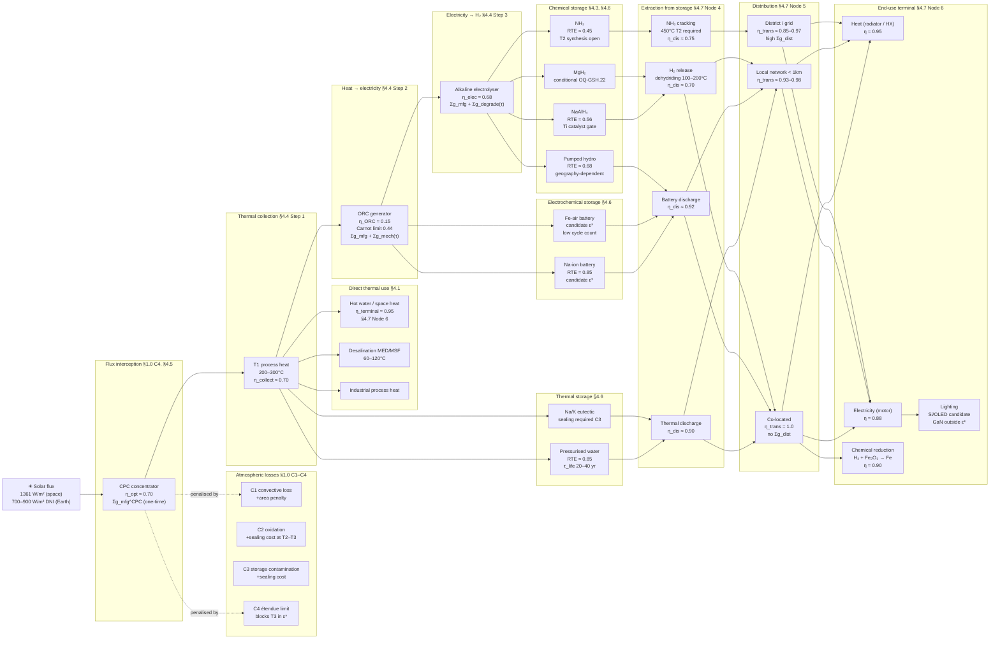
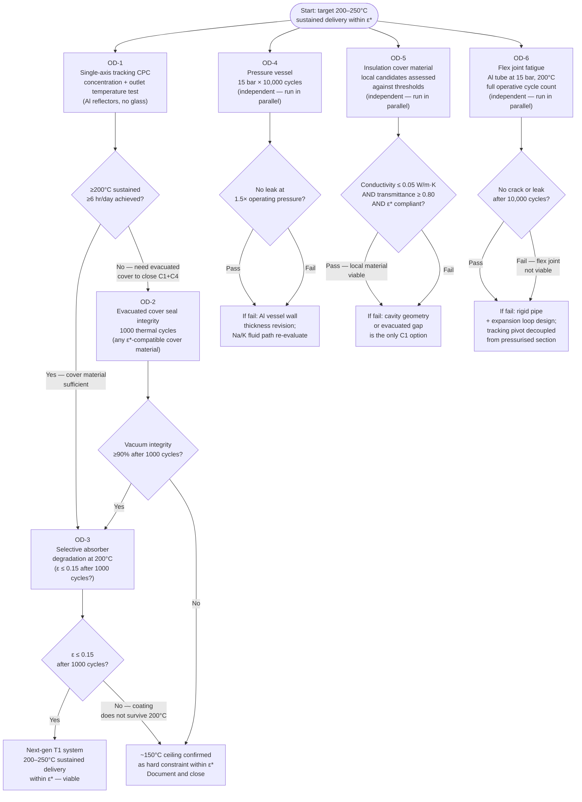

# Solar Thermal Loop Analysis — Earth Context

*Derived analysis staging document. Not a source document. Purpose: derive from the GSH framework (both documents) why T3 is disproportionately expensive on Earth relative to space, why T2 is the realistic ceiling for terrestrial $\mathcal{E}^*$ - constrained operation, and — critically — why the T1 sustained-delivery ceiling within $\mathcal{E}^*$ sits at ~150°C rather than the 300°C nominal figure. The 150°C finding is not commercially obvious: commercial solar collectors reach and exceed it using glass evacuation and steel structures that are outside $\mathcal{E}^*$. The derivation traces why four atmospheric constraints (§1.0 C1–C4) compound to produce this specific ceiling within $\mathcal{E}^*$ constraints, and what the GSH framework can and cannot claim below it. Candidate for addition to `geometric_sufficiency_hypothesis.md` §5 as a fourth Earth derivation example, or as a standalone linked appendix.*

*Both documents required: this analysis uses tier definitions and physical reactions from [geometric_sufficiency_hypothesis.md](geometric_sufficiency_hypothesis.md) H:§7 OQ-GSH.7 and cost accounting mechanisms from [GSH_mathematical_inventory.md](GSH_mathematical_inventory.md) M:§1.6, M:§3.1.*

---

## Assumed element set for this analysis

$\mathcal{E}^*$ membership is problem-specific and derived by the criteria hierarchy in H:§4. The Earth terrestrial context (H:§5 context variation table) yields the following working set for this analysis. This declaration is not a universal prescription — it is the set assumed throughout Sections 1–7 so that $\mathcal{E}^*$ references are self-contained for a reader who has not loaded the full hypothesis.

**Confirmed $\mathcal{E}^*$ — available throughout this analysis:**

| Element | Primary role in this analysis | Basis |
| :--- | :--- | :--- |
| Al | Reflector, absorber substrate, structure, pressure vessel, frame | High crustal abundance; self-passivating; recyclable; confirmed element_derivation_process.md |
| Si | SiC refractory, insulation ceramics, geopolymer component | High crustal abundance; stable; confirmed element_derivation_process.md |
| C | Reductant (T3 only); graphite components; geopolymer carbon phase | Confirmed H:§5; CO₂ recycling open at T3 (§1.0 C2) |
| H, O | Water (heat transfer fluid, electrolysis feedstock); H₂ energy carrier | Confirmed H:§5; Axiom III compliant |
| N | NH₃ synthesis (§4.3); atmospheric constituent | Confirmed H:§5 |
| Na, K | Na/K eutectic heat transfer fluid; NaAlH₄ storage; NH₃ via Haber-Bosch; geopolymer activation (alkali activator in Na/K-Al-Si binder system — no Ca required) | Confirmed H:§5 |
| Fe | Structural frame (short-τ, low-corrosion environments); iron-air battery anode | Conditional — $r_{\text{corr}}(\text{Fe})$ is deployment-fixed by environment (ISO 9223 data). The general inequality $\Sigma_g(\mathcal{G}, \tau) < \Sigma_s(\text{Fe}, \tau)$ determines inclusion; no classification gate applies. Axiom II note: corrosion products (Fe₂O₃/Fe₃O₄) must be recoverable within $\mathcal{E}^*$. *[→ H:§4 scope note; OQ-GSH.8]* |
| S | Electrolyte component (borderline); minor role | Crustal abundant; Axiom II assessment pending for specific process |

**Candidate / borderline — available for specific uses subject to identified open condition:**

| Element | Use in this analysis | Open condition | Where flagged |
| :--- | :--- | :--- | :--- |
| Cu | ORC generator windings; electrolyser contacts | Criterion 5 (extraction energy cost); on directed removal trajectory as Al/graphene conductors mature (element_derivation_process.md application examples) | §4.4, §4.6, §7.2 |
| Ni | Selective absorber (black Ni on Al); electrolyser catalyst; MgH₂ catalyst | Criterion 5 borderline; quantity-limited uses may be acceptable | §4.3, §7.2, §7.4 OD-3 |
| Ti | NaAlH₄ dehydriding catalyst | Trace quantity gate — OQ-GSH.15 class; kinetic requirement not thermodynamic | §4.3, §4.6 |
| Mg | MgH₂ solid-state H₂ storage | OQ-GSH.22 — $\mathcal{E}^*$ status unresolved; Mg processing energy cost under review | §4.3, §4.6 |
| Ag | Reflector coating (higher specular reflectance than Al) | Trace mass — acceptable if quantity is small; crustal scarcity at scale (element_derivation_process.md) | §7.2 |
| P | Na-ion battery cathode (NaFePO₄) | Criterion 5 borderline; phosphate mining energy cost | §4.6 |
| Ca | Roman cement / lime binder (pozzolanic concrete) — distinct from geopolymer | Calcination CaCO₃ → CaO + CO₂ requires ~900°C (T2); CO₂ product is Axiom II non-compliant within $\mathcal{E}^*$ unless CO₂ recovery loop demonstrated. Ca is not required for geopolymer (Na/K-Al-Si system). Roman cement is a separate material with a separate T-tier gate. | §1.2 T2 |

**Excluded — appear in commercial products for this application but outside $\mathcal{E}^*$:**

| Material / element | Commercial use | Exclusion basis |
| :--- | :--- | :--- |
| Glass (borosilicate) | Evacuated tube collector cover; parabolic mirror substrate | Composite — B (Criterion 1 abundance) fails; manufacturing energy non-recoverable from ambient flux |
| Steel (Fe + Cr + Ni alloys) | CPC structure, absorber tube | Cr fails Criterion 4 (Axiom II — Cr⁶⁺ compounds toxic, not recyclable at ambient flux) |
| Synthetic heat transfer fluid (Therminol, glycol) | High-temp HTF loop | Petrochemical origin; Axiom II non-compliant (CO₂ product) |
| Li | LiBr-H₂O absorption chiller | Criterion 1 (crustal abundance insufficient at scale); excluded from this analysis explicitly (§4.1) |
| Pb | Lead-acid battery | Criterion 4 — toxic; Axiom II non-compliant at scale |
| Rare earths (Ce, La, Nd…) | Permanent magnets; some catalysts | Criterion 1 (abundance); Criterion 4 (processing waste) |
| Pt, Ir | PEM electrolyser catalyst | Criterion 1 (trace abundance insufficient at scale for this application); PEM excluded; alkaline electrolyser with Ni is the $\mathcal{E}^*$ path |
| TiNOx, black chrome cermet | Selective absorber coating | Ti/Cr synthesis route outside $\mathcal{E}^*$; excluded in favour of black Ni on Al (candidate) |
| Portland cement / lime (CaO-based) | Structural binder | Calcination at 900–1450°C — T2/T3 gate; CO₂ product not recyclable within $\mathcal{E}^*$ alone; Ca is borderline not confirmed (see candidate table) |

*Geopolymer chemistry note: "geopolymer" in this analysis refers strictly to the alkali-activated aluminosilicate system — Si-O-Al network, activated by NaOH or Na₂SiO₃ (Na, Si, Al, O — all confirmed $\mathcal{E}^*$), cured at ambient to ~80°C (within T1). This is chemically distinct from Roman cement (Ca-based pozzolanic binder, T2 lime production), Portland cement (Ca-silicate hydrates, T3 kiln), and geopolymer composites that incorporate Ca-rich fly ash. When this document references geopolymer synthesis, it means the Na/K-Al-Si system only.*

*Notation used throughout: (within $\mathcal{E}^*$) means confirmed or candidate in the table above. (Outside $\mathcal{E}^*$) means excluded. "Borderline" or "candidate" means the element is in the second table — available for the specific use noted, subject to the stated open condition.*

**Known material capability gaps in the current $\mathcal{E}^*$ element set:**

Two design requirements have no confirmed $\mathcal{E}^*$ solution at current technology readiness. These are stated upfront because they are the reason commercial systems use steel and copper — not acknowledging them would misrepresent the difficulty of the $\mathcal{E}^*$-constrained design programme.

| Gap | Requirement | Current $\mathcal{E}^*$ candidates | Shortfall | Commercial solution (outside $\mathcal{E}^*$) |
| :--- | :--- | :--- | :--- | :--- |
| **High-strength flexible tubing** | Pressure-bearing tube that flexes under thermal cycling and mechanical movement without fatigue cracking — required at tracking pivot joints, storage tank connections, expansion loops | Al alloy tube (ductile but limited fatigue life at 15 bar + daily thermal cycling); SiC tube (brittle — cannot flex) | No $\mathcal{E}^*$ elastomer or high-temperature polymer exists; Al fatigues at repeated flex under pressure; rigid pipe with sufficient expansion loops adds Σg but avoids flex entirely | Stainless steel flex hose (Fe-Cr-Ni, excluded); copper soft tube (borderline — softer, but temperature-limited); PTFE bellows (excluded) |
| **High tensile strength at large span** | Long structural members resisting wind and gravity load at shared-plant scale (2000–3000 m² aperture, §4.1) without excessive deflection | Al (wrought, structural grade): sufficient at household scale; geopolymer beam: compressive only, low tensile; SiC: high compressive strength, brittle in tension | At shared-plant span lengths, Al approaches deflection limits without steel reinforcement; geopolymer cannot substitute for tensile members; requires either more Al mass or revised geometry | Galvanised steel (Fe-Zn, excluded at scale); carbon fibre (C in $\mathcal{E}^*$ as element but CFRP manufacturing route uses epoxy — outside $\mathcal{E}^*$) |

**Scale dependency of these gaps:**

- **Household scale** (12–18 m², §4.5): Al is sufficient for both roles. Neither gap is operative — short spans, low loads, flex joints can be avoided with expansion loops in rigid Al tube.
- **Shared-plant scale** (50–600 m², §4.1): tensile gap begins to constrain span geometry; flex gap is operative at tracking pivot joints (§7.4 OD-1 and OD-4). Not blocking but increases Σg and constrains geometry choices.
- **Next-gen tracking CPC** (§7): the tracking pivot and drive mechanism introduces daily flex cycling at pressure — the flex gap is directly operative here. OD-4 (pressure vessel cycling test) partially addresses this but does not cover the flex joint specifically. An explicit flex joint fatigue test is a missing OD.

**These gaps are not concealed by the $\mathcal{E}^*$ framework** — they are precisely what the framework surfaces. The commercial solution (steel + copper) is excluded not arbitrarily but because Cr (in stainless steel) fails Criterion 4 (Cr⁶⁺ compounds are toxic and not recoverable from ambient flux) and PTFE fails Axiom II. The design programme in §7 is partly an investigation of whether geometry — avoiding flex, shortening spans, adding expansion loops — can route around these gaps without the excluded materials.

*Note on organic and natural fibre composites:* elements C, H, O, N are all within $\mathcal{E}^*$ and organic/natural fibre composites (plant fibres, lignin-derived carbon fibre, basalt fibre) address the tensile and flexibility gaps for structural frame roles at ambient temperature. The pressure tube role at 200°C is above the steam degradation threshold for most organic fibres — this boundary separates which gap each material class can close. The threshold is a physics constraint, not a $\mathcal{E}^*$ constraint; a designer assessing local fibre candidates should apply it before testing against §7.2 pressure vessel thresholds.

---

## Bootstrap Tier definitions

Bootstrap Tiers (BT1–BT4) decompose the $\mathcal{E}^*$ self-sufficiency condition into independently-testable capability stages. Each tier has standalone confirmation value regardless of whether higher tiers are attempted. Transitional materials outside $\mathcal{E}^*$ — industrial refractory, Teflon seals, existing tooling — are legitimate inputs to the proto-bootstrap with computable $\Sigma_s$ from standard exergy tables. They are not framework violations: $\mathcal{E}^*$ membership criteria apply to the end-state operating system, not to the construction phase.

- **BT1 ( $\sim 200\text{--}300^\circ\mathrm{C}$):** Can a non-tracking CPC geometry using $\mathrm{Al/Ag}$ reflectors intercept solar flux and deliver heat to an unconstrained thermal load within $\mathcal{E}^*$? CPC geometry here functions as a *concentrating* device — routing flux inward to a thermal load. Note: the same cavity geometry class also functions in the inverse role of *gradient containment* — restricting IR escape angles outward to minimise thermal loss; these are distinct geometric problems sharing a component class. Confirms Axiom III is operable at the lowest useful thermal threshold. Already physically competitive with fossil-fuel alternatives.

- **BT2 ( $600\text{--}1000^\circ\mathrm{C}$):** Can geopolymer synthesis ( $\mathrm{Al-Si-O-Na-K}$) and $\mathrm{Al}$ structural casting be driven by concentrated solar, with $\mathrm{Na/K}$ as the heat-transfer medium? Confirms the low-complexity $\mathcal{E}^*$ structural and functional loop closes. $\mathrm{Na}$/$\mathrm{K}$ in geopolymer activation is consumed as alkali hydroxide/silicate (bound into structural matrix) — distinct from the metallic eutectic heat-transfer stream; BT2 operation requires separation of these two chemically incompatible inventories, adding to $\Sigma_g$ and the minimum energy-return threshold; Axiom II closure on the geopolymer-bound fraction is a BT4 decommissioning item, not a BT2 operational requirement.

- **BT3 ( $1400\text{--}1700^\circ\mathrm{C}$):** Can carbothermic reduction of $\mathrm{SiO}_2$ ( $\mathrm{SiO}_2 + 2\mathrm{C} \rightarrow \mathrm{Si} + 2\mathrm{CO}$, spontaneous above $\sim 1500^\circ\mathrm{C}$) produce semiconductor-grade $\mathrm{Si}$ using $\mathcal{E}^*$ members alone? Confirms the primary logic substrate is synthesisable from abundant oxides within $\mathcal{E}^*$.

- **BT4 ( $>2000^\circ\mathrm{C}$):** Can carbothermic reduction of $\mathrm{Al}_2\mathrm{O}_3$ ( $\mathrm{Al}_2\mathrm{O}_3 + 3\mathrm{C} \rightarrow 2\mathrm{Al} + 3\mathrm{CO}$, feasible above $\sim 2000^\circ\mathrm{C}$) close the Axiom II recycling loop for structural elements, and can $\mathrm{SiC}$ refractory structures be sintered natively? The carbothermic route proceeds via $\mathrm{Al}_4\mathrm{C}_3$ as a stable intermediate above $\sim 1400^\circ\mathrm{C}$; suppression to pure $\mathrm{Al}$ requires controlled $\mathrm{CO}$ atmosphere or arc furnace conditions — neither is available without additional process control in an open solar concentrator geometry, and Hall-Héroult fluorine chemistry is outside $\mathcal{E}^*$. Confirms the self-sufficiency condition (Axioms II + III combined). BT4 is the original binary bootstrap question; BT1–BT3 are its decomposition into stages that are independently valuable. *Gradient Locality sub-condition:* deferred-gradient compliance holds when all three conditions (system-scope interception, Axiom II recyclability, live gradient relationship within $\tau_{\mathrm{storage}}$) are satisfied. *[→ `geometric_sufficiency_hypothesis.md` H:§2 Axiom III Gradient Locality]*

---

## Framework

OQ-GSH.7 decomposes the bootstrap loop question into four tiers by achievable temperature:

| Tier | Temperature | Primary process | Earth status |
| :--- | :--- | :--- | :--- |
| T1 | 200–300°C | Non-tracking CPC, solar thermal delivery | Commercially deployed |
| T2 | 600–1000°C | Geopolymer synthesis, Al casting, Na/K heat transfer | Research problem — demonstrated with imaging concentrators (parabolic trough/tower) outside $\mathcal{E}^*$; not yet demonstrated within $\mathcal{E}^*$ CPC constraints |
| T3 | 1400–1700°C | Carbothermic SiO₂ reduction → Si | Fundamental physics challenges on Earth; efficient alternative is T1 → H₂ electrolysis path |
| T4 | >2000°C | Carbothermic Al₂O₃ reduction → Al; SiC sintering | Not demonstrated without arc furnace |

The question is: why does T3 represent a qualitatively different cost boundary on Earth compared to T2, and why is the T1 → H₂ electrolysis path the more efficient Earth route than the direct heat path?

---

## Section 1 — Cost structure at each tier

### 1.0 Atmospheric constraints: four independent mechanisms

Earth's atmosphere imposes four independent physical constraints on solar thermal systems within $\mathcal{E}^*$. Each constraint attacks a different component of the $\Sigma_g$ accounting. In space (vacuum), all four vanish simultaneously — this is the precise content of the Earth/space asymmetry, not a vague claim that space is "easier."

#### C1 — Heat dissipation: convective and conductive losses

A receiver at temperature $T_\text{rec}$ in atmospheric air loses heat continuously via convection:

$$\dot{Q}_\text{conv} = h \cdot A \cdot (T_\text{rec} - T_\text{amb})$$

where $h$ is the convective heat transfer coefficient (roughly $10$–$50\ \text{W}\cdot\text{m}^{-2}\cdot\text{K}^{-1}$ in still air; higher under wind). At $T_\text{rec} = 800°C$, $T_\text{amb} = 25°C$, $A = 1\ \text{m}^2$: $\dot{Q}_\text{conv} \approx 8$–$40\ \text{kW}$ — continuously.

In space (vacuum): $h = 0$. The only heat loss is radiation, bounded by the Stefan-Boltzmann law and partially recoverable by cavity geometry. Convective loss is absent by definition.

**$\Sigma_g$ consequence:** Convective loss requires larger collector area to reach the same process temperature — increasing $\Sigma_{g,\text{mfg}}$ for the concentrator. The loss scales linearly with temperature difference, so it compounds at T2 and T3 relative to T1.

---

#### C2 — Material chemical reactions: atmosphere consumes $\mathcal{E}^*$ materials

Above ~400°C, Earth's O₂/N₂ atmosphere reacts with the primary $\mathcal{E}^*$ structural and reductant materials:

| Material | Reaction | Temperature | Consequence |
| :--- | :--- | :--- | :--- |
| C (reductant) | $\text{C} + \text{O}_2 \to \text{CO}_2$ | Any temperature in O₂ | Consumes the reductant — Axiom II violation: CO₂ not recyclable within $\mathcal{E}^*$ alone |
| SiC (refractory) | $\text{SiC} + \frac{3}{2}\text{O}_2 \to \text{SiO}_2 + \text{CO}$ | Above ~1200°C | Degrades the refractory ceiling material in the regime where it is needed most |
| Al (structural) | $2\text{Al} + \frac{3}{2}\text{O}_2 \to \text{Al}_2\text{O}_3$ | Self-passivating at low $T$ | Passivation layer fails under thermal stress cycling at T2–T3 |

These are not slow degradation effects — at T3 temperatures, C oxidation in the presence of oxygen proceeds at rates that consume the material on the timescale of a reaction cycle. The atmosphere turns $\mathcal{E}^*$ structural and reductant materials into consumables.

**P7 AND gate:** These reactions must be simultaneously prevented (sealed atmosphere) AND the sealing infrastructure must itself be within $\mathcal{E}^*$ and subject to Axiom II. Both conditions must hold.

In space (vacuum): no O₂, no N₂. C and SiC are stable. Al remains passivated without thermal stress from atmospheric convection.

**$\Sigma_g$ consequence:** Sealed reaction environment adds $\Sigma_{g,\text{CO-mgmt}}$ and $\Sigma_{g,\text{sealing}}$ — discrete new terms absent at T1.

---

#### C3 — Heat storage: atmosphere as contaminant

High-temperature thermal storage in $\mathcal{E}^*$ requires Na/K eutectic (melting point ~−12°C, usable to ~800°C). Na and K react with atmospheric O₂ and N₂:

$$4\text{Na} + \text{O}_2 \to 2\text{Na}_2\text{O} \quad \text{(vigorous above 100°C)}$$
$$2\text{Na} + \text{N}_2 \to \text{Na}_3\text{N} \quad \text{(at elevated temperature)}$$

The storage medium degrades on contact with atmosphere. A large-scale Na/K thermal storage system must be hermetically sealed from atmosphere at all times — including during filling, maintenance, and emergency venting. This is the same containment problem as CO management at T3, applied to the storage infrastructure. The two problems compound if both are present in the same system.

Alternative thermal storage (molten salt — Na/K nitrates) decomposes above ~600°C releasing NO₂ — outside $\mathcal{E}^*$ and Axiom II non-compliant. There is no high-temperature thermal storage medium within $\mathcal{E}^*$ that is atmosphere-compatible above ~500°C.

In space: Na/K can be stored in open reservoirs at T1–T2 operating temperatures. No sealing against atmosphere required.

**$\Sigma_g$ consequence:** Sealed storage infrastructure adds a persistent maintenance entropy term $\Sigma_{g,\text{storage-seal}}(\tau)$ — a rate term, not a one-time manufacturing cost, because seal integrity must be maintained for the full operational lifetime $\tau$.

---

#### C4 — Optical concentration: atmosphere limits usable flux

Direct Normal Irradiance (DNI) is the only usable fraction for high-concentration solar. On Earth in good locations, DNI ≈ 700–900 W/m²; the remainder is diffuse — scattered by atmospheric particles and water vapour — and cannot be concentrated by any focusing geometry.

The theoretical maximum concentration ratio for a non-imaging 2D concentrator on Earth is:

$$C_\text{max,2D} = \frac{1}{\sin^2 \theta_s} \approx 46000$$

- $\theta_s \approx 0.27°$ — solar half-angle (angular radius of the solar disc as seen from Earth); sets the étendue limit for any concentrating geometry

where $\theta_s \approx 0.27°$ is the solar half-angle. This is a fundamental optical limit (étendue conservation), not a technology limit. In practice, atmospheric turbulence, mirror surface imperfections, and structural deflection under wind reduce achievable $C$ to:

| Concentrator type | Practical $C$ (Earth) | $\mathcal{E}^*$ compatible? |
| :--- | :--- | :--- |
| Non-tracking CPC | $C \sim 1$–$10$ | Yes — Al reflectors |
| Tracking CPC | $C \sim 10$–$100$ | Candidate — research problem |
| Parabolic trough (imaging) | $C \sim 70$–$100$ | No — glass mirrors, steel structure |
| Parabolic dish (imaging) | $C \sim 1000$–$3000$ | No — glass mirrors, steel structure |
| Central tower + heliostats (imaging) | $C \sim 300$–$1000$ | No — glass mirrors, steel structure |

T3 requires $C > 1000$. Within $\mathcal{E}^*$, non-imaging CPC at $C \sim 10$–$100$ is the demonstrated (or candidate) geometry. The gap between achievable $\mathcal{E}^*$ concentration and T3-required concentration is one to two orders of magnitude — not a refinement of existing technology but a geometry class change.

In space: no atmospheric scattering, no diffuse component. DNI ≈ 1361 W/m² (full solar constant) is entirely direct. A passive non-imaging reflector achieves T3 temperatures with a much smaller collector area.

**$\Sigma_g$ consequence:** Higher required $C$ on Earth means larger collector area per unit process output — directly increasing $\Sigma_{g,\text{mfg}}^{T3}$ per unit of useful heat delivered.

---

#### Summary: four constraints and which tier each bites

| Constraint | T1 impact | T2 impact | T3 impact |
| :--- | :--- | :--- | :--- |
| C1 — convective loss | Negligible (low $\Delta T$) | Moderate (increases collector area) | Significant (large $\Delta T$, forced convection) |
| C2 — material oxidation | Negligible (passivation holds) | Moderate (selective absorber degradation) | Severe (C and SiC consumed; sealing required) |
| C3 — storage contamination | Minor (low-T storage viable) | Significant (Na/K sealing required) | Severe (storage sealing + reaction sealing compound) |
| C4 — optical concentration | None (T1 is low-$C$) | Significant (T2 requires $C \sim 100$, undemonstrated in $\mathcal{E}^*$) | Blocking (T3 requires $C > 1000$, outside $\mathcal{E}^*$ geometry class) |

No single constraint makes T3 impossible on Earth. All four together make it a fundamentally different research programme from T1 and T2 — requiring not incremental improvement but simultaneous resolution of four independent physics-adjacent engineering problems, each of which is absent in space.

---

### 1.1 T1 — passive concentrator regime

**Geometry:** Non-tracking CPC. Fixed installation, no moving parts. Energy barrier $E_b \gg k_B T$ — purely passive structure.

**Operative $\Sigma_g$ form (M:§1.6 passive regime):**

$$\Sigma_g^{T1} = \Sigma_{g,\text{mfg}}^{T1} = \frac{W_{\text{irreversible,fab}}^{T1}}{T_0^{\text{fab}}}$$

Manufacturing entropy only — no maintenance term. $W_{\text{irreversible,fab}}^{T1}$ is the exergy of Al sheet forming and surface finishing for the CPC reflectors (Gutowski 2009 data). One-time cost, amortised over $\tau$.

**Earth atmospheric penalty:** Minimal. CPC operates at below-boiling temperatures. Oxidation of Al reflector surface is self-limiting (Al₂O₃ passivation layer — $r_{\text{corr}}(\text{Al}) \approx 0$ at T1 operating temperatures; corrosion contribution to $\Sigma_s(\text{Al}, \tau)$ is negligible in this context). No containment of reaction products required.

**Computability: T1.** $\Sigma_{g,\text{mfg}}$ computable from Gutowski machining data and Szargut exergy tables. $\Sigma_s(\text{Al}, \tau)$ computable from M:§3.1 chain.

---

### 1.2 T2 — tracking concentrator + process heat regime

**Geometry:** Linear parabolic trough or high-concentration CPC with selective absorber. Tracking required for >600°C. Moving parts — mechanical maintenance gap (OQ-GSH.23) applies but at low cycle frequency.

Critical distinction — current technology vs $\mathcal{E}^*$-constrained technology:

Current commercial solar thermal at T2 temperatures (parabolic trough, central tower) uses imaging concentrators — large glass mirrors with silicone coatings, steel support structures, and synthetic heat-transfer fluids — none of which are within $\mathcal{E}^*$. The T2 claim in OQ-GSH.7 is that CPC geometry using Al/Ag reflectors within $\mathcal{E}^*$ *could* reach T2 temperatures. This is not yet demonstrated at engineering scale within the $\mathcal{E}^*$ constraint. T2 is a long research problem, not a demonstrated capability.

The gap between current commercial T2 (outside $\mathcal{E}^*$) and $\mathcal{E}^*$-constrained T2 includes:
- CPC optical efficiency at high concentration ratios without imaging optics — reflectance losses accumulate at each reflection; non-imaging CPC requires multiple reflections to achieve high concentration
- Al reflector degradation under outdoor weathering at $600$–$1000°C$ operating conditions — Al₂O₃ passivation holds at ambient temperature but the selective absorber coating (cermet) must survive thermal cycling in this range
- Na/K eutectic loop compatibility with Al/SiC piping at T2 pressures — not yet validated at scale

**Operative $\Sigma_g$ form:**

$$\Sigma_g^{T2} = \Sigma_{g,\text{mfg}}^{T2} + \Sigma_{g,\text{mech}}^{T2}(\tau)$$

where $\Sigma_{g,\text{mech}}^{T2}$ is the mechanical maintenance entropy from tracking drive fatigue over $\tau$ (wear term: $\int_0^\tau F_f(t) \cdot v(t) / T_0\, dt$ per M:§1.6 OQ-GSH.23).

**Earth atmospheric penalty:** Moderate. Selective absorber coatings require oxidation-resistant design. No reaction byproducts requiring atmospheric isolation.

**Key T2 constraint noted in H:§7 OQ-GSH.7 T2:** Na/K in geopolymer activation is consumed as alkali hydroxide/silicate (bound into structural matrix) — chemically incompatible with the metallic Na/K eutectic heat-transfer stream. T2 operation requires separation of two chemically incompatible Na/K inventories, adding to $\Sigma_g$ and the EROI threshold.

**Computability:** $\Sigma_{g,\text{mfg}}^{T2}$ computable at dominance level; $\Sigma_{g,\text{mech}}^{T2}$ requires fatigue data for specific geometry (OQ-GSH.23 — conservative underestimate if omitted). T2 within $\mathcal{E}^*$ is a research problem, not a T1-computable confirmed output.

---

### 1.3 T3 — carbothermic reduction regime

**Geometry:** High-concentration dish or tower. Requires concentration ratio $C > 1000$ suns for 1500°C. Tracking precision required. Operating at the SiC refractory ceiling.

**T3 introduces three independent $\Sigma_g$ cost components not present at T2:**

---

**Cost component 1 — CO atmosphere management infrastructure**

The T3 reaction is:

$$\text{SiO}_2 + 2\text{C} \to \text{Si} + 2\text{CO} \quad \text{(spontaneous above} \sim 1500°C\text{)}$$

CO is toxic and flammable. On Earth at atmospheric pressure, operating this reaction in an open solar concentrator geometry is not feasible — CO accumulates and must be actively managed. The BT4 definition above (§1) states this explicitly: *"suppression to pure Al requires controlled CO atmosphere or arc furnace conditions — neither is available without additional process control in an open solar concentrator geometry."* The same constraint applies at T3 for the SiO₂ reaction.

CO management requires a sealed reaction chamber, CO recovery loop, and pressure control — none of which is required at T1 or T2. This is a discrete step-change in $\Sigma_g$:

$$\Sigma_g^{T3} = \Sigma_{g,\text{mfg}}^{T3} + \Sigma_{g,\text{CO-mgmt}}^{T3} + \Sigma_{g,\text{mech}}^{T3}(\tau)$$

$\Sigma_{g,\text{CO-mgmt}}^{T3}$ is not present at T1 or T2. It is the manufacturing and maintenance entropy of the sealed reaction chamber and CO handling loop — a qualitatively new infrastructure term.

**Type check (P7 — AND gate):** CO management satisfies Axiom II (CO is recoverable within $\mathcal{E}^*$ via Boudouard cycle: CO + C → 2CO reversed, or oxidation to CO₂ + carbothermic reduction). But both the thermodynamic condition *and* the kinetic condition must hold. CO recovery kinetics at T3 operating cycle frequencies is an open condition (OQ-GSH.15 class). The thermodynamic gate passes; the kinetic gate is unresolved.

**In space (vacuum):** CO disperses naturally. No sealed chamber required. $\Sigma_{g,\text{CO-mgmt}}^{T3} = 0$. This is the single largest Earth vs space $\Sigma_g$ differential at T3.

---

**Cost component 2 — atmosphere-compensating concentrator geometry requires imaging optics**

At T3 (1400–1700°C), achieving concentration ratio $C > 1000$ suns on Earth requires compensating for:

- Atmospheric scattering — diffuse fraction of solar flux is unusable for high-concentration work; direct normal irradiance (DNI) only is usable
- Water vapour absorption bands — reduce available spectral flux
- Convective heat loss from receiver at high temperature in atmospheric pressure

Non-imaging CPC geometry reaches concentration ratios of roughly $C_{\max} = 1/\sin^2\theta_s \approx 46000$ for a 2D trough under ideal conditions, but practical non-imaging designs with finite acceptance angle and surface imperfections achieve far lower — commercial non-imaging concentrators typically reach $C \sim 10$–$100$. Reaching $C > 1000$ suns on Earth requires imaging optics (parabolic dish, central tower with heliostat field) — both of which are outside $\mathcal{E}^*$ as currently demonstrated (glass mirrors, steel structures, synthetic coatings).

This means T3 on Earth within $\mathcal{E}^*$ is blocked not just by CO management but by a fundamental optical geometry constraint: the concentrator class that reaches T3 temperatures (imaging) is different from the concentrator class within $\mathcal{E}^*$ (non-imaging CPC). This is a third independent new cost — or more precisely, a new geometry class with its own $\Sigma_{g,\text{mfg}}$ that has not been demonstrated within $\mathcal{E}^*$.

$$\Sigma_g^{T3} = \Sigma_{g,\text{mfg}}^{T3} + \Sigma_{g,\text{CO-mgmt}}^{T3} + \Sigma_{g,\text{imaging-optics}}^{T3} + \Sigma_{g,\text{mech}}^{T3}(\tau)$$

In space (vacuum): CO disperses, no atmospheric scattering, no convective loss. A non-imaging passive reflector can reach T3 temperatures with a much smaller collector — $\Sigma_{g,\text{CO-mgmt}}$ and $\Sigma_{g,\text{imaging-optics}}$ both collapse to zero.

**$T_0$ context mismatch (M:§1.6 OQ-GSH.19):** If the T3 concentrator is manufactured on Earth (where $T_0^{\text{fab}} = 298\ \text{K}$) and deployed in space (where $T_0^{\text{deploy}} \approx 250\ \text{K}$), the dominance test uses:

$$\Sigma_{g,\text{mfg}}^{\text{deploy}} = \Sigma_{g,\text{mfg}}^{\text{fab}} \cdot \frac{T_0^{\text{fab}}}{T_0^{\text{deploy}}} = \Sigma_{g,\text{mfg}}^{\text{fab}} \cdot \frac{298}{250} \approx 1.19 \cdot \Sigma_{g,\text{mfg}}^{\text{fab}}$$

A 19% upward correction on manufacturing entropy when normalising to deployment context. This applies to T3 Earth-manufactured concentrators deployed in space — but the reverse direction (space-manufactured concentrators deployed on Earth) does not arise in this analysis.

---

### 1.4 T4 — full Al recovery regime

T4 (>2000°C) adds a third independent cost jump: the carbothermic Al₂O₃ route requires:

$$\text{Al}_2\text{O}_3 + 3\text{C} \to 2\text{Al} + 3\text{CO} \quad \text{(feasible above} \sim 2000°C\text{)}$$

with the additional constraint that the $\text{Al}_4\text{C}_3$ intermediate above ~1400°C must be suppressed to yield pure Al — requiring controlled CO atmosphere or arc furnace conditions. T4 is explicitly outside current $\mathcal{E}^*$ Earth capability without W infrastructure (Challenge C, H:§6).

T4 is not the analysis target here — it is noted to confirm that T3 → T4 is a third independent cost jump, not an incremental step from T3.

---

## Section 2 — Term-count cost comparison

The three tiers form a staircase, not a gradient:

| Transition | New $\Sigma_g$ terms introduced | Nature of jump |
| :--- | :--- | :--- |
| T1 → T2 | Tracking mechanism $\Sigma_{g,\text{mech}}$; Na/K inventory separation; CPC-within-$\mathcal{E}^*$ not yet demonstrated | Long research problem — same geometry class but $\mathcal{E}^*$ constraint undemonstrated |
| T2 → T3 | CO management infrastructure; imaging optics requirement (outside current $\mathcal{E}^*$); atmosphere-compensating collector area | Discrete — three independent new terms; imaging optics is a geometry class change |
| T3 → T4 | Al₄C₃ intermediate suppression; arc furnace alternative | Discrete — outside current $\mathcal{E}^*$ without W |

The T2→T3 transition is qualitatively different from T1→T2 because it introduces two *independent* new cost terms simultaneously. Either alone would make T3 more expensive than T2. Together they compound.

This observation follows from term count and term type alone — no $\Sigma_g$ magnitude is required. The inventory's passive regime scope condition (M:§1.6) and the hypothesis's CO management note (H:§7 OQ-GSH.7) are the two sources; no open condition is required.

---

## Section 3 — Earth vs space differential, per tier

| Tier | Earth $\Sigma_g$ extra terms vs space | Direction |
| :--- | :--- | :--- |
| T1 | Oxidation protection for Al reflectors (self-limiting) | Negligible — passivation is self-managing |
| T2 | Selective absorber coating maintenance; Na/K inventory separation | Small — engineering solution within $\mathcal{E}^*$ |
| T3 | CO management infrastructure; atmosphere-compensating collector area | Large — two discrete new terms, no space analogue |
| T4 | Al₄C₃ intermediate suppression; arc furnace alternative | Very large — outside current Earth $\mathcal{E}^*$ without W |

The Earth / space $\Sigma_g$ gap grows non-linearly with tier. T1 and T2 are achievable on Earth with modest overhead. T3 and T4 are structurally more expensive on Earth than in space — not because the reactions are different, but because the atmosphere creates containment and concentration requirements that don't exist in vacuum.

---

## Section 4 — T1 as the efficient Earth path; T2 as the long research problem

The full chain from solar flux to end-use has seven distinct nodes. The diagram below maps the chain, showing branch points, η losses at each conversion step, storage entry/exit points, and the distribution configuration options. Each node label references the subsection that covers it. Use this diagram as a completeness audit: any gap in coverage will appear as a node without a section reference.

*Dashed edges show atmospheric penalty paths — they increase required collector area and Σg_mfg but do not break the chain. All solid edges are energy-carrying paths. RTE = round-trip efficiency including charge and discharge. η values are mid-range estimates from §4.4 and §4.6 tables.*

**Reading the diagram as a coverage audit:** every subsection in Section 4 corresponds to one or more subgraphs. Sections §4.8–§4.11 are cross-cutting modifiers on the chain rather than new nodes — they are indexed below:

| Section | What it modifies in the chain | Type |
| :--- | :--- | :--- |
| §4.8 Geographic applicability | Scales $A_\text{required}$ and storage requirement by location DNI; changes storage form at polar latitudes | Multiplier on COLLECT and TSTOR nodes |
| §4.9 Disaster resilience | Replaces deterministic τ with τ_eff = f(λ_d) across all nodes | τ-correction on entire chain |
| §4.10 Tucson vs Portland | Instantiates §4.8 multiplier for two specific locations | Numeric instance of §4.8 |
| §4.11 Worked trace | Closes the chain numerically for Tucson DHW: τ* = 6.988 days, margin 522.3–2612× | T1-computable instance |

**Reading the diagram as a path-choice tool:** the shortest path (fewest nodes) from SUN to any end-use node is always the lowest $\Sigma_g$ path. Co-located direct thermal (SUN → CPC → THERM → DHW → HEAT_OUT) has 4 nodes and η ≈ 0.67. The longest path (SUN → CPC → ORC → ELEC → NH₃ → EXT_NH₃ → GRID → ELEC_OUT) has 8 nodes and η ≈ 0.03. The complexity is justified only when the output has no shorter-path substitute.

---

### 4.1 T1 — what is already deliverable

The framework derives a practical sustained-delivery ceiling of ~150°C for non-imaging CPC within $\mathcal{E}^*$ from four compounding atmospheric constraints (§1.0 C1–C4). This ceiling is not obvious from commercial product specifications — commercial evacuated-tube collectors reach and exceed it using glass evacuation outside $\mathcal{E}^*$. The utilities below that ceiling are commercially well-known; the derivation establishes *which of them are accessible within $\mathcal{E}^*$* and *why the ceiling sits where it does*, so the GSH dominance test can be applied to specific elements with a defensible operative temperature range.

The contraction from T2 (1000°C claimed in OQ-GSH.7) → T1 nominal (300°C) → ~150°C sustained delivery ceiling → priorities 1–9 below is not a failure of the analysis — it is the analytical result. The GSH loop-closure claim for T1 is scoped to what the framework can actually derive, not to what commercial literature nominally attributes to "solar thermal."

T1 (60–300°C, non-tracking CPC, within $\mathcal{E}^*$) covers a wide band of useful outputs. The band is not a single operating point — each temperature threshold unlocks a distinct utility set. The efficient Earth path does not require T2 or T3 for most applications.

**Important distinction — point heat vs sustained useful heat delivery:** the T1 ceiling of 300°C refers to temperatures achievable in demonstrations (parabolic dish focal point, evacuated tube stagnation). *Sustained useful heat delivery* — stable process temperature across a useful absorber area, delivered to a working fluid loop continuously — is a harder constraint. Within $\mathcal{E}^*$ using non-imaging CPC geometry, the current practical ceiling for sustained delivery is approximately **150°C**. Above this threshold, four compounding problems arise: convective loss at high ΔT requires insulation or evacuation (glass — outside $\mathcal{E}^*$); selective absorber coatings degrade under thermal cycling above ~250°C; water as heat-transfer fluid requires pressure vessels above 15 bar at 200°C; and non-imaging CPC concentration is insufficient to overcome these losses at scale. Priorities above 150°C in the tables below are marked accordingly.

---

**Temperature-banded utility map**

| Temperature band | Utilities accessible | Notes |
| :--- | :--- | :--- |
| 40–60°C | Pool / greenhouse / aquaculture heating | Unglazed bare Al CPC — no selective absorber required |
| 60–80°C | Domestic hot water; space heating (underfloor, low-temp radiator); food drying; pasteurisation | Largest global thermal demand segment; non-tracking CPC sufficient |
| 75–95°C | Single-effect NH₃-H₂O absorption cooling (COP 0.5–0.7); MED desalination first effect | Cooling from heat — see absorption cooling below |
| 80–120°C | Industrial process heat (food, textile, pulp/paper); MSF desalination; low-pressure steam sterilisation | Wide industrial band — highest fossil boiler displacement value |
| 100–150°C | NH₃-H₂O single-effect upper range; low-pressure ORC ( $\eta \approx 0.08$–$0.12$); pressurised water storage at full T1 capacity; NaAlH₄ dehydriding | ORC electricity generation begins above ~120°C. **~150°C is the current sustained-delivery ceiling within $\mathcal{E}^*$** — upper bound of what non-imaging CPC can hold against convective loss without glass evacuation |
| 140–165°C | Double-effect NH₃-H₂O absorption cooling (COP 0.9–1.2); improved ORC ( $\eta \approx 0.12$–$0.18$) | **Above sustained-delivery ceiling** — achievable in demonstration; sustained loop delivery at this band requires tracking CPC or glass evacuation, neither within $\mathcal{E}^*$ as demonstrated |
| 180–250°C | High-pressure steam; NaOH production; soap making; advanced ORC | **Point-heat demonstrated; sustained useful delivery unsolved within $\mathcal{E}^*$** — pressure vessel at 15–40 bar; selective absorber degradation; concentration gap from non-imaging CPC |
| 250–300°C | Upper T1 ceiling; geopolymer curing (partial); upper NaAlH₄ dehydriding margin | **Point-heat only** — parabolic dish focal demonstrations; no sustained area-heat delivery within $\mathcal{E}^*$ at this temperature |

---

**Absorption cooling — phase-change cooling from heat input**

Absorption cooling uses heat as the driving energy to produce a cooling effect. In summer at Tucson or other high-DNI locations, space heating demand is near zero — the CPC aperture would otherwise be a stranded asset. Routing the summer surplus through an absorption chiller converts it to cooling demand satisfaction and eliminates the seasonal utilisation gap.

**Working pair selection within $\mathcal{E}^*$:**

- **LiBr-H₂O** (driving temperature 75–165°C, COP 0.6–1.3): LiBr is outside $\mathcal{E}^*$ — Li is not producible from ambient flux alone. Excluded.
- **NH₃-H₂O** (driving temperature 100–200°C, COP 0.5–0.7 single-effect, 0.9–1.2 double-effect): N, H, O all within $\mathcal{E}^*$. The $\mathcal{E}^*$-compatible option.

**Operative cycle (single-effect NH₃-H₂O):** T1 heat drives NH₃ out of solution in the generator → NH₃ condenses → expands to low pressure (temperature drops) → evaporator absorbs heat from cooled space → NH₃ returns to absorber. Closed loop; all species recyclable. Axiom II passes — P7 AND gate: thermodynamic gate (T1 drive temperature) and kinetic gate (established technology) both satisfied.

**COP implication:** 1 kWh heat input → 0.5–0.7 kWh cooling. The chiller adds $\Sigma_{g,\text{mfg}}^{\text{chiller}}$ (Al plate heat exchangers, pump, vessel — all within $\mathcal{E}^*$) and extends useful output across the full year, reducing per-kWh $\Sigma_g$ cost of the CPC aperture.

---

**The designer's yield curve — minimum viable system by application**

A designer evaluating a marginal location or degraded output condition needs to know which utilities survive at reduced temperature. The table below ranks by minimum temperature threshold. The **Commercial readiness** column distinguishes what is available today from what requires development. The **Sustained delivery** column distinguishes temperature thresholds that are achievable with sustained loop delivery from those where only point-heat demonstrations exist.

| Priority | Utility | Min. T (°C) | Sustained delivery within $\mathcal{E}^*$? | Value density | Commercial readiness |
| :--- | :--- | :--- | :--- | :--- | :--- |
| 1 | Pool / greenhouse / aquaculture | 40 | Yes | Low absolute; zero marginal cost if CPC present | **Available within $\mathcal{E}^*$** — bare Al CPC, widely deployed |
| 2 | Domestic hot water | 60 | Yes | High — direct fossil boiler displacement | **Available within $\mathcal{E}^*$** — flat-plate CPC, mature commercial |
| 3 | Space heating (underfloor) | 65 | Yes | High — largest thermal demand in cold climates | **Available within $\mathcal{E}^*$** — standard solar thermal coupling |
| 4 | Food drying / dehydration | 65 | Yes | Moderate — zero competing infrastructure at small scale | **Available within $\mathcal{E}^*$** — same hardware as hot water |
| 5 | Low-temperature desalination (MED) | 70 | Yes | High in water-scarce locations | **Available within $\mathcal{E}^*$** — MED units commercial; CPC coupling standard |
| 6 | Single-effect absorption cooling | 75 | Yes | High in hot climates; zero value in cool-humid locations | **Available outside $\mathcal{E}^*$** — commercial units use steel/Cu; Al/SiC version is research |
| 7 | Industrial process heat (food, textile) | 80 | Yes | High — replaces gas boiler | **Available outside $\mathcal{E}^*$** — industrial CPC products exist; $\mathcal{E}^*$ material substitution needed |
| 8 | Sterilisation / pasteurisation | 100 | Yes — at lower boundary | High in medical / agricultural contexts | **Outside $\mathcal{E}^*$ commercially** — evacuated glass tube; Al flat-plate needs selective absorber |
| 9 | ORC electricity (low η) | 120 | Yes — approaching ceiling | Enables storage charging; η offsets value | **Research / pre-commercial** — no household ORC; shared-plant scale matches commercial units |
| 10 | Double-effect absorption cooling | 140 | **Marginal — at sustained-delivery ceiling** | Higher COP; high value in Tucson-class summer | **Research** — above ~150°C ceiling; tracking CPC or glass evacuation needed |
| 11 | NaAlH₄ dehydriding (H₂ release) | 100–200 | Partial — lower half yes; upper half marginal | Enables H₂ storage cycle | **Research** — lab/pilot scale; no commercial product |
| 12 | ORC electricity (useful η) | 150 | **At sustained-delivery ceiling** | η ≈ 0.15 just becomes useful | **Research** — shared-plant scale matches commercial ORC; sustained delivery at 150°C is boundary condition |
| 13 | Chemical synthesis (NaOH, soap) | 180 | **No — point-heat only within $\mathcal{E}^*$** | Enables bootstrap chemistry | **Research** — sustained loop delivery at 180°C unsolved within $\mathcal{E}^*$ |
| 14 | High-pressure steam | 200 | **No — point-heat only within $\mathcal{E}^*$** | Wide industrial process chemistry | **Industrial only** — 40 bar pressure vessel; non-imaging CPC concentration insufficient |

**Commercial readiness and sustained delivery summary:**

| Band | Priorities | Commercial status | Sustained delivery within $\mathcal{E}^*$ |
| :--- | :--- | :--- | :--- |
| Within $\mathcal{E}^*$, commercially available | 1–5 | Deployed today at household scale | Yes — well within ~150°C ceiling |
| Commercially available but outside $\mathcal{E}^*$ as built | 6–8 | Products exist; material substitution needed | Yes — still within or near ceiling |
| Research / pre-commercial; scale mismatch at household level | 9–12 | Shared-plant scale matches commercial products; $\mathcal{E}^*$ material gap | At or above ceiling — 10 and 12 are boundary; 9 marginal |
| Point-heat demonstrated; sustained delivery unsolved | 13–14 | Research regardless of scale | **No** — sustained loop delivery at 180–300°C within $\mathcal{E}^*$ is the unsolved problem |

**The gap this identifies:** priorities 1–5 are available today within $\mathcal{E}^*$. Priorities 6–9 are available or near-available with material substitution and correct deployment scale — sustained delivery is achievable below the ~150°C ceiling. Priorities 10–12 sit at or near the ceiling — boundary condition, not confirmed. Priorities 13–14 are blocked not by commercial readiness but by the sustained delivery gap: no non-imaging CPC within $\mathcal{E}^*$ has demonstrated continuous loop delivery of useful heat above ~160°C at engineering scale.

The yield curve is a physics map, not a product catalogue. A designer using it must distinguish three levels: (a) available now, (b) available with material substitution at the right deployment scale, and (c) requires sustained delivery breakthrough above the ~150°C ceiling.

**Reading the table:** priorities 1–9 are the practical working range of a T1 system within $\mathcal{E}^*$, covering domestic hot water, space heating, food processing, absorption cooling, desalination, and low-efficiency electricity generation. Priorities 13–14 are goals for a future T1 design programme — the physics is real but the engineering between point-heat demonstration and sustained useful delivery has not been solved within $\mathcal{E}^*$ constraints.

**GSH framing — aperture sizing rule:** the designer should not size the system to reach 300°C and accept reduced output. The correct rule is to identify the highest-priority utility accessible at the local output temperature and size aperture to the *minimum temperature required for that utility* — not to the T1 ceiling. This minimises $\Sigma_{g,\text{mfg}}^{\text{CPC}}$ for a given application, which directly minimises τ*.

---

**Deployment scale — shared plant vs per-household**

The commercial readiness column above assumes a per-household product. This is one design choice, not the only one. A shared solar thermal plant serving a residential block of 10–50 units changes the commercial readiness picture: priorities 7–14 shift from scale-mismatch gaps to available products, while the $\mathcal{E}^*$ material gaps (priorities 6–7) remain unchanged.

**Why deployment scale changes the picture:**

At block scale, the aperture aggregates to 50–600 m² (10–50 households × 5–12 m² each). At this scale, the system is no longer a household appliance — it is a small industrial plant. The CPC process heat products that exist commercially today (Industrial Solar GmbH, Chromasun, Absolicon) operate at exactly this aperture range and deliver 80–250°C process heat. The "industrial only" label on priorities 7–14 refers to *product scale*, not to physical impossibility at the residential level.

**What shared-plant configuration changes:**

| Priority | Per-household status | Shared-plant (block) status | Change |
| :--- | :--- | :--- | :--- |
| 6 — Absorption cooling | Research ( $\mathcal{E}^*$ material gap) | Available outside $\mathcal{E}^*$; $\mathcal{E}^*$ material gap remains | Deployment scale neutral — still needs material substitution |
| 7 — Industrial process heat | Available outside $\mathcal{E}^*$ | **Available outside $\mathcal{E}^*$ at correct scale** — commercial block-scale CPC products exist today | Scale match achieved |
| 8 — Sterilisation / pasteurisation | Outside $\mathcal{E}^*$ (glass tube) | Achievable with selective absorber + block-scale pressure vessel — commercial analogues exist | Nearer to available |
| 9, 12 — ORC electricity | Research; no household unit | **Available outside $\mathcal{E}^*$** — 10–50 kW ORC units are commercial; block CPC aperture matches input requirement | Scale match achieved |
| 10 — Double-effect cooling | Research | Commercial NH₃-H₂O double-effect units exist at block scale outside $\mathcal{E}^*$ | Scale match achieved |
| 11 — NaAlH₄ H₂ storage | Research | Still research at any scale — Ti catalyst gate applies regardless | No change |
| 13 — Chemical synthesis | Research | Lab demonstration — block scale does not resolve research gap | No change |
| 14 — High-pressure steam | Industrial only (large scale) | Commercial block-scale CPC process heat can deliver 200°C steam | **Scale match achieved** |

**The shared-plant configuration resolves the scale mismatch for priorities 7, 9, 10, 12, 14** — these move from "no product" to "commercial product exists, material substitution needed for $\mathcal{E}^*$." The remaining research gaps (priority 11 Ti catalyst, priority 13 synthesis chemistry) are not resolved by scale change — they are genuine open conditions.

**$\Sigma_g$ consequence of shared-plant configuration:**

A shared plant introduces $\Sigma_{g,\text{mfg}}^{\text{dist}}$ — the distribution infrastructure (insulated pipes, pumps) from central plant to each household — which does not appear in a per-household system. The crossover between shared-plant and per-household configuration depends on:

- Household density (urban blocks: distribution pipes are short, shared plant favoured)
- Which utilities are required (if only priorities 1–5, per-household is simpler; if 7–14 are needed, shared plant is the only near-term path)
- $\mathcal{E}^*$ status of the distribution infrastructure (Al pipes, low-power pumps — candidate)

**Design choice, not a physics claim:** the hypothesis and inventory do not prescribe deployment scale. Both per-household and shared-plant configurations are compatible with the framework. The shared-plant path makes priorities 7–14 accessible sooner at the cost of distribution infrastructure and shared-governance complexity. The per-household path minimises $\Sigma_g$ per household for priorities 1–5 but defers 7–14 to future product development.

This is a genuine design degree of freedom. The yield curve and commercial readiness table apply to both configurations with the shared-plant corrections noted above.

---

**Heat → electricity → H₂ path**

For applications requiring electricity or reducing chemistry that direct T1 heat cannot address, the T1 → ORC → electrolysis path extends the application range. H₂ produced is Axiom III-compliant, storable, transportable, and usable as a reductant at controlled temperature and atmosphere — decoupled from concentrator geometry.

**The electrolysis route is more efficient on Earth than the direct-heat route for processes requiring reducing chemistry** because:
- T1 → H₂ → chemical reduction operates at a controlled temperature determined by the chemistry, not by the concentrator
- The T2 direct-heat route couples two unresolved problems in series (concentrator capability and process chemistry)
- H₂ from solar electrolysis is already demonstrated at commercial scale

**$\Sigma_g$ path comparison:**

| Path | Concentrator required | Process coupling | $\Sigma_g$ terms |
| :--- | :--- | :--- | :--- |
| T1 → direct heat | Non-tracking CPC | Direct; temperature-limited | $\Sigma_{g,\text{mfg}}^{T1}$ only |
| T1 → electricity → H₂ | Non-tracking CPC + ORC + electrolyser | Decoupled; flexible | $\Sigma_{g,\text{mfg}}^{T1} + \Sigma_{g,\text{mfg}}^{\text{ORC}} + \Sigma_{g,\text{mfg}}^{\text{elec}}$ |
| T2 → direct heat | Tracking CPC within $\mathcal{E}^*$ (undemonstrated) | Direct; T2 research problem | $\Sigma_{g,\text{mfg}}^{T2} + \Sigma_{g,\text{mech}}^{T2}$ + research cost |

The T1 → H₂ path has more $\Sigma_g$ terms than direct heat but all are within demonstrated $\mathcal{E}^*$ capability. The T2 path has fewer terms but the concentrator term is unresolved — an undemonstrated capability adds a research cost that does not appear in the formula.

### 4.2 T2 — long research problem, not an incremental step

T2 within $\mathcal{E}^*$ requires demonstrating:
- Non-imaging CPC reaching 600–1000°C with Al/Ag reflectors at engineering scale
- Al₂O₃/cermet selective absorber surviving thermal cycling in atmosphere
- Na/K eutectic loop compatible with SiC/Al₂O₃ piping at T2 pressures
- Separation of Na/K geopolymer-bound inventory from heat-transfer inventory

None of these are demonstrated within $\mathcal{E}^*$. Current parabolic trough and tower technology demonstrates T2 *temperatures* using imaging optics and non-$\mathcal{E}^*$ materials. That demonstration does not transfer to the $\mathcal{E}^*$-constrained problem.

T2 is worth pursuing — it unlocks geopolymer synthesis and the Na/K process heat loop — but it is a research programme with multiple unresolved engineering challenges, not a confirmed step from T1. The hypothesis should not represent it as "demonstrated at scale."

### 4.3 H₂ storage — on-demand generation vs stored carrier

The T1 → H₂ electrolysis path raises an immediate design question: H₂ storage has its own $\Sigma_g$ cost and engineering constraints. The hypothesis mentions "$\text{H}_2$ storage" and $\tau_\text{storage}$ (tank self-discharge rate) in passing but has no treatment of storage mechanism, storage cost, or the on-demand vs stored trade-off. This section addresses the gap.

**The on-demand framing eliminates storage for co-located applications**

For household and industrial heat where generation and demand are co-located, on-demand electrolysis (electrolyse during solar hours, consume immediately) sidesteps H₂ storage entirely. Storage cost only materialises when there is a temporal gap between generation and demand:

- **Diurnal gap:** solar flux available 6–10 hours/day; heat demand is 24-hour — requires ~12–18 hours of buffer
- **Seasonal gap:** solar flux lower in winter; demand higher — requires weeks to months of storage
- **Dispatchability:** process heat at fixed temperature on demand regardless of weather

For diurnal buffering, the storage problem is modest. For seasonal or dispatchable supply, it is significant. The analysis here addresses diurnal buffering — the minimum storage requirement for T1 applications.

---

**H₂ storage options assessed against $\mathcal{E}^*$**

| Method | Working principle | $\mathcal{E}^*$ compatible? | Axiom II | Key constraint |
| :--- | :--- | :--- | :--- | :--- |
| Compressed gas (Al/SiC vessel) | Physical compression | Candidate | Pass — H₂O product recyclable | H₂ embrittlement of Al at high pressure; $\Sigma_{g,\text{mfg}}$ for high-pressure vessel is high |
| Cryogenic liquid | Liquefaction at −253°C | No | Pass in principle | Insulation and refrigeration outside $\mathcal{E}^*$; liquefaction energy exceeds T1 gradient budget for small systems |
| NaAlH₄ (sodium aluminium hydride) | Solid-state absorption; release at 100–200°C | Yes — Na, Al both in $\mathcal{E}^*$ | Pass — NaAlH₄ ↔ NaH + Al + H₂ ↔ Na + Al + H₂; all products recyclable | Ti catalyst (trace amounts, OQ-GSH.25 class); ~5.5 wt% gravimetric capacity |
| MgH₂ | Solid-state absorption; release at ~300°C | Conditional — Mg is OQ-GSH.22 | Pass — MgH₂ ↔ Mg + H₂; Mg recyclable | Conditional on OQ-GSH.22 resolution; ~7.6 wt% capacity; desorption temperature well-matched to T1 CPC output |
| NaBH₄ | Chemical hydride; hydrolysis releases H₂ | Borderline — Na in $\mathcal{E}^*$, B borderline | Partial concern — NaBO₂ hydrolysis product; borate recovery requires energy-intensive process | ~10.6 wt% theoretical capacity; recovery loop not confirmed within $\mathcal{E}^*$ |
| Ammonia NH₃ | H₂ carrier; liquid at ambient; crack on demand | Yes — N, H in $\mathcal{E}^*$ | Pass — N₂ returned to atmosphere on combustion | Haber-Bosch synthesis requires 400–500°C (T2) and high pressure; electrochemical route at T1 is open research |

**NaAlH₄ as the primary diurnal buffer candidate**

NaAlH₄ is the most $\mathcal{E}^*$-compatible solid-state option for diurnal buffering:

- **Thermal match:** dehydriding at 100–200°C is directly within T1 CPC output range. The concentrator that generates H₂ during the day can also drive H₂ release from the hydride at night — same thermal infrastructure.
- **Charge cycle:** NaH + Al + H₂ → NaAlH₄ under moderate pressure (10–100 bar); electrolyser H₂ output charges the hydride during solar hours.
- **Axiom II compliance:** all species (Na, Al, H) are within $\mathcal{E}^*$ and recyclable using ambient flux. The cycle is: solar → electrolysis → H₂ → NaAlH₄ (store) → H₂ release (heat) → combustion → H₂O → electrolysis (recycle). Closed loop within $\mathcal{E}^*$.
- **Open condition:** Ti catalyst for dehydriding kinetics — required in small amounts. Ti is a borderline $\mathcal{E}^*$ element (Criterion 5 borderline, OQ-GSH.22 class). If Ti is excluded, alternative catalysts (Ce, La) are rare earths outside $\mathcal{E}^*$. This is the operative kinetic gate on NaAlH₄ — the same OQ-GSH.15 class problem that applies to Axiom II recovery reactions generally.

**MgH₂ as conditional alternative**

If OQ-GSH.22 resolves Mg as a conditional $\mathcal{E}^*$ inclusion, MgH₂ becomes available:

- Desorption at ~300°C — upper edge of T1, achievable with a tracking CPC or early T2 geometry
- ~7.6 wt% capacity — 38% higher than NaAlH₄
- Slower kinetics than NaAlH₄ without catalyst; Ni catalyst (in $\mathcal{E}^*$ as borderline) or Pd (outside $\mathcal{E}^*$) required

MgH₂ is a better material than NaAlH₄ if Mg is confirmed. The OQ-GSH.22 resolution is the gate.

**Ammonia as the long-duration carrier**

For seasonal storage or transport of H₂ energy, ammonia is the $\mathcal{E}^*$-compatible alternative to compressed H₂:

- NH₃ is liquid at ambient pressure above −33°C (easier storage than H₂ at any pressure)
- All atoms within $\mathcal{E}^*$: N, H
- Cracking to H₂ + N₂ requires ~450°C — T2 territory — and a catalyst (currently Fe/K, both borderline in $\mathcal{E}^*$)
- Electrochemical ammonia synthesis (ambient pressure, T1 electricity input) is an active research area — if demonstrated, it removes the T2 dependency entirely

The NH₃ path converts the H₂ storage problem into an ammonia synthesis problem. For the T1 Earth loop, the bottleneck is the same: T2 thermal input or an electrochemical route that replaces it.

**$\Sigma_g$ accounting for storage**

The on-demand path adds no storage $\Sigma_g$ but couples generation to demand temporally. The NaAlH₄ path adds:

$$\Sigma_g^{\text{storage}} = \Sigma_{g,\text{mfg}}^{\text{hydride-vessel}} + \Sigma_{g,\text{mfg}}^{\text{charge-system}} + \Sigma_{g,\text{maint}}^{\text{seal}}(\tau)$$

All three terms are passive-regime or low-maintenance — no active control required beyond periodic pressure management. The manufacturing terms are computable from Gutowski data; the seal maintenance term is the same class as the Na/K storage seal problem (C3 in Section 1.0) but at much lower operating temperature and therefore lower severity.

**Summary: storage is not a blocking constraint for T1 diurnal applications**

| Scenario | Storage needed | $\mathcal{E}^*$ option | Status |
| :--- | :--- | :--- | :--- |
| Co-located, daytime-only demand | None | On-demand generation | Resolved |
| Diurnal buffer (12–18 hours) | NaAlH₄ or MgH₂ | NaAlH₄ confirmed $\mathcal{E}^*$; MgH₂ conditional | NaAlH₄ operative pending Ti catalyst gate |
| Seasonal / dispatchable | NH₃ | NH₃ within $\mathcal{E}^*$; synthesis route open | T2 synthesis or electrochemical route unresolved |
| Transport of H₂ energy | NH₃ | Same as above | Same open condition |

H₂ storage is not a blocking constraint for T1 household and process heat applications with diurnal buffering — NaAlH₄ provides the buffer within $\mathcal{E}^*$ pending the Ti catalyst kinetic gate. It becomes a significant open condition for seasonal storage and dispatchability — which is where NH₃ synthesis enters as the required research programme.

### 4.4 Phase change efficiency cascade

Every conversion step between solar flux and final useful output has its own conversion efficiency $\eta_i < 1$, its own manufacturing cost $\Sigma_{g,\text{mfg}}^i$, and its own maintenance term. For a multi-step chain the output fraction is $\prod_i \eta_i$; the $\Sigma_g$ cost is $\sum_i \Sigma_g^i$. The question of which path is favourable is not answered by efficiency alone or by $\Sigma_g$ alone — both must be evaluated together.

- $\eta_i$ — conversion efficiency of step $i$ in the chain; dimensionless, $0 < \eta_i < 1$; product $\prod_i \eta_i$ is the end-to-end output fraction

**Step 1 — Solar flux → T1 heat**

Non-tracking CPC optical efficiency at T1: $\eta_\text{opt} \approx 0.6$–$0.8$ (reflectance losses, acceptance angle losses). This is the concentrator efficiency, not a thermodynamic limit. The $\Sigma_g$ cost is $\Sigma_{g,\text{mfg}}^{T1}$ (manufacturing only — no Carnot bound applies here; this is thermal collection, not a heat engine).

**Step 2 — T1 heat → electricity (heat engine)**

A heat engine operating between $T_\text{hot}$ (T1 output, ~500–570 K) and $T_\text{cold}$ (ambient, ~298 K) is bounded by Carnot. See [[solar_thermal_loop_computed#cascade-efficiency]] for computed values.

Practical ORC (organic Rankine cycle) at T1 temperatures achieves $\eta_\text{ORC} \approx 0.12$–$0.20$ — roughly half the Carnot bound. This is the dominant loss in the chain: the thermodynamic penalty for converting low-grade heat to electricity.

**$\Sigma_g$ consequence:** The ORC generator adds $\Sigma_{g,\text{mfg}}^{\text{ORC}}$ and a mechanical maintenance term $\Sigma_{g,\text{mech}}^{\text{ORC}}(\tau)$ (turbine bearings, expander wear). Both are computable from Gutowski machining data. The generator is within $\mathcal{E}^*$ if Al/Cu windings and SiC/ceramic seals are used — Cu is borderline (Criterion 5).

**Step 3 — Electricity → H₂ (electrolysis)**

Polymer electrolyte membrane (PEM) or alkaline electrolysis efficiency: $\eta_\text{elec} \approx 0.65$–$0.80$ (HHV basis). The second major loss. The electrolyser stack adds $\Sigma_{g,\text{mfg}}^{\text{elec}}$ and a degradation term $\Sigma_{g,\text{degrade}}^{\text{elec}}(\tau)$ (membrane replacement cycles, electrode catalyst — Ir or Pt for PEM are outside $\mathcal{E}^*$; alkaline electrolyser with Ni electrodes is the $\mathcal{E}^*$-compatible option with $\eta_\text{elec} \approx 0.65$–$0.70$).

**Step 4 — H₂ → chemical synthesis (if applicable)**

Depends entirely on the target reaction. Direct combustion (H₂ → heat): $\eta \approx 0.90$–$0.95$. Reduction chemistry (H₂ as reductant, e.g., Fe₂O₃ + H₂ → Fe + H₂O): stoichiometric conversion, reaction efficiency $\approx 0.85$–$0.95$ depending on process temperature. Ammonia synthesis (Haber-Bosch): $\eta \approx 0.60$–$0.65$ on an energy basis (T2 dependency noted in Section 4.3).

**Cascade efficiency: T1 → electricity → H₂**

![[solar_thermal_loop_computed#cascade-efficiency]]

*Computed by `solar_thermal_loop_calc.py` — run locally to verify or modify.*

Roughly 7% of incident solar flux reaches H₂. By comparison, direct T1 heat delivery has $\eta_\text{cascade} = \eta_\text{opt} \approx 0.70$ — ten times higher on a solar-to-useful-energy basis.

**The cascade loss does not reverse the path comparison — it reframes it**

The multi-step path is not chosen for efficiency; it is chosen because:

1. **Decoupling:** the 7% H₂ output is storable and dispatchable; the 70% direct heat output is neither — it must be used at the moment it is generated or lost
2. **Application compatibility:** many chemical reduction targets cannot be addressed by direct T1 heat (wrong temperature, wrong chemistry); H₂ as a reductant extends the application range beyond what T1 heat alone can reach
3. **Concentrator simplification:** the T1 → electricity path does not require demonstrating $\mathcal{E}^*$-constrained T2 concentrators — it substitutes a converter manufacturing cost for a concentrator research problem

The relevant comparison is not $\eta_{\text{T1} \to \text{H}_2} / \eta_{\text{T2} \to \text{direct}}$ but rather the combined figure:

$$\frac{\Sigma_g^{T1\to H_2}}{\text{useful output per unit } \tau} \quad \text{vs} \quad \frac{\Sigma_g^{T2\to\text{direct}} + \Sigma_g^{\text{research}}}{\text{useful output per unit } \tau}$$

The T2 path has higher $\eta$ but $\Sigma_g^{\text{research}}$ is a real cost that does not appear in the $\Sigma_g$ formula. The T1 → H₂ path has lower $\eta$ but all terms are T1-computable.

**$\Sigma_g$ summary for the conversion chain**

| Step | $\Sigma_g$ terms added | $\eta$ range | In $\mathcal{E}^*$? |
| :--- | :--- | :--- | :--- |
| CPC concentrator | $\Sigma_{g,\text{mfg}}^{T1}$ (one-time) | 0.60–0.80 | Yes |
| ORC generator | $\Sigma_{g,\text{mfg}}^{\text{ORC}} + \Sigma_{g,\text{mech}}^{\text{ORC}}(\tau)$ | 0.12–0.20 | Candidate — Cu borderline |
| Alkaline electrolyser | $\Sigma_{g,\text{mfg}}^{\text{elec}} + \Sigma_{g,\text{degrade}}^{\text{elec}}(\tau)$ | 0.65–0.70 | Candidate — Ni catalyst in $\mathcal{E}^*$ |
| H₂ → process use | Application-specific | 0.85–0.95 | N/A |

**Open calculation:** The crossover condition — at what $\tau$ does the NaAlH₄ diurnal buffer system (manufacturing + maintenance + Ti gate) become more $\Sigma_g$-expensive than the avoided cost of T2 concentrator development — is computable from Gutowski machining data once Ti catalyst quantity is specified. This is the quantitative form of the path-choice question.

---

### 4.5 T1 system: physical scale, build complexity, and structural lifespan

The dominance test cannot be evaluated without specifying these three properties:

- **Scale** determines $\Sigma_{g,\text{mfg}}^{T1}$ magnitude — aperture area is proportional to Al mass consumed
- **Build complexity** determines whether the initial bootstrap requires W-infrastructure (heavy machinery, fossil-derived feedstocks) — an Axiom I dependency question
- **Lifespan** sets the operative $\tau$ in the dominance test — crossover $\tau^*$ must be less than system lifetime for GSH to be satisfiable

**Physical scale of a T1 CPC system**

For a household-scale hot water and space heating application (EU average: ~8,000 kWh/yr thermal demand):

- At T1 CPC efficiency ( $\eta_\text{opt} \approx 0.70$, DNI $\approx 800\ \text{W/m}^2$, 6 solar hours/day, 200 usable days/yr): collector aperture area $\approx 12$–$18\ \text{m}^2$
- At Al sheet thickness 1–2 mm for CPC reflector panels: Al mass $\approx 40$–$80\ \text{kg}$ for the reflector surface
- Total system mass (reflectors + absorber + frame + plumbing): $\approx 150$–$300\ \text{kg}$ for the above aperture

This is within a scale where all fabrication steps are achievable with hand tools, basic metalworking equipment, and low-power process heat. No heavy machinery is required. The forming operations (rolling Al sheet, cutting and bending to CPC profile, anodising or chemical brightening for reflectance) all operate at forces and temperatures within human-scale workshop capability.

For an industrial-scale system (process heat, 1 MW thermal equivalent):

- Aperture area $\approx 2000$–$3000\ \text{m}^2$
- Al mass $\approx 6000$–$12000\ \text{kg}$ (6–12 tonnes)
- Structural frame (Al extrusion): additional 10–20 tonnes

At this scale, forming and positioning the CPC panels requires lifting equipment — but not fossil-derived heavy machinery specifically. A bootstrap argument using solar-thermal-powered Al casting to produce structural Al extrusions is self-referential at the 10–20 tonne scale: the system being built produces the material needed to build itself. This is the T1 loop-closure claim in operational form.

**Build complexity — does the initial build require W-infrastructure?**

The critical Axiom I question is whether the *first* T1 system can be built without W (fossil or electric grid infrastructure). The answer depends on which fabrication step sets the complexity floor:

| Fabrication step | Process required | W required? | $\mathcal{E}^*$ note |
| :--- | :--- | :--- | :--- |
| Al sheet rolling | Cold/warm rolling at 150–300°C | No — T1 heat sufficient | CPC output drives the rolling temperature |
| CPC profile forming | Sheet metal bending | No — mechanical press, hand tools at scale | Al is ductile at T1 temperatures |
| Surface finishing (reflectance) | Chemical brightening (NaOH + HNO₃) or electropolishing | Borderline — electropolishing needs electricity; chemical route uses Na, N, H (all $\mathcal{E}^*$) | Chemical route preferred for bootstrap |
| Absorber tube fabrication | Al or Cu tube drawing | Cu is borderline; Al tube drawing at T1 | Al tube is within $\mathcal{E}^*$ and T1 capable |
| Selective absorber coating (cermet) | PVD deposition or electrodeposition | Yes — PVD requires vacuum chamber and sputtering equipment outside $\mathcal{E}^*$; electrodeposition requires electricity | This is the operative complexity floor: selective absorber coating is not achievable without electricity or W-adjacent equipment |
| Plumbing and sealing | Brazing (Al–Si filler) or compression fittings | Low-power torch; no heavy machinery | Within $\mathcal{E}^*$ |
| Frame assembly | Al extrusion, fasteners | Extrusion requires an extrusion press — moderate force, achievable with T1 heat + mechanical press | No fossil machinery required at household scale |

**The operative build constraint is the selective absorber coating.** A bare Al reflector with an Al absorber tube achieves stagnation temperatures up to ~150°C — the lower boundary of T1. To reach 200–300°C reliably requires a selective absorber (high absorptance in solar spectrum, low emittance in thermal IR). Electrodeposition of a black nickel or black chrome selective absorber requires low-voltage DC electricity — which the T1 system itself can provide once one unit is operating. The bootstrap sequence is therefore:

1. Build a minimal CPC with bare Al absorber — achieves ~150°C
2. Use that system's thermal output to drive an ORC or thermoelectric to generate electricity
3. Use that electricity to electrodeposit selective absorber on the next unit's absorber tubes — achieves 200–300°C
4. Scale from there

Step 1 requires no W. Steps 2–4 use the output of Step 1. This is a staged bootstrap, not a simultaneous requirement.

**Structural lifespan — weakest component determines operative $\tau$**

The GSH dominance test requires $\tau > \tau^*$ (crossover lifetime). The system lifespan is determined by whichever component fails first. For a T1 CPC system, the candidate failure modes in order of observed field lifetime are:

| Component | Typical field lifetime | Failure mode | Replaceability within $\mathcal{E}^*$ |
| :--- | :--- | :--- | :--- |
| Al reflector surface (bare or anodised) | 15–25 years | Pitting corrosion in coastal/humid environments; UV degradation of anodised layer | Yes — Al within $\mathcal{E}^*$; surface re-treatment with NaOH etch + re-anodise |
| Selective absorber coating (black Ni/Cr) | 10–20 years | Selective absorber degrades under UV + thermal cycling; emittance rises, performance drops | Borderline — re-electrodeposition requires electricity; within $\mathcal{E}^*$ if electricity available |
| Glazing (borosilicate glass) | 20–30 years | Soiling, devitrification, microcracking | No — glass is outside $\mathcal{E}^*$; evacuated tube collectors excluded; unglazed or polymer-film glazing is borderline |
| Heat transfer fluid (water/glycol) | Indefinite (refreshed) | Freeze damage, scaling | Water within $\mathcal{E}^*$; glycol is borderline (C, H, O — but synthesised from fossil route) |
| Seals and joints (compression fittings or brazed) | 15–30 years | Thermal fatigue cracking at joints | Within $\mathcal{E}^*$; Al–Si brazing recyclable |
| Al structural frame | 30–50 years | Galvanic corrosion if dissimilar metals used; fatigue at mounting points | Yes — all-Al frame within $\mathcal{E}^*$ |

**The weakest component in an unglazed or polymer-film-glazed system within $\mathcal{E}^*$ is the selective absorber coating at 10–20 years.** An uncoated (bare Al absorber) system has no coating degradation failure mode but lower operating temperature — it lives as long as the Al structure, potentially 30–50 years, but operates at the lower end of T1.

**$\tau$ implication for the dominance test:**

The Fe/Al crossover $\tau^*$ computed in `fe_crossover_numeric.py` is at the scale of years to decades depending on use conditions (H:§7 and M:§8.2). A T1 system with selective absorber has an operative $\tau \approx 10$–$20$ years before its weakest component (the coating) requires replacement. If $\tau^* < 10$ years for the target element and environment, the dominance condition is satisfied within the first coating replacement cycle. If $\tau^*$ exceeds 20 years, the replacement event itself becomes a bootstrap cost that must be accounted in the multi-cycle $\Sigma_g$ sum.

**Summary: T1 does not require heavy machinery for bootstrap; lifespan is governed by selective absorber**

| Property | Household scale | Industrial scale |
| :--- | :--- | :--- |
| Aperture area | 12–18 m² | 2000–3000 m² |
| Al mass | 40–80 kg reflector + frame | 15–30 tonnes |
| Heavy machinery required? | No — hand tools + mechanical press | Lifting equipment — but achievable from T1 output |
| Bootstrap W dependency | Electricity for electrodeposition (step 3 of staged sequence) | Same — electricity first from ORC on first unit |
| System lifespan (weakest component) | 10–20 yr (selective absorber coating) | Same — coating is same regardless of scale |
| Bare Al (no coating) lifespan | 30–50 yr (Al frame) | Same |
| Operative $\tau$ for dominance test | 10–50 yr depending on coating strategy | Same |

---

### 4.6 Energy storage — thermal, chemical, and mechanical options

Energy storage for a T1 solar system has three physical categories: thermal (store heat directly), chemical (store energy as a chemical bond), and mechanical (store energy as potential or kinetic). Each has distinct $\Sigma_g$ structure, $\mathcal{E}^*$ compatibility, and operative lifespan.

Section 4.3 addressed H₂ as a chemical carrier for diurnal and seasonal buffering. This section covers the full category map, including thermal and mechanical storage, and identifies which storage form is appropriate for which temporal scale and demand profile.

---

**Thermal storage — store the heat, skip the conversion**

Thermal storage is the simplest path for a T1 heat-only application: no conversion losses, no electrochemistry. The challenge within $\mathcal{E}^*$ is the fluid compatibility problem identified in Section 1.0 C3 — Na/K eutectic degrades in atmosphere.

| Thermal storage medium | Temperature range | $\mathcal{E}^*$ compatible? | Axiom II | Key constraint |
| :--- | :--- | :--- | :--- | :--- |
| Water (sensible heat) | 0–100°C (1 bar) | Yes — H, O | Pass | Low energy density (~0.116 kWh/litre per 10°C rise); large tank volume for diurnal buffer |
| Pressurised water | 100–300°C | Candidate — Al pressure vessel required | Pass | Pressure vessel manufacturing cost; upper T1 range |
| Na/K eutectic (sensible heat) | −12°C to ~800°C | Yes — Na, K in $\mathcal{E}^*$ | Pass | Must be hermetically sealed from atmosphere (Section 1.0 C3); sealing is the operative $\Sigma_g$ term |
| PCM — NaNO₃/KNO₃ (molten salt) | 220–600°C (solid/liquid transition) | Borderline — Na, K in $\mathcal{E}^*$; NO₃ releases NO₂ above ~600°C | Concern — NO₂ outside $\mathcal{E}^*$ at high T | Below 600°C: viable; above: Axiom II non-compliant |
| PCM — NaOH | Melt point 318°C | Yes — Na, O, H in $\mathcal{E}^*$ | Pass — recyclable | Highly corrosive; Al vessel incompatible; SiC-lined vessel needed |
| PCM — NaCl | Melt point 801°C | Yes — Na, Cl in $\mathcal{E}^*$ | Pass | Above T2 operating range; relevant at T2–T3 boundary only |

**For T1 diurnal buffering, pressurised water is the primary candidate.** Energy density at 150°C (pressurised): ~0.3 kWh/litre above ambient. A 24-hour household buffer (8 kWh thermal) requires ~27 litres of storage volume at 150°C — a standard hot water tank scale. All within $\mathcal{E}^*$; no sealing against atmospheric contamination required (water is air-compatible).

**$\Sigma_g$ form for thermal storage:**

$$\Sigma_g^{\text{thermal-store}} = \Sigma_{g,\text{mfg}}^{\text{vessel}} + \Sigma_{g,\text{insulation}}^{\text{mfg}}$$

The insulation term is significant: thermal storage only works if standby heat loss is low. Within $\mathcal{E}^*$, the insulation candidates are aerogel (Si, O — borderline), mineral wool (Si, Al, O — borderline), or vacuum-panel geometry (no fill material — $\mathcal{E}^*$ compatible but manufacturing-intensive). A thick mineral wool wrap is the practical $\mathcal{E}^*$ option; standby loss ~5–10% per 24 hours at 150°C — manageable for diurnal buffering.

No maintenance entropy term for sealed pressurised water storage; the vessel is passive once charged. Operative lifespan: Al pressure vessel 20–40 years (corrosion-limited at inner surface — add sacrificial Al anode or inhibitor within $\mathcal{E}^*$).

---

**Chemical storage — H₂ and NH₃ (already covered in Section 4.3)**

The H₂/NaAlH₄ and NH₃ options are the chemical storage layer. They add conversion losses (Section 4.4) but decouple storage from temperature — stored chemical energy can be released at any temperature, not just the T1 operating point. This is the decisive advantage over thermal storage for dispatchability: a H₂ fuel cell or H₂ combustor produces heat at the point of demand regardless of T1 system operating hours.

**Key distinction from thermal storage:**
- Thermal storage: retrieve heat at the same temperature it was stored — useful only if demand is at T1 temperature
- Chemical storage: retrieve energy at any temperature and in any form (heat, electricity, mechanical) — decoupled from source

For a household combining domestic hot water (T1 thermal demand) and cooking / lighting / small appliance load (electricity demand), the split is: pressurised water for thermal demand (efficient, simple), NaAlH₄ for electricity demand buffer (via H₂ → fuel cell or combustion → ORC).

---

**Electrochemical storage — batteries**

Electrochemical batteries store and retrieve electricity directly, bypassing thermal conversion entirely. Within $\mathcal{E}^*$, the options are constrained by electrode material.

| Battery type | $\mathcal{E}^*$ compatible? | Specific energy | Lifespan (cycles) | Key constraint |
| :--- | :--- | :--- | :--- | :--- |
| Lead-acid (Pb/PbSO₄) | No — Pb outside $\mathcal{E}^*$ | 30–50 Wh/kg | 300–800 | Pb is Criterion 4 excluded (toxic, not ambient-flux recoverable) |
| Lithium-ion (Li/graphite) | No — Li outside $\mathcal{E}^*$ | 150–250 Wh/kg | 500–2000 | Li is Criterion 5 borderline; LiCoO₂ cathode has Co outside $\mathcal{E}^*$ |
| Sodium-ion (Na/hard carbon) | Candidate — Na in $\mathcal{E}^*$ | 100–160 Wh/kg | 1000–3000 | Carbon (hard carbon anode) is within $\mathcal{E}^*$; cathode material determines $\mathcal{E}^*$ status — NaFePO₄ (Fe, P — both borderline) is the candidate |
| Iron-air (Fe/O₂) | Candidate — Fe, O in $\mathcal{E}^*$ | ~1000 Wh/kg theoretical; 300–400 Wh/kg practical | Low cycle count (~100–500) | Discharge is Fe oxidation (Fe → Fe₂O₃); charge reverses with electrolysis; slow kinetics; carbon catalyst required |
| Aluminum-air (Al/O₂) | Yes — Al, O in $\mathcal{E}^*$ | ~1300 Wh/kg theoretical | Primary only (non-rechargeable in current form) | Rechargeable Al-air requires Al-replating which is energy-intensive; mechanical recharge (replace Al anode) is possible within $\mathcal{E}^*$ |

**Assessment:**

Sodium-ion batteries with NaFePO₄ cathode are the most $\mathcal{E}^*$-compatible rechargeable electrochemical option. Fe, Na, P are all in or borderline in $\mathcal{E}^*$; the technology is commercially emerging (CATL, HiNa). The operative open condition is cathode material — NaMnO₂ (Mn borderline) and NaNiO₂ (Ni borderline) are alternatives; none confirmed within $\mathcal{E}^*$ without case-by-case Criterion assessment.

**$\Sigma_g$ structure for electrochemical storage:** Manufacturing entropy is high relative to energy capacity — electrode synthesis, separator production, and cell assembly are precision processes. Maintenance entropy includes capacity fade (cycle degradation) modelled as a replacement frequency term. Unlike thermal or H₂ storage, electrochemical storage has a definite end-of-life cycle count that must be factored into multi-$\tau$ accounting.

---

**Mechanical storage — physical battery**

Mechanical storage includes gravitational (pumped hydro, raised mass), kinetic (flywheel), and elastic (compressed gas). All add complexity and have narrow application windows within $\mathcal{E}^*$.

| Mechanical type | $\mathcal{E}^*$ compatible? | Specific energy | Lifespan | Operative constraint |
| :--- | :--- | :--- | :--- | :--- |
| Pumped hydro (water elevation) | Yes — H, O, Si (concrete/rock) | 0.3–3 Wh/kg (site-dependent) | >50 years | Geography-dependent; civil engineering scale; no chemistry degradation | 
| Raised solid mass | Yes — any dense material | ~0.003 kWh/tonne per metre | >50 years (structure-limited) | Very low energy density; useful only at very large mass or height |
| Flywheel (Al rotor, SiC bearing) | Candidate — Al, Si in $\mathcal{E}^*$; bearing material determines | 5–30 Wh/kg | High cycle count | Vacuum containment for high-speed SiC flywheel; Axiom II requires vacuum pump within $\mathcal{E}^*$ (feasible); standby loss via bearing friction |
| Compressed air (Al vessel) | Candidate — Al vessel within $\mathcal{E}^*$ | 3–6 Wh/litre at 300 bar | >30 years | H₂ embrittlement (relevant for H₂ storage only); compressed air: no embrittlement; retrieval requires expansion turbine → $\Sigma_g$ increases |

**Mechanical storage is not ideal** — as the user's framing correctly identifies — due to complexity. For T1 bootstrap, pumped hydro (where geography permits) is the exception: it is the simplest storage form with the lowest $\Sigma_g$ per kWh, no chemistry, no degradation, and lifespan measured in decades. All other mechanical forms add moving parts and thus $\Sigma_{g,\text{mech}}(\tau)$ terms comparable to or worse than T2 tracking mechanisms.

---

**Storage hierarchy for T1 Earth applications**

| Temporal scale | Preferred storage form | Reason | $\mathcal{E}^*$ status |
| :--- | :--- | :--- | :--- |
| Hours (daytime demand buffer) | On-demand (no storage) | Demand co-located with generation | N/A |
| Diurnal (12–18 hr) — thermal demand | Pressurised water (sensible heat) | Simplest; no conversion loss; within $\mathcal{E}^*$ | Confirmed |
| Diurnal — electricity demand | Na-ion battery or NaAlH₄ → H₂ cell | Battery if cycles allow; H₂ if cycle count is the constraint | Candidate (Na-ion cathode open) |
| Seasonal — heat | NaAlH₄ → H₂ → combustion at T1 | Thermal store loses too much over seasons; chemical is better | Ti catalyst gate |
| Seasonal — electricity | NH₃ or H₂ (large tank) | NH₃ liquid density advantage; synthesis is T2-dependent | T2 synthesis open |
| Long-duration, geography-favourable | Pumped hydro | Lowest $\Sigma_g$ per kWh, longest lifespan, no chemistry | Confirmed — site dependent |

**$\Sigma_g$ summary across storage categories**

Every storage form adds terms to the dominance test denominator — they extend the useful output of the system but also increase the total $\Sigma_g$ investment. The crossover condition $\tau^*$ is recalculated with storage included:

$$\Sigma_g^{\text{total}} = \Sigma_{g,\text{mfg}}^{\text{CPC}} + \Sigma_{g,\text{mfg}}^{\text{storage}} + \Sigma_{g,\text{maint}}^{\text{storage}}(\tau) + \text{[conversion chain terms if applicable]}$$

The hierarchy above is ordered by increasing $\Sigma_g$ per kWh stored — on-demand is cheapest, NH₃/H₂ seasonal is most expensive. No storage form within $\mathcal{E}^*$ is blocked outright; the operative open conditions are Na-ion cathode $\mathcal{E}^*$ status and NH₃ electrochemical synthesis route.

---

**The step-change from T1 to T2** is the difference between demonstrating Axiom III is operable (T1 — already commercially proven) and demonstrating that a manufacturing and materials loop closes within $\mathcal{E}^*$ (T2 — demonstrated at component level, not yet at full system loop). That is a significant research and engineering gap, but not a physics gap — no new element is required and no open condition blocks it.

**The step from T2 to T3** requires crossing the CO management boundary. That is a physics-adjacent engineering constraint on Earth that does not apply in space. T3 on Earth is a separate programme from T2, not an incremental extension of it.

---

### 4.7 Extraction from storage, distribution, and end-use topology

The chain from flux interception to end-use has five nodes that have not been treated together:

1. Flux interception → thermal collection (covered: §1.0 C4, §4.4 Step 1)
2. Conversion to storable form (covered: §4.3, §4.4, §4.6)
3. Storage (covered: §4.6)
4. **Extraction from storage** — retrieval efficiency and cost
5. **Distribution / transmission** — from source to point of use
6. **End-use terminal** — final conversion at the demand point

Nodes 4–6 are addressed here.

---

**Node 4 — Extraction from storage**

Every storage form has a discharge efficiency $\eta_\text{dis}$ and a discharge $\Sigma_g$ cost. Together with the charge efficiency $\eta_\text{chg}$, the round-trip efficiency (RTE) is:

$$\text{RTE} = \eta_\text{chg} \cdot \eta_\text{dis}$$

![[solar_thermal_loop_computed#round-trip-efficiencies]]

*Computed by `solar_thermal_loop_calc.py` — run locally to verify or modify.*

**Key observation (P5 — boundary behaviour):** The weakest RTE in the chain is NH₃ at ~0.45. This is not a failure — it is the cost of seasonal storage and transportability. The relevant comparison is not NH₃ RTE vs. battery RTE, but NH₃ seasonal RTE vs. the absence of any seasonal storage option.

**$\Sigma_g$ consequence of extraction:** Extraction adds a rate term to the full $\Sigma_g$ accounting for any non-passive storage form:

$$\Sigma_g^{\text{extract}}(\tau) = \Sigma_{g,\text{maint}}^{\text{discharge-equipment}}(\tau) + \Sigma_{g,\text{degrade}}^{\text{storage-medium}}(\tau)$$

For pressurised water: this term is small (pump and valve wear). For NaAlH₄: Ti catalyst is a discrete consumption event (replace or replenish at a cycle interval — OQ-GSH.15 class). For Na-ion: capacity fade is a continuous degradation term.

---

**Node 5 — Distribution: transmission losses and topology choice**

Distribution is the movement of useful energy from the generation point to the demand point. It introduces a new $\Sigma_g$ term — transmission infrastructure — and a transmission loss $\eta_\text{trans}$.

**Three distribution topologies:**

| Topology | Description | Transmission medium | $\eta_\text{trans}$ | $\Sigma_g$ structure |
| :--- | :--- | :--- | :--- | :--- |
| Co-located (no distribution) | Generation and demand at same point | None | 1.0 | No transmission $\Sigma_g$; storage $\Sigma_g$ only |
| Local network (neighbourhood/building cluster) | Pipes or cables, <1 km | Hot water pipe (insulated) or low-voltage cable | 0.90–0.98 | Pipe insulation or cable manufacturing; passive once installed |
| Grid distribution (district or regional) | Pipes or high-voltage lines, 1–100 km | HV cable (Cu/Al) or district heating pipe | 0.85–0.95 (thermal pipe); 0.93–0.97 (HV cable) | High $\Sigma_g$ for cable/pipe manufacturing; active pumping for thermal |

**The locality argument:**

Transmission loss $\eta_\text{trans}$ penalises distance. More importantly, transmission infrastructure adds $\Sigma_{g,\text{mfg}}^{\text{grid}}$ — a manufacturing cost that must be amortised across all users on the network. For a T1 bootstrap argument, large centralised solar thermal farms face a structural disadvantage:

- Large central plant → high concentration → T2/T3 technology required → outside current $\mathcal{E}^*$ CPC constraints
- Small distributed units → T1 temperature achievable → within $\mathcal{E}^*$ → no transmission $\Sigma_g$ if co-located

This is not just an economic argument. Within the GSH framework, centralisation adds $\Sigma_g^{\text{grid}}$ to the left side of the dominance test without reducing $\Sigma_s$ — it makes the inequality harder to satisfy, not easier. The geometry of the concentrator and the topology of the distribution network are coupled through the dominance test.

**District heating as an intermediate case:**

A district heating network (insulated pipes, 80–120°C water) operates within T1. The pipe network adds $\Sigma_{g,\text{mfg}}^{\text{pipe}}$ but serves many households from fewer CPC units, reducing per-household CPC manufacturing cost. The crossover — whether district heating or distributed individual units has lower per-household $\Sigma_g$ — depends on:

- Household density (urban: district heating favoured; rural: distributed favoured)
- Pipe insulation quality (determines standby loss along the network)
- Whether the distribution pump is within $\mathcal{E}^*$ (Al pump, electric motor from Na-ion battery)

This is a computable comparison for a specific geography — not resolved here but identified as T1-computable from Gutowski data and ISO 9223 material data.

---

**Node 6 — End-use terminal equipment**

The final conversion at the demand point may require additional equipment, adding $\Sigma_{g,\text{mfg}}^{\text{terminal}}$ to the full chain. The terminal device determines the final useful output form (heat, mechanical work, electricity).

| Demand type | Terminal device | $\mathcal{E}^*$ compatible? | Efficiency | $\Sigma_g$ addition |
| :--- | :--- | :--- | :--- | :--- |
| Domestic hot water | Heat exchanger (Al plate) | Yes | ~0.95 | Low — passive Al plate |
| Space heating | Radiator or underfloor (Al pipe) | Yes | ~0.90–0.95 | Low — passive |
| Cooking (direct heat) | Induction hob or resistance element | Candidate — requires electricity from storage | ~0.85 (induction) | Copper coil (borderline) |
| Mechanical work (pump, press) | Electric motor (Al winding + Fe core) | Candidate — Cu winding borderline; Fe core within $\mathcal{E}^*$ | ~0.85–0.92 | Motor manufacturing; bearing maintenance |
| Lighting | LED (Si, Ga — GaN outside $\mathcal{E}^*$) | No — GaN LED is outside $\mathcal{E}^*$ | ~0.30 (luminous) | Si-based LED (lower efficiency) is candidate if GaN alternative develops |
| Chemical reduction (Fe₂O₃ + H₂ → Fe) | Reduction reactor (SiC-lined) | Yes | Stoichiometric (~0.90) | Reactor vessel manufacturing; H₂ flow control |

**Lighting is the notable gap:** GaN (gallium nitride) LEDs are the current high-efficiency option; Ga is outside $\mathcal{E}^*$. Si-based or organic LEDs (C, H, N, O — all in $\mathcal{E}^*$) exist at lower efficiency. This is an active research area. Until resolved, artificial lighting in a T1 $\mathcal{E}^*$-constrained system relies on lower-efficiency alternatives or on passive daylighting design (architecture, light pipes — no $\Sigma_g$ beyond structure).

---

**Full chain round-trip efficiency summary**

From solar flux to end-use output, the cumulative $\eta$ product for each path:

![[solar_thermal_loop_computed#full-chain-efficiency]]

*Computed by `solar_thermal_loop_calc.py` — run locally to verify or modify.*

**The round-trip efficiency penalty for chemical storage and electricity conversion is large — 3–8% end-to-end.** The direct thermal path (67%) is an order of magnitude more efficient. This quantifies why co-located direct thermal demand is the highest-value application of T1 solar: minimum conversion steps, minimum $\Sigma_g$ addition, maximum η.

The low η of the electrical path (~8% to motor) does not disqualify it — the question is always Σg/output over τ, and the output (mechanical work, dispatchable electricity) has higher value per unit than co-located heat. But it means that electrically-mediated applications require longer τ to satisfy the dominance condition, which feeds back to the operative $\tau$ range identified in Section 4.5.

---

**$\Sigma_g$ full chain expression**

For a complete T1 system delivering multiple output types from a single CPC array:

$$\Sigma_g^{\text{full}} = \underbrace{\Sigma_{g,\text{mfg}}^{\text{CPC}}}_{\text{collector}} + \underbrace{\Sigma_{g,\text{mfg}}^{\text{storage}} + \Sigma_{g,\text{maint}}^{\text{storage}}(\tau)}_{\text{storage}} + \underbrace{\Sigma_{g,\text{mfg}}^{\text{conversion}} + \Sigma_{g,\text{maint}}^{\text{conversion}}(\tau)}_{\text{ORC/electrolyser if present}} + \underbrace{\Sigma_{g,\text{mfg}}^{\text{dist}} + \Sigma_{g,\text{maint}}^{\text{dist}}(\tau)}_{\text{distribution if non-zero}} + \underbrace{\Sigma_{g,\text{mfg}}^{\text{terminal}}}_{\text{end-use equipment}}$$

The co-located direct thermal path collapses this to two terms: CPC manufacturing + terminal heat exchanger. Every additional node adds terms. The dominance test must be satisfied at the total $\Sigma_g^{\text{full}}$, not at any single component.

---

### 4.8 Geographic applicability — solar hours, polar limits, and τ* sensitivity

The T1 chain analysis above assumes a location with commercially viable DNI. This section identifies where on Earth the chain is still operable, where it degrades, and where it becomes a qualitatively different problem — specifically at high latitudes where seasonal storage transitions from optional to mandatory.

**Why geography shifts τ* — and can reverse the dominance verdict**

The dominance test requires $\Sigma_g(\mathcal{G}, \tau) < \Sigma_s(x, \tau)$. The left side ( $\Sigma_g$) is determined partly by collector area, which scales with required aperture. Required aperture scales inversely with DNI:

$$A_\text{required} = \frac{E_\text{demand}}{\eta_\text{opt} \cdot \text{DNI} \cdot t_\text{solar}}$$

Lower DNI or fewer solar hours → larger $A$ → larger $\Sigma_{g,\text{mfg}}^{\text{CPC}}$. The right side ( $\Sigma_s$) is independent of location for the same element and environment. Therefore τ* — the crossover lifetime — is location-sensitive: the same element that GSH predicts should be retained in a sunny climate may fail the dominance test in a low-insolation climate without a longer operative τ or additional storage.

**Global DNI distribution — the operative range**

| Zone | Representative location | Annual DNI (kWh/m²/yr) | Avg. solar hours/day | T1 CPC status |
| :--- | :--- | :--- | :--- | :--- |
| Highest — hyperarid desert | Atacama (23°S), Sahara (25°N), Arabian Peninsula | 2800–3000 | 9–11 | Strongly favourable — minimum aperture, minimum $\Sigma_g$ |
| High — subtropical | SW USA, N. Africa coast, S. Spain, NW India | 2200–2800 | 7–9 | Favourable — standard commercial deployment zone |
| Moderate — Mediterranean / temperate | Central Europe, E. China, SE Australia | 1400–2000 | 4–6 | Viable — aperture ~1.5–2× subtropical; diurnal storage sufficient |
| Low — maritime / overcast | N. Europe (UK, Benelux, Scandinavia), Pacific NW | 800–1400 | 2–4 | Marginal — aperture 2–3× subtropical; seasonal storage begins to matter |
| Lowest — polar | Above Arctic/Antarctic Circle (~66.5°N/S) | 400–800 annual average; near zero in winter | 0 in polar night (up to 24 hr in summer) | Seasonal structure changes fundamentally — see below |

**Polar case — qualitative chain change**

Above the Arctic Circle (~66.5°N), solar geometry imposes a structural discontinuity: there are days in winter with zero solar hours, and days in summer with 24-hour daylight. Annual DNI is low (400–800 kWh/m²/yr) but the temporal distribution is extreme rather than merely diminished.

This has three GSH consequences:

1. **Seasonal storage becomes mandatory, not optional.** In the T1 chain, a diurnal buffer (pressurised water, 12–18 hr) is sufficient at moderate latitudes because solar flux is available every day. Above the Arctic Circle, the buffer must span weeks to months during polar night. This forces the chain from pressurised water (diurnal, RTE ≈ 0.85) to NH₃ or H₂ seasonal storage (RTE ≈ 0.45), adding multiple conversion nodes that do not appear in the mid-latitude analysis.

2. **$\Sigma_g^{\text{full}}$ is structurally larger.** The mandatory seasonal storage adds: ORC + alkaline electrolyser + NaAlH₄ or NH₃ synthesis equipment + cracking or dehydriding extraction. The co-located direct thermal path (2 $\Sigma_g$ terms) is unavailable for a large fraction of demand. The full chain form becomes the minimum, not the maximum.

3. **τ* shifts outward.** Because $\Sigma_g^{\text{full}}$ is larger (more nodes) and annual useful output per unit aperture is lower (less DNI), the crossover τ* increases. Whether τ* still falls within the operative system lifespan (10–50 yr from §4.5) depends on the specific element and use context.

**Lowest viable T1 latitude — approximate boundary**

Below ~400 kWh/m²/yr DNI, the required collector aperture for household-scale demand (8 MWh/yr thermal) at $\eta_\text{opt} = 0.70$ reaches:

$$A = \frac{E_\text{demand}}{\eta_\text{opt} \cdot \text{DNI}_\text{polar}}$$

![[solar_thermal_loop_computed#geographic-dni-scaling]]

This is roughly twice the mid-latitude figure (§4.5: 12–18 m²), increasing $\Sigma_{g,\text{mfg}}^{\text{CPC}}$ proportionally. The Al mass doubles. With seasonal storage added, $\Sigma_g^{\text{full}}$ may be 3–5× the mid-latitude equivalent for the same demand profile.

The operative lower bound on DNI for T1 viability within $\mathcal{E}^*$ is not a hard cutoff — it is the point where τ* exceeds the system lifespan. That threshold is element-and-environment specific and requires a numeric calculation. Structurally: low-insolation locations do not make the T1 chain inoperable; they make τ* longer, which may push the system outside the parameter range where the dominance condition is satisfiable within the physical lifetime of the weakest component.

**Lowest verified DNI deployment of CPC technology**

Non-tracking CPC collectors are commercially deployed in Northern Europe (UK, Germany, Scandinavia) at DNI as low as ~900 kWh/m²/yr for domestic hot water. These systems operate at lower efficiency (more diffuse fraction, less concentrable) and larger aperture per household than subtropical equivalents — consistent with the scaling argument above. They do not require T2 temperatures and remain within $\mathcal{E}^*$ material constraints.

At latitudes above ~65°N (N. Norway, Iceland, N. Canada), commercial solar thermal deployment is sparse. Seasonal storage requirements and low DNI make solar thermal secondary to other sources (geothermal in Iceland, biomass elsewhere) for base heat supply. This is not an $\mathcal{E}^*$ constraint — geothermal is Earth-gradient-derived and passes Axiom III — but it represents a geographic regime where the solar T1 chain is not the primary path.

**$\Sigma_g$ consequence — location as a multiplier on the dominance test**

The location modifier enters the dominance test as a scaling factor on $\Sigma_{g,\text{mfg}}^{\text{CPC}}$:

$$\Sigma_{g,\text{mfg}}^{\text{CPC}}(\text{location}) = \Sigma_{g,\text{mfg}}^{\text{CPC,ref}} \cdot \frac{\text{DNI}_\text{ref}}{\text{DNI}_\text{location}}$$

where DNI$_\text{ref}$ is the reference latitude (e.g., southern Spain, 2000 kWh/m²/yr). Computed multipliers per location are shown in [[solar_thermal_loop_computed#geographic-dni-scaling]] above.

**Summary: geographic applicability envelope**

| Zone | DNI range | Storage requirement | $\Sigma_g$ multiplier vs ref | T1 chain status |
| :--- | :--- | :--- | :--- | :--- |
| Hyperarid desert | 2800–3000 | Diurnal only | 0.67–0.71 | Strongly favourable |
| Subtropical | 2200–2800 | Diurnal only | 0.71–0.91 | Favourable |
| Temperate / Mediterranean | 1400–2000 | Diurnal only | 1.0–1.43 | Viable |
| Maritime / overcast | 800–1400 | Diurnal; seasonal begins to matter | 1.43–2.5 | Marginal — τ* lengthens |
| Polar | 400–800 | Seasonal mandatory | 2.5–5.0 + seasonal storage chain | Different programme — full chain mandatory |
| Arctic/Antarctic winter (polar night) | 0 | Seasonal mandatory; all demand from storage | Storage chain only | Solar T1 not the primary path — geothermal or biomass more efficient |

The geographic applicability of the T1 chain is not binary. It degrades continuously with decreasing DNI and shifts from a 2-term $\Sigma_g$ problem (co-located direct thermal) to a 7-term problem (full chain including seasonal storage) as latitude increases. The polar case is not a failure of the T1 chain — it is a regime change where the chain's efficient path (shortest node sequence) is no longer accessible.

---

### 4.9 Disaster resilience — τ-truncation and tier-asymmetric rebuild cost

Disaster resilience is not a separate criterion in the GSH framework — durability against natural events is not a new dimension alongside $\Sigma_g$ and $\Sigma_s$. It enters through τ: a disaster that destroys the system truncates operative lifetime at the event. The dominance test responds to that truncation in a precise way.

**τ-truncation and the three-case structure**

Let $\tau_d$ be the time of a destructive event. The dominance test outcome depends on where $\tau_d$ falls relative to $\tau^*$:

| Case | Condition | Outcome |
| :--- | :--- | :--- |
| Early destruction | $\tau_d < \tau^*$ | Dominance condition never satisfied — $\Sigma_g$ investment does not recover through element retention before destruction. Total loss against the GSH claim. |
| Late destruction | $\tau_d > \tau^*$ | Condition already satisfied. Rebuild is a new cycle with its own $\Sigma_g$ accounting — independent of the original claim. The hypothesis holds for the first cycle. |
| Boundary destruction | $\tau_d \approx \tau^*$ | P10 indeterminate region. Whether the condition was satisfied at the moment of destruction depends on whether $\tau_d > \tau^*$ with sufficient margin. |

The practical consequence: disaster risk converts the deterministic τ in the dominance test into a stochastic quantity. The relevant operative τ is not the design lifetime but the **expected τ** weighted by the probability of early truncation:

$$\tau_\text{eff} = \int_0^{\tau_\text{life}} \tau \cdot p(\text{survive to } \tau) \, d\tau$$

where $p(\text{survive to } \tau)$ is the survival probability as a function of local disaster hazard. For most mid-latitude temperate locations, $\tau_\text{eff} \approx \tau_\text{life}$ — disaster probability per year is low enough that the integral converges close to the design lifetime. For high-hazard locations (seismic zone, cyclone corridor), $\tau_\text{eff}$ may be substantially shorter than $\tau_\text{life}$, shifting the effective τ* threshold upward.

**Tier-asymmetric rebuild cost**

If the system is destroyed and must be rebuilt, the rebuild $\Sigma_g$ equals the original build $\Sigma_g$ — the same Al mass, same fabrication steps, same conversion equipment. This is tier-asymmetric for the same reason the original build cost is:

| Tier | Rebuild $\Sigma_g$ | Rebuild complexity | Self-reliance after first cycle |
| :--- | :--- | :--- | :--- |
| T1 | $\Sigma_{g,\text{mfg}}^{T1}$ — Al sheet, mechanical forming | Low — hand tools + mechanical press + T1 heat (§4.5 staged bootstrap applies to rebuild) | If τ* was satisfied in first cycle, rebuild can be self-funded from retained elements |
| T2 | $\Sigma_{g,\text{mfg}}^{T2} + \Sigma_{g,\text{mech}}^{T2}$ — tracking mechanism, selective absorber | Moderate — electrodeposition required; Na/K loop recommissioning | Requires electricity supply to restart |
| T3 | $\Sigma_{g,\text{mfg}}^{T3} + \Sigma_{g,\text{CO-mgmt}}^{T3} + \Sigma_{g,\text{imaging-optics}}^{T3}$ — sealed chamber, imaging optics, CO recovery loop | High — three independent systems must be rebuilt and recommissioned simultaneously | External W supply required for initial CO management commissioning |

**The rebuild asymmetry:** **T1 rebuild is self-bootstrapping from retained elements if the first cycle satisfied τ > τ*.** Al from the destroyed structure can be re-formed into a new CPC. The bootstrap sequence from §4.5 applies again. T3 rebuild is not self-bootstrapping — the CO management and imaging optics infrastructure cannot be reconstructed from the materials of the destroyed T3 system alone within $\mathcal{E}^*$.

This is the disaster-resilience argument in GSH terms: T1 is resilient not because it is physically robust (a hurricane destroys T1 as readily as T3) but because its rebuild path is within $\mathcal{E}^*$ and does not require external W supply. T3 resilience requires external intervention: its rebuild path depends on CO management infrastructure and imaging optics that cannot be reconstructed from the destroyed system's materials within $\mathcal{E}^*$.

**Geographic overlap with §4.8 — DNI-optimum locations and disaster hazard**

The highest-DNI locations on Earth partially overlap with elevated natural disaster hazard zones:

| High-DNI zone | Dominant hazard | Relevant τ-truncation mechanism |
| :--- | :--- | :--- |
| Atacama (Chile, 23°S) | Seismic (subduction zone, Nazca/South American plate boundary) | Earthquake — structural collapse, landslide |
| Arabian Peninsula | Low seismic; dust storm (haboob) | Dust accumulation degrades reflectance — not destruction but performance degradation; recoverable |
| Sahara (N. Africa) | Low seismic; sand abrasion | Surface erosion of Al reflector — maintenance term, not τ-truncation |
| SW USA (Arizona/Nevada) | Low-moderate seismic; extreme heat events | Thermal stress cycling accelerates selective absorber degradation — reduces τ_life at upper end |
| NW India (Rajasthan) | Moderate seismic; monsoon dust | Seasonal soiling; recoverable |
| Mediterranean coast (Spain/Morocco) | Low-moderate seismic; wildfire | Wildfire — structure loss; T1 rebuild from retained Al is the recovery path |

The Atacama case is the most interesting: highest DNI on Earth (minimising $\Sigma_g$) combined with high seismic risk (τ-truncation probability above global average). The GSH dominance test at Atacama is the best-case $\Sigma_g$ but non-trivial $\tau_\text{eff}$ correction. Whether τ* is still satisfied at $\tau_\text{eff}$ (rather than $\tau_\text{life}$) is an open calculation.

**Performance degradation as a soft τ-truncation**

Not all disaster effects are binary (destroy/survive). Some create progressive performance degradation:

- **Dust and soiling** (Sahara, Arabian Peninsula, Rajasthan): reflectance degradation is recoverable by cleaning — adds a maintenance labour term to $\Sigma_g$ but not τ-truncation
- **Sand abrasion** (extended exposure): surface micro-pitting of Al reflectors reduces specular reflectance permanently below a threshold — this is a soft τ-truncation; the system does not fail catastrophically but the effective DNI capture declines progressively
- **Thermal stress cycling** (extreme heat zones): accelerates selective absorber coating degradation — shortens τ_life of the weakest component identified in §4.5 from 10–20 yr toward the lower bound

Each of these adds a site-specific modifier to the τ_life estimate in §4.5. The §4.5 table (10–20 yr coated, 30–50 yr bare Al) is a temperate-climate reference. In extreme desert conditions, the coated system lifetime may contract toward 8–12 yr; in maritime humid conditions, Al reflector corrosion may shorten bare-Al lifetime below 30 yr.

**$\Sigma_g$ consequence — maintenance entropy has a disaster-hazard component**

The maintenance term $\Sigma_{g,\text{maint}}(\tau)$ already captures scheduled maintenance. For disaster-hazard locations, an additional expected repair term appears:

$$\Sigma_{g,\text{repair}}(\tau) = \lambda_d \cdot \Sigma_{g,\text{rebuild}} \cdot \tau$$

- $\lambda_d$ — annual disaster event rate for the deployment location; $\mathrm{yr}^{-1}$; site-specific external input, not a formula property of the inventory
- $\Sigma_{g,\text{rebuild}}$ — per-event repair entropy; $\mathrm{J}\cdot\mathrm{K}^{-1}$; the entropy cost of restoring the system to operational state after a single disaster event

where $\lambda_d$ is the annual disaster event rate and $\Sigma_{g,\text{rebuild}}$ is the per-event repair entropy. For T1, $\Sigma_{g,\text{rebuild}}$ is bounded and self-fundable; for T3, it is not. This term does not appear in the current inventory (it is a site-specific external input, not a formula property) but is a computable addition for any specific deployment location.

**Summary**

| Aspect | T1 | T3 |
| :--- | :--- | :--- |
| Disaster destroys before τ* | Dominance condition fails — same for all tiers | Same |
| Rebuild path | Self-bootstrapping within $\mathcal{E}^*$ — Al re-formable from wreckage | Requires external W supply — CO management and imaging optics cannot be reconstructed within $\mathcal{E}^*$ alone |
| Geographic DNI/hazard overlap | Atacama: best DNI, elevated seismic | T3 on Earth is already limited to research context — disaster compounds this |
| Soft degradation | Dust/soiling: recoverable; abrasion: progressive; accelerates coating lifetime contraction | Same degradation mechanisms; additionally CO management seals and imaging optics alignment are more sensitive to structural disturbance |
| τ_eff vs τ_life | Close in low-hazard temperate zones; diverges in high-hazard zones | Same formula; T3 τ_eff correction more severe due to higher rebuild cost |

Disaster resilience does not change the structure of the GSH framework — it is a τ-correction to an existing parameter, not a new axis. But it is tier-asymmetric in rebuild consequence, and it has geographic correlation with the DNI-optimum zones that are otherwise the most favourable for T1 operation.

---

### 4.10 Location comparison — Tucson AZ (favourable) vs Portland OR (borderline)

This section applies the chain parameters from §4.4–§4.9 to two specific US locations using publicly available data. The comparison is not a numeric GSH calculation — the element-specific Σg and Σs values require Gutowski machining data and Szargut exergy inputs that are not computed here. It is a **parameter loading**: identifying which inputs change between locations and in which direction, so the dominance test can be run once the element-specific values are supplied.

**Why these two locations**

Tucson, AZ represents the upper range of commercially viable solar thermal in the continental US — high DNI, low disaster hazard, dry climate, near-ideal for T1 CPC. Portland, OR represents the borderline margin — low DNI, maritime overcast, moderate seismic hazard, but still within the continental US and a real inhabited context with actual solar thermal deployments. It is not the worst case (that is the Pacific Northwest coast or upper Midwest), but it is representative of the threshold where T1 solar thermal transitions from straightforward to marginal.

**Data sources — all publicly available**

| Parameter | Source | URL / identifier |
| :--- | :--- | :--- |
| DNI annual and monthly | NREL NSRDB (4 km resolution, 1998–2022) | nsrdb.nrel.gov — TMY data download |
| Temperature normals (T_amb) | NOAA Climate Normals 1991–2020 | ncei.noaa.gov/products/land-based-station/us-climate-normals |
| Wind speed (C1 h modifier) | Same NOAA normals | Same |
| Hurricane / tornado hazard | FEMA National Risk Index | hazards.fema.gov/nri/ |
| Seismic hazard (PGA) | USGS National Seismic Hazard Model 2023 | earthquake.usgs.gov/hazards/hazmaps/ |
| Wildfire risk | USFS Wildfire Hazard Potential 2023 | fs.usda.gov/rds/archive/Catalog/RDS-2015-0047-4 |
| Water stress | USGS National Water Information System | waterdata.usgs.gov |
| Wet-bulb heat stress | NOAA Heat Risk product + Xu et al. 2020 PNAS | — |
| Flood zone | FEMA National Flood Hazard Layer | msc.fema.gov |

---

**Parameter comparison: Tucson AZ vs Portland OR**

| Parameter | Tucson AZ | Portland OR | GSH consequence |
| :--- | :--- | :--- | :--- |
| Annual DNI (kWh/m²/yr) | ~2500 | ~900 | $\Sigma_g$ multiplier: see [[solar_thermal_loop_computed#location-comparison-apertures]] |
| Peak solar hours/day (summer) | 9–10 | 6–7 | Diurnal storage dimensioning |
| Solar hours/day (winter) | 7–8 | 2–3 | Diurnal storage sufficient in Tucson year-round; Portland winter approaches marginal buffer |
| Avg. winter T_amb (°C) | ~8 | ~4 | Low impact at T1 (ΔT = 192°C Tucson vs 196°C Portland at 200°C target) — negligible C1 difference |
| Avg. summer T_amb (°C) | ~35 | ~18 | Tucson summer C1 penalty: ΔT reduced to 165°C at 200°C target; minor effect on collection efficiency |
| Wind speed avg (m/s) | ~3.5 | ~3.8 | Nearly identical — C1 h modifier similar between sites |
| Annual precipitation (mm/yr) | ~300 | ~940 | Water for electrolysis readily available in Portland; modest constraint in Tucson (but groundwater available) |
| Hurricane risk (FEMA NRI score) | Very Low | Very Low | Neither location in hurricane corridor |
| Tornado risk | Very Low | Very Low | — |
| Seismic hazard (PGA at 2% in 50yr) | ~0.15–0.20 g (moderate — Basin and Range) | ~0.30–0.40 g (elevated — Cascadia subduction zone) | Portland τ_eff correction larger than Tucson; Cascadia M9 event recurrence ~200–500 yr |
| Wildfire hazard | Moderate (Sonoran desert interface) | High (surrounding forest, WUI) | Portland wildfire: direct structure loss risk; Tucson: low (sparse vegetation) |
| Flood zone | Low (arid basin) | Moderate (Willamette River floodplain, coastal storm) | Portland: small fraction of metro in flood zone |
| Water stress trend | Increasing — Colorado River system under allocation stress | Low — Columbia Basin, high precipitation | Electrolysis feedwater: Portland favoured long-term |
| Outdoor heat/humidity (WBGT) | High dry heat — WBGT 28–31°C summer peak; dry so tolerable | Low — WBGT rarely exceeds 24°C | Tucson: outdoor maintenance is seasonally constrained (summer midday); Portland: no constraint |

---

**Chain node parameters: Tucson vs Portland**

Working through each node in the §4 DAG:

**Node 1 — Flux interception**

Tucson: DNI 2500 kWh/m²/yr. Portland: DNI 900 kWh/m²/yr.

![[solar_thermal_loop_computed#location-comparison-apertures]]

$\Sigma_{g,\text{mfg}}^{\text{CPC}}$ scales proportionally with aperture area.

**Node 2 — Atmospheric losses**

C1 (convective): Both sites have similar wind speed (~3.5–3.8 m/s). T_amb difference is modest at T1 operating temperatures — the ΔT from ambient to 200°C is 192°C (Portland winter) vs 165°C (Tucson summer). This is a small effect: the collection efficiency advantage is on the order of 5–10% in Portland's favour during cold months (lower ambient = lower convective loss at same T_rec), but this is a second-order correction relative to the 2.78× aperture difference.

C4 (concentration): Both locations receive sufficient DNI for non-tracking CPC at T1. No change in tier capability between sites.

**Node 3 — Thermal collection and direct use**

Both sites: T1 direct thermal (hot water, space heating) is viable. Portland's higher precipitation and lower temperature increase the heating demand relative to Tucson, making the thermal output more valuable per kWh — this partially offsets the higher aperture cost. Tucson's cooling demand is high; solar thermal does not directly address cooling (absorption chillers exist but add conversion complexity outside current analysis scope).

**Node 4 — Thermal storage**

Both sites: pressurised water diurnal buffer is viable. Portland winter (2–3 solar hours/day) requires a larger buffer fraction — roughly 18–20 hr of demand vs 12–14 hr for Tucson. This modestly increases vessel size but does not change the storage form. No seasonal storage required at either site — both receive some solar flux every month of the year.

**Node 5 — Heat → electricity (ORC)**

Both sites: ORC parameters identical — Carnot bound is a function of T_hot and T_amb, which differ slightly but both fall within the same efficiency range (η_ORC ≈ 0.12–0.18). No node-level difference.

**Node 6 — Distribution topology**

Both cities have suburban and rural zones where co-located generation is feasible. Portland's building stock is older and less solar-optimised (designed for overcast, not solar collection); roof orientation and shading are more variable. This is an installation-specific factor, not a framework-level difference.

**Node 7 — Disaster / τ_eff correction**

Tucson:
- Seismic: moderate (PGA ~0.15–0.20 g); M7+ events possible in Basin and Range, recurrence hundreds of years
- Wildfire: low (sparse desert vegetation)
- λ_d (significant damage): estimated ~0.005–0.01 per year (one damaging event per 100–200 yr)
- τ_eff ≈ 0.93–0.96 × τ_life — small correction

Portland:
- Seismic: elevated (PGA ~0.30–0.40 g); **Cascadia Subduction Zone** M8.0–M9.2 event — mean recurrence ~200–500 yr, but with significant uncertainty; smaller crustal events more frequent
- Wildfire: high in surrounding WUI zones; urban Portland moderate
- λ_d (significant damage): estimated ~0.006–0.015 per year combined (dominated by Cascadia probability)
- τ_eff ≈ 0.85–0.93 × τ_life — non-trivial correction, especially if τ_life is 10–20 yr (coated system)

For a coated T1 system with τ_life = 15 yr:
- Tucson: τ_eff ≈ 14.0–14.4 yr
- Portland: τ_eff ≈ 12.8–13.9 yr

The difference is modest at the τ_life scale — but if τ* for a specific element is 13 yr, Portland's τ_eff correction may push it below the threshold while Tucson's does not.

---

**Overall assessment: Tucson vs Portland**

| Aspect | Tucson AZ | Portland OR | Direction |
| :--- | :--- | :--- | :--- |
| $\Sigma_g$ multiplier | 0.8000× | 2.222× | Tucson strongly favoured |
| Required aperture | 4.571 m² | 12.70 m² | Tucson strongly favoured |
| Storage requirement | Diurnal (12–14 hr) | Diurnal (18–20 hr) | Tucson modestly favoured |
| Chain nodes needed | 2 (direct thermal) | 2 (direct thermal) | Same — no seasonal storage at either site |
| Seismic τ_eff correction | Small (~4–7% reduction) | Moderate (~7–15% reduction) | Tucson modestly favoured |
| Wildfire τ_eff correction | Very low | Moderate | Tucson favoured |
| Water availability | Constrained (Colorado River stress) | Abundant | Portland favoured |
| Outdoor maintenance habitability | Constrained in summer (dry heat) | Year-round viable | Portland favoured |
| Long-term habitability trend | Increasing heat stress | Stable | Portland favoured |

**Verdict:** Tucson is the stronger T1 deployment site on Σg grounds — 2.78× lower aperture requirement means τ* is reached in roughly one-third the time for the same element. Portland is viable but the dominance condition is harder to satisfy: more Al, more manufacturing entropy, longer τ required, and a Cascadia seismic correction on τ_eff that is non-trivial for short-τ systems.

Portland is not "unsuitable" — commercial solar thermal is deployed there today. The GSH framing clarifies *why* it is harder: not because the sun doesn't shine, but because the manufacturing investment required to intercept the same flux is 2.78× larger, and τ* must be reached across a longer system lifetime with a slightly higher disaster-truncation probability.

**The borderline character of Portland** in this framework is not about absolute viability — it is about the margin between τ* and τ_eff. At Tucson, that margin is wide. At Portland, it is narrower, and element-specific Σs values determine whether the condition is satisfied at all within a standard system lifetime.

---

### 4.11 Worked parameter trace — Tucson household hot water

*Purpose: instantiate the chain parameters derived in §4.4–§4.10 for a single fully-instantiated case — all chain parameters resolved to numeric inputs. All inputs are available from NREL NSRDB and Gutowski 2009 machining data — this is the T1-computable case in Section 5. The trace shows which terms in $\Sigma_g^{\text{full}}$ are determined and which remain open, and produces a numeric τ* estimate for comparison with the operative system lifespan.*

**Case specification:**
- Location: Tucson AZ (DNI = 2500 kWh/m²/yr, §4.10)
- Application: domestic hot water only — priority 2 in the yield curve (§4.1), minimum temperature 60°C, target delivery 65°C
- Demand: 8 MWh/yr thermal (EU average household; conservative for Tucson where heating demand is lower but used as reference)
- Deployment scale: per-household, co-located
- System: non-tracking CPC, bare Al absorber (no selective absorber — below 80°C ceiling), pressurised water HTF
- Storage: pressurised water diurnal buffer, 14-hour

---

![[solar_thermal_loop_computed#tucson-worked-trace]]

*Computed by `solar_thermal_loop_calc.py` — run locally to verify or modify.*

---

**Step 8 — Sensitivity and open conditions**

| Parameter | Value used | Sensitivity | Open condition |
| :--- | :--- | :--- | :--- |
| Al forming energy (Gutowski) | 2 MJ/kg | ±50% → τ* shifts 3–10 days | T1 — Gutowski data directly applicable |
| DNI (NREL NSRDB) | 2500 kWh/m²/yr | ±20% → aperture ±20% → τ* ±20% | T1 — public data |
| $\Sigma_s$ fossil boiler | 19.93 MJ/K/yr (see [[solar_thermal_loop_computed#tucson-worked-trace]]) | ±30% if element or environment changes | T2 — depends on element-specific Σs(x,τ) form |
| Coating (bare Al assumed) | No selective absorber | With black Ni coating: adds ~5 kJ/K Σg; τ* extends by ~6 hours | T2 — OD-3 gates coating viability above 80°C |
| τ_eff (disaster correction, Tucson) | ~0.94 × τ_life | τ* << τ_eff — condition satisfied with large margin at Tucson | T1 — seismic correction available |

**Conclusion:** for the Tucson household hot water case, $\tau^* = 6.988$ days against a system lifetime of 10–50 years (§4.5). The margin is 522.3–2612×. The dominance condition is satisfied by a wide margin and is not sensitive to reasonable parameter variation. This is the strongest case in the analysis — the simplest path (priority 2, co-located, direct thermal, no conversion) at the best-case location.

The T1-computable status is confirmed: all inputs exist, the calculation is closed-form, and the result validates the hypothesis's element retention claim for domestic hot water at Tucson conditions.

---

*Computability tier key — consistent with M:§0 inventory tiers:*
- **T1** — computable now given available data (Gutowski, Szargut, NREL NSRDB, FEMA NRI); no blocking open condition
- **T2** — formula or structure exists; specific inputs not yet defined or require site measurement
- **T3** — genuinely open; no formula or requires research not yet done
- **Resolved** — no open condition; claim follows from stated sources

| Claim | Status | Blocking condition | Tier |
| :--- | :--- | :--- | :--- |
| T1 $\Sigma_g$ dominated by manufacturing entropy | Resolved — passive regime confirmed (M:§1.6) | None | Resolved |
| T2 $\Sigma_g$ adds tracking mechanism entropy | Computable at dominance level | OQ-GSH.23 (mechanical degradation underestimate — conservative) | T1 |
| T3 introduces CO management as discrete new term | Structural — follows from H:§7 T4 CO note | None — stated constraint in hypothesis | Resolved |
| T3 requires imaging optics outside $\mathcal{E}^*$ | Structural — concentration ratio gap identified | None — follows from étendue limit and CPC practical range | Resolved |
| Na/K inventory separation adds T2 $\Sigma_g$ | Structural — stated in H:§7 OQ-GSH.7 T2 | Magnitude open | T2 |
| T2 within $\mathcal{E}^*$ is undemonstrated | Stated — current T2 uses imaging optics outside $\mathcal{E}^*$ | Research problem — no OQ yet assigned | T3 |
| NaAlH₄ as diurnal H₂ buffer within $\mathcal{E}^*$ | Candidate — Na, Al in $\mathcal{E}^*$; Axiom II compliant | Ti catalyst kinetic gate (OQ-GSH.15 class) | T2 |
| MgH₂ as diurnal H₂ buffer | Conditional | OQ-GSH.22 (Mg $\mathcal{E}^*$ status unresolved) | T3 |
| NH₃ as seasonal H₂ carrier within $\mathcal{E}^*$ | Candidate — N, H in $\mathcal{E}^*$ | Haber-Bosch requires T2; electrochemical route open research | T3 |
| $T_0$ context mismatch correction factor 1.19 | Computed from M:§1.6 OQ-GSH.19 formula | OQ-GSH.19 (Earth-manufactured, space-deployed case) | T1 |
| T1 → H₂ cascade $\eta \approx 7\%$; direct T1 heat $\eta \approx 70\%$ | Computed from published ORC and alkaline electrolyser ranges | Cu in ORC (borderline), Ni catalyst in electrolyser (borderline) | T1 |
| Crossover $\tau^*$: NaAlH₄ buffer vs T2 concentrator research cost | Computable from Gutowski data once Ti catalyst quantity specified | Ti catalyst quantity per kg H₂ capacity unspecified | T2 |
| T1 bootstrap: bare Al system achievable without W; selective absorber requires electricity | Structural — staged sequence identified (4 steps) | ORC electricity output from Step 2 assumed sufficient; magnitude not verified | T2 |
| T1 operative $\tau$: 10–20 yr (coated) or 30–50 yr (bare Al) | Estimated from field data; weakest component identified | Coating degradation rate under local climate conditions is application-specific | T2 |
| Pressurised water as T1 diurnal thermal buffer | Confirmed — H, O in $\mathcal{E}^*$; Al pressure vessel within $\mathcal{E}^*$ | Insulation material (mineral wool) borderline; standby loss ~5–10%/day | Resolved |
| Na-ion battery (NaFePO₄) as T1 electricity buffer | Candidate — Na, Fe, P all in or borderline $\mathcal{E}^*$ | Cathode $\mathcal{E}^*$ status requires Criterion 5 assessment per specific material | T2 |
| Iron-air battery within $\mathcal{E}^*$ | Candidate — Fe, O in $\mathcal{E}^*$ | Cycle count low; carbon catalyst required; slow kinetics | T3 |
| Pumped hydro as long-duration storage | Confirmed within $\mathcal{E}^*$ where geography permits | Site-dependent; civil engineering scale | Resolved |
| District heating crossover vs distributed units | T1-computable from Gutowski + ISO 9223 data | Household density and pipe insulation quality are site inputs | T1 |
| Lighting within $\mathcal{E}^*$ | Open — GaN LED outside $\mathcal{E}^*$; Si/OLED candidates | Efficiency gap vs GaN unresolved | T3 |
| Full chain $\Sigma_g^{\text{full}}$: co-located thermal collapses to 2 terms; each added node adds terms | Structural — follows from term accounting | Magnitudes require Gutowski data per component | T1 |
| Location multiplier on $\Sigma_{g,\text{mfg}}^{\text{CPC}}$: see [[solar_thermal_loop_computed#geographic-dni-scaling]] | Structural — follows from DNI scaling formula | Specific τ* shift per location requires numeric calculation | T1 |
| Polar regime: seasonal storage mandatory; full chain becomes minimum not optional | Structural — follows from zero solar hours in polar night | τ* at polar latitudes may exceed operative system lifespan — requires element-specific calculation | T2 |
| Disaster resilience: τ-truncation; T1 rebuild self-bootstrapping, T3 requires external W | Structural — follows from τ role in dominance test and tier rebuild cost asymmetry | λ_d site-specific; τ_eff calculation requires local hazard data | T2 |
| Atacama: highest DNI + elevated seismic — best Σg but non-trivial τ_eff correction | Identified — computable with local seismic recurrence data | Seismic recurrence data available; calculation not yet done | T1 |
| Tucson vs Portland: full parameter comparison across chain nodes | Drafted in §4.10 | Numeric τ* calculation requires Gutowski data and element-specific Σs inputs | T1 |
| NH₃-H₂O absorption cooling within $\mathcal{E}^*$: LiBr excluded; NH₃-H₂O viable at 100–200°C | Structural — N, H, O in $\mathcal{E}^*$; Axiom II passes | COP 0.5–1.2; chiller Σg_mfg not yet estimated | T2 |
| Designer yield curve: 65–80°C satisfies priorities 1–7 | Structural — temperature thresholds from process data | Aperture sizing to minimum required temperature minimises Σg | Resolved |
| Commercial readiness gap: priorities 1–5 within $\mathcal{E}^*$ today; 6–7 need material substitution; 8–14 need product development | Stated — current commercial product set | Engineering gap for 6–7; no OQ assigned | Resolved |
| Sustained delivery ceiling ~150°C within $\mathcal{E}^*$: four mechanisms compound | Structural — C1, C2, M4, M8 identified | No OQ yet assigned for sustained delivery above 150°C | T2 (engineering) / T3 (research path) |
| OD-1: tracking CPC concentration + outlet temperature | Open design question | Experimental measurement required | T3 (experiment) |
| OD-2: evacuated cover seal integrity — 1000 cycles | Open design question | Accelerated cycling test required | T3 (experiment) |
| OD-3: selective absorber ε degradation at 200°C | Open design question | Thermal cycling test required | T3 (experiment) |
| OD-4: pressure vessel 15 bar fatigue — no leak | Open design question — likely engineering validation | Cycling test; probably T2 once geometry specified | T2 |
| OD-5: insulation cover material meeting thresholds | Open design question — site-specific | Local candidates require synthesis route audit | T2 |
| OD-6: Al flex joint fatigue at pressure and temperature | Open design question | Cycling test; no endurance limit complicates prediction | T2 |
| Material capability gaps: no ε*-confirmed flex tube; tensile limit at large span | Structural | Geometry workarounds being assessed in §7 | T2 |
| M3 CTE mismatch: Al/SiC/Al₂O₃ differential strain at joints | Structural — follows from material properties | Quantitative stress calculation needs joint geometry | T2 |
| M2+M6 compound: Al fatigue + Ni diffusion — both temporal, neither in static Σg | Structural — P9 class | OD-3 and OD-6 address each separately; joint interaction unassessed | T2 |
| Worked parameter trace: Tucson household hot water, Σg_mfg estimate | **T1-computable** — all inputs available | See §4.11 | T1 |

The core term-count claim — T3 introduces two independent $\Sigma_g$ cost terms not present at T2, making the T2→T3 transition qualitatively different from T1→T2 — requires no open condition. It follows from term-counting the operative $\Sigma_g$ expressions for each tier.

---

## Section 6 — Relationship to framework application examples

This analysis is an extension of the fossil fuel substitution example in `element_derivation_process.md` (Application examples — Fossil fuel substitution). That example showed coal is excluded by Axiom II before the $\Sigma$ comparison is reached, and identified T2 solar thermal as the operative alternative. This analysis supplies what that example does not: why T2 is the ceiling, not T3 or T4, and why that ceiling is an Earth-atmosphere constraint, not an intrinsic physics limit.

Together they form a complete Earth context argument:
- Fossil fuel substitution example: *what replaces fossil fuel for industrial process heat* → T2 solar thermal
- This analysis: *why T2 is the realistic ceiling on Earth* → CO management boundary at T3; T4 outside current $\mathcal{E}^*$
- The asymmetry: *T3+ is not blocked by physics — it is blocked by Earth's atmosphere creating containment requirements absent in vacuum*

**Commit decision:** This analysis should be committed to `element_derivation_process.md` as a fifth application example once the T2 kinetic gate (OQ-GSH.15 class) is assessed — specifically, whether solar-driven geopolymer synthesis and Al casting are kinetically confirmed at T2 conditions or remain thermodynamically-only at this stage. If kinetically confirmed: commit as a T1-supported derivation. If kinetically open: commit with explicit OQ-GSH.15 caveat on the loop-closure claim.

*Quality gate: run `python3 tests/test_doc_quality.py` after committing.*

---

## Section 7 — Next-generation T1 design brief

*Purpose: supply the missing layer between constraint identification (Sections 1–4) and an actionable design programme. Section 4 establishes what the current ceiling is and why. This section specifies what a next-generation design must achieve, what the solution space looks like within $\mathcal{E}^*$, and what the explicit open design questions are. An AI designer reading this section should be able to identify which constraints to attack first, which material substitutions are in scope, and what "solved" looks like for each sub-problem.*

---

### 7.0 Constraint taxonomy

Two categories of constraint operate simultaneously on any $\mathcal{E}^*$-constrained solar thermal design. Section 1 §1.0 covers the first category (atmospheric physics). Material engineering constraints are the second — currently scattered across §7.2 thresholds and the OD questions. This section names both categories as parallel audit groups so a designer can check completeness.

**Category A — Atmospheric physics constraints (from §1.0)**

| Code | Constraint | Operative tier | Section |
| :--- | :--- | :--- | :--- |
| C1 | Convective and conductive heat loss | T1–T3, scales with ΔT | §1.0 C1 |
| C2 | Material oxidation by O₂/N₂ | T2–T3 only | §1.0 C2 |
| C3 | Storage medium atmospheric contamination | T2–T3 (Na/K); T1 if pressurised water used → not applicable | §1.0 C3 |
| C4 | Optical concentration limit (étendue) | T2–T3; T1 marginal | §1.0 C4 |

**Category B — Material engineering constraints**

These are independent of Earth's atmosphere — they apply in space as well as on Earth, and they apply regardless of which $\mathcal{E}^*$ element is chosen. They interact with Category A constraints: solving C1 (insulation cover) introduces CTE mismatch at the cover-to-frame joint; solving C4 (tracking) introduces fatigue at the pivot joint.

| Code | Constraint | Primitive group | What it catches | Math inventory analogue | Where in §7 |
| :--- | :--- | :--- | :--- | :--- | :--- |
| M1 | **Tensile and yield strength** | Mechanical | Structural member fails under load before τ* is reached; spans must be designed within material yield margin | P5 — boundary behaviour at maximum load | §7.2 structural frame threshold |
| M2 | **Fatigue — no endurance limit** | Mechanical | Al (and most non-ferrous metals) have no fatigue endurance limit — the S-N curve continues declining; any cyclic stress eventually causes crack initiation | P5 — boundary at N→∞ cycles; P9 — temporal: damage accumulates continuously | §7.4 OD-6 |
| M3 | **Coefficient of thermal expansion (CTE) mismatch** | Thermal | Differential expansion at joints between dissimilar materials (Al ~23 ppm/K, SiC ~4 ppm/K, Al₂O₃ ~8 ppm/K) drives cyclic stress at interfaces under daily temperature cycling — primary driver of joint fatigue and seal failure | P7 AND gate — both materials must survive; P5 — stress amplitude is a function of ΔT and geometry | §7.2 structural frame and seal thresholds |
| M4 | **Operating temperature ceiling per material** | Thermal | Each material has a maximum service temperature above which it degrades (selective absorber coating, organic fibres, Al anodising layer) — ceiling must be above the target operating temperature with margin | P5 — boundary behaviour at T → T_max | §7.2 selective absorber and insulation thresholds |
| M5 | **Thermal conductivity requirements** | Thermal | Absorber substrate must conduct heat to fluid fast enough to prevent absorber surface overheating; insulation must conduct slowly enough to suppress C1 loss | P2 — dimensional match: two competing conductivity requirements on different components | §7.2 absorber substrate and insulation thresholds |
| M6 | **Chemical compatibility at interfaces** | Chemical | Galvanic corrosion between dissimilar metals in electrical contact with electrolyte (Al-Cu, Al-Fe in humid environment); diffusion of coating into substrate at high temperature (Ni diffusion into Al under thermal cycling) | P7 AND gate — thermodynamic feasibility AND kinetic rate both matter; P9 — temporal: degradation accumulates | §7.4 OD-3; §7.2 seal threshold |
| M7 | **Fracture toughness and brittleness** | Mechanical | Ceramics (SiC, Al₂O₃) have high compressive strength and operating temperature but low fracture toughness — brittle failure under tensile or impact load; shock from hail, thermal shock from cold rain on hot surface | P5 — boundary at tensile load or thermal gradient | §7.2 absorber substrate; element set gap (flex tube) |
| M8 | **Geometric / optical constraints** | Optical | Specular vs diffuse reflectance; concentration ratio achievable with non-imaging geometry; acceptance angle vs tracking precision | P4 — type mismatch (point heat vs area heat); P8 — lossiness at each reflection | §7.3 C4 interaction; §1.0 C4 |

**How the two categories interact:**

Every solution to a Category A constraint introduces at least one Category B constraint. This is the reason the design problem does not simplify — it compounds:

| Category A solution | Category B constraint introduced |
| :--- | :--- |
| Insulation cover (C1) | M3 CTE mismatch at cover-frame joint; M4 cover material temperature ceiling |
| Evacuated gap cover (C1 full close) | M7 brittleness of cover panel under hail or thermal shock; M2 fatigue at vacuum seal |
| Tracking drive (C4) | M2 fatigue at pivot joint under daily cycling; M6 galvanic corrosion at dissimilar metal contacts in drive mechanism |
| Na/K hermetic seal (C3) | M3 CTE mismatch at Al-SiC seal interface; M6 chemical compatibility of seal material with Na/K |
| Selective absorber coating (M4 response to C1) | M6 Ni diffusion into Al substrate at 200°C; M2 coating adhesion fatigue |

**Audit use:** before committing to any design intervention, check both columns of the interaction table. A solution that closes one Category A constraint without identifying which Category B constraints it introduces is incomplete.

---

### 7.1 Design target — pushing the sustained delivery ceiling from ~150°C to 200–250°C within $\mathcal{E}^*$

**Quantitative target definition:**

A next-generation T1 system within $\mathcal{E}^*$ must satisfy all of the following simultaneously to claim sustained delivery at 200–250°C:

| Target parameter | Specification | Rationale |
| :--- | :--- | :--- |
| Sustained outlet temperature | 200°C ± 10°C | Unlocks priorities 13–14 (NaOH synthesis, high-pressure steam); lower bound of useful industrial process heat |
| Continuous delivery duration | ≥ 6 hours/day at design DNI | Sufficient for a production cycle; not a peak measurement |
| Absorber aperture area | ≥ 1 m² (household); ≥ 10 m² (shared plant) | Area delivery, not focal point |
| Heat transfer fluid | Must be within $\mathcal{E}^*$ | Excludes synthetic oils, glycol; water or Na/K eutectic only |
| Working pressure | ≤ 15 bar | Upper limit for Al pressure vessel feasibility; corresponds to ~200°C saturation for water |
| Thermal loss fraction | ≤ 20% of collected flux at 200°C | Keeps system efficiency viable; sets insulation requirement |
| Selective absorber survival | ≥ 5 years at 200°C cycling | Minimum economic lifetime; below this τ* cannot be satisfied |
| All structural materials | Within $\mathcal{E}^*$ Criteria 1–5 | Hard constraint — no glass, no steel, no synthetic coatings |
| Axiom II compliance | All consumables recyclable from ambient flux | Hard constraint |

---

### 7.2 Functional property requirements — roles and thresholds

Before naming candidate materials, the framework identifies what each functional role requires. Material selection is local — available feedstocks, fabrication capability, and climate vary by site. The property thresholds are what the framework can assert from physics; the designer matches local materials to those thresholds.

**Functional roles and required property thresholds:**

| Functional role | Required properties | Threshold values | Why these thresholds |
| :--- | :--- | :--- | :--- |
| **Reflector** | High specular reflectance in solar spectrum (0.3–2.5 μm); dimensional stability to 100°C; low Σg_mfg per m² | Specular reflectance ≥ 0.85; surface flatness within CPC tolerance | Below 0.85 reflectance, CPC optical efficiency drops below useful range; flatness determines concentration accuracy |
| **Selective absorber surface** | High solar absorptance α; low thermal emittance ε at operating temperature; adhesion to substrate at 200°C thermal cycling | α ≥ 0.90; ε ≤ 0.15 at 200°C; survive 1000 thermal cycles (20°C↔200°C) | At ε > 0.15, radiative loss from absorber surface exceeds useful gain margin at 200°C; below threshold is P5 boundary behaviour |
| **Absorber substrate** | High thermal conductivity (heat transfer to fluid); structural integrity at 200°C and 15 bar; compatible with heat transfer fluid | Conductivity ≥ 50 W/m·K; yield strength ≥ 3× operating stress; no corrosion from water or Na/K at 200°C | Low conductivity creates temperature gradient across absorber — hotspot on surface, lower fluid temperature |
| **Thermal insulation cover** | Low thermal conductivity (reduce C1 convective/conductive loss); transparent or semi-transparent in solar spectrum (not block incoming flux); stable at 200°C; mechanically protective | Conductivity ≤ 0.05 W/m·K; solar transmittance ≥ 0.80 (or geometry such that insulation does not intercept flux path); stable ≥ 200°C | 0.05 W/m·K is the threshold below which C1 loss drops to ≤20% of collected flux at 200°C target; above this threshold C1 remains the dominant loss |
| **Heat transfer fluid** | Liquid at operating range; low viscosity (pumping efficiency); no reaction with absorber material; within $\mathcal{E}^*$ | Liquid from −20°C to 220°C (or narrow range with pressure control); viscosity ≤ 5 mPa·s at 150°C | Narrow liquid range → large pressure vessel or narrow operating window |
| **Pressure vessel / piping** | Contain 15 bar at 200°C; thermal fatigue resistance over the operative cycle count (see OD-4, OD-6); compatible with heat transfer fluid | Yield strength sufficient to contain operating pressure at 3× safety factor; no stress corrosion cracking in fluid at operating temperature | 15 bar is 200°C water saturation pressure — the hard upper limit of the pressurised water path; specific wall thickness and geometry are designer inputs, not framework prescriptions |
| **Structural frame** | Load-bearing at outdoor conditions; resist wind (3–10 m/s dynamic load); thermal expansion compatible with other components; low Σg_mfg | Yield strength ≥ 50 MPa; thermal expansion coefficient matched to absorber substrate within 5 ppm/K | Mismatch in expansion coefficient causes differential stress at joints under thermal cycling — drives seal failure |
| **Seals and joints** | Leak-free at 15 bar, 200°C; thermal cycling compatible; within $\mathcal{E}^*$ | Zero measurable leak at 1.5× operating pressure; 10,000 cycle fatigue without failure | Seal failure is the single most common field failure in solar thermal — it determines τ_life |

**Notes on local availability:**

The thresholds above are material-agnostic. A designer with access to geopolymer foam (Si, Al, Na, O — all $\mathcal{E}^*$ compatible) should assess whether it meets the insulation cover threshold (conductivity ≤ 0.05 W/m·K, solar transmittance ≥ 0.80). A designer with access to basalt fibre (Si, Al, Fe, O — mostly $\mathcal{E}^*$ compatible) should assess it against the structural frame threshold. A designer in a location with abundant clay (Al₂Si₂O₅(OH)₄) should assess fired ceramic against the absorber substrate threshold.

The framework does not prescribe which material to use — it prescribes the threshold the material must meet. Local abundance, local fabrication energy, and local Σg cost determine which candidate is optimal at a given site.

**$\mathcal{E}^*$ constraint on all roles:** every material must satisfy $\mathcal{E}^*$ Criteria 1–5 (producible from ambient flux, non-toxic at scale, recyclable within $\mathcal{E}^*$, sufficient crustal abundance, Axiom II compliant). This is a filter applied after the property threshold is met, not before. A material that meets the property threshold but fails $\mathcal{E}^*$ is noted as "outside $\mathcal{E}^*$" — it reveals the gap between the commercial design space and the $\mathcal{E}^*$-constrained design space.

**Illustrative candidate mapping (non-exhaustive — local alternatives exist):**

| Functional role | Threshold | Illustrative $\mathcal{E}^*$ candidates | Outside $\mathcal{E}^*$ reference (what commercial products use) |
| :--- | :--- | :--- | :--- |
| Reflector | α ≤ 0.15, specular ≥ 0.85 | Polished Al, Al-Ag alloy sheet | Silvered glass mirror |
| Selective absorber | α ≥ 0.90, ε ≤ 0.15 at 200°C | Electrodeposited black Ni on Al (Ni borderline); oxidised Al₂O₃ surface (lower α) | Black chrome cermet; TiNOx cermet |
| Absorber substrate | Conductivity ≥ 50 W/m·K, 15 bar | Al alloy tube (205 W/m·K); SiC tube (120 W/m·K, Si+C in $\mathcal{E}^*$) | Copper tube (398 W/m·K — borderline $\mathcal{E}^*$) |
| Insulation cover | Conductivity ≤ 0.05 W/m·K, T ≥ 0.80 | Vacuum air gap (evacuated Al panel — seal is OD-2); foam geopolymer (assess against threshold); aerogel from silica (assess synthesis route in OD-5) | Borosilicate glass tube (evacuated) |
| Heat transfer fluid | Liquid −20 to 220°C | Pressurised water (120°C at 2 bar; 200°C at 15 bar); Na/K eutectic (requires C3 sealing) | Synthetic Therminol VP-1; glycol blends |
| Pressure vessel | 15 bar, operative cycle count per OD-4 | Al (wrought, pressure-rated grade); Al₂O₃-lined Al | Stainless steel |
| Structural frame | 50 MPa yield, expansion matched | Al alloy extrusion; fired geopolymer beam (assess strength) | Galvanised steel |
| Seals | 15 bar, 10,000 cycles | Al/Al diffusion bond; compressed Al₂O₃ gasket | PTFE; rubber; silicone |

---

### 7.3 Cross-constraint interaction map

Each of the four atmospheric constraints (C1–C4) can be partially addressed by a design intervention. Most interventions trade one constraint for another or add Σg. The map below identifies which solutions genuinely close the gap and which merely shift it.

| Constraint | Primary intervention | Secondary effect | Net assessment |
| :--- | :--- | :--- | :--- |
| **C1 — Convective loss** | Low-conductivity insulation cover meeting threshold (≤ 0.05 W/m·K, solar transmittance ≥ 0.80) | Adds Σg_mfg for insulation material; any opaque cover reduces optical efficiency — geometry must route flux past insulation | Partial close — reduces convective+conductive loss by ~60–80%; residual loss from conduction through structural frame members |
| **C1 — Convective loss** | Evacuated air gap cover (vacuum between outer cover and absorber) | Eliminates convection entirely; adds Σg for vacuum sealing and outer cover; vacuum integrity is time-limited | Full close if sustained — vacuum integrity over τ_life is the operative unsolved problem (OD-2) |
| **C1 — Convective loss** | Cavity geometry (absorber recessed in reflective cavity) | Reduces convection by trapping warm air; no additional material; concentration geometry constrained | Partial close — 30–50% reduction; compatible with CPC geometry; lowest Σg option |
| **C2 — Material oxidation** | No intervention needed at T1 ≤150°C | Al passivation holds; no C or SiC reductant exposed | Resolved below ceiling; re-emerges only if T3 processes attempted |
| **C3 — Storage contamination** | Hermetic Na/K loop sealed with Al/SiC fittings | Adds Σg_mfg for sealing system; Na/K reactive with any air leak | Full close if seal integrity maintained; adds maintenance entropy Σg_maint(τ) |
| **C3 — Storage contamination** | Pressurised water loop instead of Na/K | Eliminates C3 entirely for storage; water compatible with atmosphere | Full close — preferred for ≤200°C where water pressure is manageable |
| **C4 — Concentration limit** | Increase CPC acceptance angle precision (tighter Al forming tolerances) | Reduces acceptance angle → longer stagnation periods on cloudy days; increases Σg for tighter tolerances | Marginal gain — practical C_max for non-imaging CPC is ~100 even with tight tolerances |
| **C4 — Concentration limit** | Add secondary CPC stage (two-stage non-imaging concentrator) | Doubles reflections → reflectance losses accumulate; Al reflectance ~0.85 per reflection → 0.85² = 0.72 for two stages | Net negative — concentration gain not worth reflectance loss for non-imaging geometry |
| **C4 — Concentration limit** | Tracking single-axis CPC | Increases concentration by ~2–5× for same aperture; adds Σg_mech(τ) for tracking drive | Significant gain — likely required to reach 200°C; see §7.4 OD-1 |

**Key interaction — C1 and C4 are coupled:** increasing concentration (C4 solution) raises absorber temperature, which increases ΔT above ambient, which increases convective loss (C1 penalty). A design that solves C4 without simultaneously solving C1 may not improve net heat delivery. The two constraints must be addressed together — this is why commercial solutions use glass evacuation (solves C1 completely) combined with high concentration (solves C4) as a joint solution, at the cost of leaving $\mathcal{E}^*$.

**The $\mathcal{E}^*$-constrained joint solution space:** the only candidates that address C1 and C4 simultaneously without glass are:
1. Evacuated cover (C1 full close) + single-axis tracking CPC (C4) — any material meeting vacuum seal threshold within $\mathcal{E}^*$
2. Cavity geometry (C1 partial) + single-axis tracking (C4) — lower Σg, lower performance
3. Low-conductivity insulation cover meeting ≤ 0.05 W/m·K threshold (C1 partial) + single-axis tracking (C4) — intermediate; material selected from local feedstocks

Option 1 is the highest-performance path. What material meets the evacuated cover requirement within $\mathcal{E}^*$ — and at what Σg cost — is the open design question, not which specific material to use.

---

### 7.4 Open design questions — explicit and scoped

Each question below is the specific first experiment needed to determine whether a constraint can be closed within $\mathcal{E}^*$. They are ordered by dependency: OD-1 must be answered before OD-3 is meaningful.

**OD-1 — Single-axis tracking CPC within $\mathcal{E}^*$: what is the achievable concentration ratio and sustained output temperature?**

Current non-tracking Al CPC: C ≈ 1–10, sustained delivery ~80–120°C. A single-axis tracking CPC with Al reflectors and a cermet-coated Al absorber tube: what C is achievable with Al reflector surface quality (specular reflectance ~0.85), and what sustained outlet temperature does that deliver against C1 losses at 200°C?

*What "solved" looks like:* experimental measurement of sustained outlet temperature ≥ 180°C for ≥ 6 hours at representative DNI (700–900 W/m²) with Al reflectors and Al absorber tube (no glass). If not achievable: OD-2 becomes the primary path.

**OD-2 — Al vacuum panel as absorber cover: can vacuum integrity be sustained over a 10-year operational cycle?**

A flat evacuated panel with Al foil faces, Al frame, and a metal-to-metal seal (Al/Cu braze — Cu borderline; Al/Al diffusion bond within $\mathcal{E}^*$) must maintain vacuum at <0.1 Pa over a thermal cycling range of −20°C to 250°C. The thermal expansion mismatch between Al and the seal material under daily cycling is the primary failure mode.

*What "solved" looks like:* accelerated cycling test (1000 cycles representing 10 years) with vacuum integrity ≥ 90% of initial value. Pass → vacuum panel is a viable C1 solution within $\mathcal{E}^*$. Fail → aerogel + cavity geometry is the fallback path for C1.

**OD-3 — Black Ni on Al selective absorber: what is the degradation rate at 200°C under daily thermal cycling?**

Current electrodeposited black Ni on Al achieves α ≈ 0.93, ε ≈ 0.08 at room temperature. At 200°C under daily cycling (20°C to 200°C, 365 cycles/year), Ni diffusion into the Al substrate and oxidation of the Ni layer will increase ε over time. The rate determines whether the selective absorber survives within τ_life.

*What "solved" looks like:* ε ≤ 0.15 after 1000 thermal cycles. If ε rises above 0.15, the selective absorber advantage over bare anodised Al is lost above ~150°C and the coating is not viable at 200°C.

**OD-4 — Al/SiC piping compatibility with pressurised water at 200°C: does SiC-reinforced Al tube hold 15 bar over 10 years?**

Al pressure vessels at 15 bar (200°C saturation) are within Al's tensile strength range for wrought, pressure-rated grades. The question is fatigue under thermal cycling and whether SiC or Al₂O₃ fittings maintain seal integrity over the operative lifetime. Specific wall thickness and tube geometry are designer inputs that must satisfy the §7.2 pressure vessel threshold — the framework does not prescribe them.

*What "solved" looks like:* pressure cycle test (15 bar, 10,000 cycles, 200°C) with no measurable leak. This is likely solvable — it is an engineering validation question, not a research question.

**OD-5 — Insulation cover material: which locally available $\mathcal{E}^*$-compatible materials meet the conductivity ≤ 0.05 W/m·K and solar transmittance ≥ 0.80 threshold at 200°C?**

The insulation cover role requires a material meeting two simultaneous thresholds: low conductivity to suppress C1 loss, and high solar transmittance so incoming flux reaches the absorber. These thresholds are in tension — most opaque insulation materials block solar flux. Candidates should be assessed against both thresholds before selection.

Known candidates include: evacuated air gap (zero conductivity, fully transparent — seal is the constraint), foam-type geopolymer (Si, Al, Na, O — $\mathcal{E}^*$ compatible; conductivity depends on foam density and porosity; solar transmittance is low unless used as a side/back insulation rather than a cover), silica-based aerogel (Si, O — $\mathcal{E}^*$ compatible if synthesis route avoids non-$\mathcal{E}^*$ solvents; assess OD-5a below), low-iron high-silica rock wool from local basalt or slag (Si, Al, Fe, Ca — assess $\mathcal{E}^*$ status per Criterion 5 for Fe content).

*OD-5a (synthesis route assessment):* for any candidate, map all inputs and process steps against $\mathcal{E}^*$ Criteria 1–5 and Axiom II. Local feedstock availability and fabrication energy are inputs the designer provides; the framework provides the filter criteria.

*What "solved" looks like:* one or more locally available materials meeting conductivity ≤ 0.05 W/m·K AND (solar transmittance ≥ 0.80 OR geometry routing flux past the insulation layer) AND $\mathcal{E}^*$ compliant. If the transmittance constraint cannot be met with an opaque material, the geometry must be redesigned so the insulation covers only non-flux-intercepting surfaces — cavity geometry (§7.3 C1 option 3) achieves this.

**OD-6 — Flex joint fatigue: can Al tube meeting the §7.2 pressure vessel threshold survive the operative daily flex cycle count at 15 bar, 200°C without leak?**

The flexible tubing gap (declared in the element set section) becomes operative at tracking pivot joints in OD-1 and at thermal expansion connections in pressurised loops. The question is whether geometry — expansion loops replacing flex joints, decoupled pivot arrangements — can substitute for material flexibility within Al's fatigue behaviour, or whether the gap is a hard constraint at this operating condition.

*Note on Al fatigue:* unlike steel, Al has no fatigue endurance limit — the S-N curve continues declining with cycle count. The operative cycle count for a 20–30 year system is ~7,000–11,000 daily cycles. Whether Al at the required pressure and temperature survives this count depends on stress amplitude, which is a function of geometry the designer must specify. The framework records this as an open condition, not a solved problem.

*What "solved" looks like:* an Al tube configuration meeting the §7.2 pressure vessel threshold survives the full operative daily cycle count (system lifetime × 365) at 15 bar, 200°C with no measurable leak or crack initiation. Specific dimensions and geometry are designer inputs. If no configuration passes: rigid pipe with Al expansion loops (corrugated or U-bend geometry) and mechanically decoupled tracking pivot is the fallback — adds Σg_mfg but eliminates the flex requirement.

*What "solved" looks like:* no measurable leak and no crack initiation after 10,000 cycles. If fail: rigid Al piping with Al bellows expansion joints (corrugated Al tube — formed, not cast) is the alternative; if that also fails, the tracking CPC design requires a mechanical decoupling arrangement (non-pressurised pivot with pressurised fixed sections) adding Σg_mfg.

*Dependency:* independent of OD-1 through OD-5 on the test side; feeds the tracking CPC design decision in OD-1.

---

### 7.5 Dependency order and minimum viable experiment sequence

The six open design questions are not independent. The diagram below maps the dependency order and decision branch points. OD-4, OD-5, and OD-6 are independent of the main sequence and can run in parallel from the start.

*OD-4, OD-5, and OD-6 inform the design but do not gate the main pass/fail decision — OD-3 outcome determines whether next-gen T1 is viable. OD-4 and OD-6 failures require design revision (thicker wall, rigid pipe + expansion loop) but do not close the programme. OD-5 failure narrows the C1 cover options to evacuated gap or cavity geometry.*

**The fastest path to a confirmed answer:** run OD-1, OD-4, OD-5, and OD-6 in parallel from the start. OD-1 determines the primary branch. OD-3 is the final gate. If OD-3 fails regardless of path, the ~150°C ceiling is confirmed as a hard constraint within the current $\mathcal{E}^*$ material set and the design brief closes with a documented finding.

**Σg consequence of the design programme:** if OD-1 + OD-3 + OD-4 + OD-6 all pass, the next-generation system adds:

$$\Sigma_g^{\text{next-gen}} = \Sigma_{g,\text{mfg}}^{\text{CPC}} + \Sigma_{g,\text{mfg}}^{\text{tracking}} + \Sigma_{g,\text{mfg}}^{\text{cover}} + \Sigma_{g,\text{mfg}}^{\text{selective-absorber}} + \Sigma_{g,\text{mfg}}^{\text{pressure-vessel}} + \Sigma_{g,\text{maint}}^{\text{tracking}}(\tau) + \Sigma_{g,\text{maint}}^{\text{absorber-recoat}}(\tau)$$

compared to the current T1 system:

$$\Sigma_g^{\text{current}} = \Sigma_{g,\text{mfg}}^{\text{CPC}}$$

The additional terms push τ* outward. Whether 200°C sustained delivery generates enough additional $\Sigma_s$ reduction (through unlocked utilities 13–14) to satisfy the dominance condition at the new τ* is the quantitative design question — computable from Gutowski data once OD-1 through OD-6 are characterised.

---

## Section 8 — Framework application examples (Earth context)

*These examples show how the criteria hierarchy produces specific, computable outputs for Earth deployment contexts. They are Earth-specific and should not be applied to space or other deployment contexts without re-running the criteria against the relevant $\mathcal{F}$ and Layer 0 state.*

### Cu removal trajectory

$\mathrm{Cu}$ is not in $\mathcal{E}^*$ ( $\mathrm{Ag}$ is the Criterion 7 optimum for electrical conductivity and optical reflectivity), but immediate exclusion is not a valid hypothesis derivation while $\Sigma_g(\mathcal{G}_{\mathrm{Cu} \rightarrow \mathrm{Ag}}, \tau)$ exceeds $\Sigma_s(\mathrm{Cu}, \tau)$ at infrastructure scale. $\mathrm{Cu}$ stays in the current Earth $\mathcal{E}^*$ on a directed removal trajectory as thin-film Ag deposition and graphene/CNT conductors decrease $\Sigma_g$ below $\Sigma_s(\mathrm{Cu}, \tau)$. The result is a directed removal trajectory, not a binary inclusion decision. For $\mathcal{F}$ with no existing $\mathrm{Cu}$ installation, the $\Sigma_g$ constraint does not bind and the trajectory argument does not carry over. *[→ OQ-GSH.8, OQ-GSH.9]*

### Fossil fuel substitution — BT2 industrial heat

Coal combustion for industrial process heat (e.g., cement precalcination at $\sim 900^\circ\mathrm{C}$, within the BT2 temperature tier) is excluded at the first analytical step: $\mathrm{C} \rightarrow \mathrm{CO}_2$ combustion fails Axiom II because $\mathrm{CO}_2$ is not recyclable within $\mathcal{E}^*$ alone. The criteria hierarchy is not required to produce the substitution result.

| Step | Criterion / Axiom | Coal result | $\mathcal{E}^*$ alternative |
| :--- | :--- | :--- | :--- |
| Axiom II | Recyclability | Fail — $\mathrm{C} \rightarrow \mathrm{CO}_2$ not recyclable within $\mathcal{E}^*$ | $\mathrm{H}_2 \rightarrow \mathrm{H}_2\mathrm{O}$ recyclable; solar thermal direct flux |
| Criterion 1 | Abundance | Pass | $\mathrm{H, O, Si, Al}$ all abundant terrestrially |
| Criterion 2 | Allotropic versatility | Pass — C covers structure, logic substrate, catalysis | Multiple roles confirmed; does not eliminate here |
| Criterion 3 | Recyclability (boundary condition) | Fail — same as Axiom II | $\mathrm{H}_2\mathrm{O}$ electrolysis closes the loop at BT1 |
| Criterion 4 | Refining energy | Conditional pass | Solar electrolysis for $\mathrm{H}_2$; CPC for direct heat — both within Axiom III |
| Criterion 5–9 | Functional criteria | Not reached — coal excluded at Axiom II | $\mathcal{E}^*$ subset $\{\mathrm{H, O, Si, Al, Na, K}\}$ sufficient for BT2 heat delivery |

The $\mathcal{E}^*$ alternative for BT2 industrial heat: concentrated solar thermal (CPC geometry, $\mathrm{Al/Ag}$ reflectors) → direct heat delivery at $600\text{--}1000^\circ\mathrm{C}$; or solar electrolysis → $\mathrm{H}_2$ storage → $\mathrm{H}_2$ combustion at point of use. The derivation does not require $\Sigma_g$ computability — Axiom II eliminates coal before the $\Sigma$ inequality is evaluated. Why T2 is the ceiling and not T3 or T4 on Earth is the subject of Section 1. Transition cost calculation is deferred to OQ-GSH.13. *[→ BT tier definitions: `derived_analysis/solar_thermal_loop_analysis.md` Bootstrap Tier definitions; OQ-GSH.13]*

---

